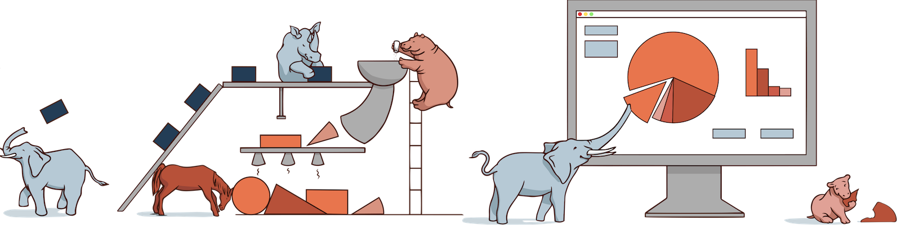

 

# Pachyderm: A Containerized, Version-Controlled Data Lake

Pachyderm is:

* [Git for Data Science](http://pachyderm.io/pfs.html): Pachyderm offers complete version control for even the largest data sets.
* [Containerized](http://pachyderm.io/pps.html): Pachyderm is built on Docker and Kubernetes. Since everything in Pachyderm is a container, data scientists can use any languages or libraries they want (e.g. R, Python, OpenCV, etc).
* [Ideal for building machine learning pipelines and ETL workflows](http://pachyderm.io/pps.html): Pachyderm versions and tracks every output directly to the raw input datasets that created it (aka: [Provenance](http://pachyderm.readthedocs.io/en/latest/advanced/provenance.html)). 

For more details, see [what's new about Pachyderm](https://github.com/pachyderm/pachyderm/#whats-new-about-pachyderm-how-is-it-different-from-hadoop).

## Getting Started
[Install Pachyderm locally](http://pachyderm.readthedocs.io/en/latest/getting_started/local_installation.html) or [deploy on AWS/GCE/Azure](http://pachyderm.readthedocs.io/en/latest/deployment/deploy_intro.html) in about 5 minutes. 

You can also refer to our complete [developer docs](http://pachyderm.readthedocs.io/en/latest) to see tutorials, check out example projects, and learn about advanced features of Pachyderm.

If you'd like to see some examples and learn about core use cases for Pachyderm:
- [Examples](http://pachyderm.readthedocs.io/en/latest/examples/readme.html)
- [Use Cases](http://www.pachyderm.io/use_cases.html)
- [Case Studies](http://www.pachyderm.io/usecases/generalfusion.html): Learn how [General Fusion](http://www.generalfusion.com/) uses Pachyderm to power commercial fusion research.

## Documentation

[Official Documentation](http://pachyderm.readthedocs.io/en/latest/)

## What's new about Pachyderm? (How is it different from Hadoop?)

There are two bold new ideas in Pachyderm:

- Containers as the core processing primitive
- Version Control for data

These ideas lead directly to a system that's much more powerful, flexible and easy to use. 

To process data, you simply create a containerized program which reads and writes to the **local filesystem**. You can use _any_ tools you want because it's all just going in a container! Pachyderm will take your container and inject data into it. We'll then automatically replicate your container, showing each copy a different chunk of data. With this technique, Pachyderm can scale any code you write to process up to petabytes of data (Example: [distributed image processing](http://pachyderm.readthedocs.io/en/latest/getting_started/beginner_tutorial.html)).

Pachyderm also version controls all data using a commit-based distributed
filesystem (PFS), similar to what git does with code. Version control for data
has far reaching consequences in a distributed filesystem. You get the full
history of your data, can track changes, collaborate with teammates, and if
anything goes wrong you can revert _the entire cluster_ with one click!

Version control is also very synergistic with our containerized processing
engine. Pachyderm understands how your data changes and thus, as new data
is ingested, can run your workload on the _diff_ of the data rather than the
whole thing. This means that there's no difference between a batched job and
a streaming job, the same code will work for both!

## Community
Keep up to date and get Pachyderm support via:
- [Twitter](http://twitter.com/pachydermio)
-  Join our community [Slack Channel](http://slack.pachyderm.io) to get help from the Pachyderm team and other users.

### Contributing

To get started, sign the [Contributor License Agreement](https://pachyderm.wufoo.com/forms/pachyderm-contributor-license-agreement).

You should also check out our [contributing guide](./contributing).

Send us PRs, we would love to see what you do! You can also check our GH issues for things labeled "noob-friendly" as a good place to start. We're sometimes bad about keeping that label up-to-date, so if you don't see any, just let us know. 

### Join Us

WE'RE HIRING! Love Docker, Go and distributed systems? Learn more about [our team](http://www.pachyderm.io/jobs.html) and email us at jobs@pachyderm.io.

## Usage Metrics

Pachyderm automatically reports anonymized usage metrics. These metrics help us
understand how people are using Pachyderm and make it better.  They can be
disabled by setting the env variable `METRICS` to `false` in the pachd
container.
