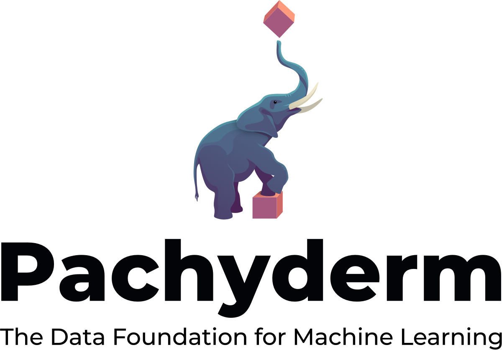

	

# Pachyderm – The Leader in Data Versioning and Pipelines for MLOps

Pachyderm is cost-effective at scale, enabling data engineering teams to automate complex pipelines with sophisticated data transformations across any type of data. Our unique approach provides parallelized processing of multi-stage, language-agnostic pipelines with data versioning and data lineage tracking. Pachyderm delivers the ultimate CI/CD engine for data. 

## Features

- Data-driven pipelines automatically trigger based on detecting data changes.
- Immutable data lineage with data versioning of any data type. 
- Autoscaling and parallel processing built on Kubernetes for resource orchestration.
- Uses standard object stores for data storage with automatic deduplication.  
- Runs across all major cloud providers and on-premises installations.

## Getting Started
To start deploying your end-to-end version-controlled data pipelines, run Pachyderm [locally](https://docs.pachyderm.com/latest/getting-started/local-installation/) or you can also [deploy on AWS/GCE/Azure](https://docs.pachyderm.com/latest/deploy-manage/deploy/amazon_web_services/) in about 5 minutes. 

You can also refer to our complete [documentation](https://docs.pachyderm.com) to see tutorials, check out example projects, and learn about advanced features of Pachyderm.

If you'd like to see some examples and learn about core use cases for Pachyderm:
- [Examples](https://docs.pachyderm.com/latest/examples/examples/)
- [Use Cases](https://www.pachyderm.com/use-cases/)
- [Case Studies](https://www.pachyderm.com/case-studies/)

## Documentation

[Official Documentation](https://docs.pachyderm.com/)

## Community
Keep up to date and get Pachyderm support via:
-  Follow us on Twitter.
-  Join our community [Slack Channel](https://slack.pachyderm.io) to get help from the Pachyderm team and other users.

## Contributing
To get started, sign the [Contributor License Agreement](https://cla-assistant.io/pachyderm/pachyderm).

You should also check out our [contributing guide](https://docs.pachyderm.com/latest/contributing/setup/).

Send us PRs, we would love to see what you do! You can also check our GH issues for things labeled "help-wanted" as a good place to start. We're sometimes bad about keeping that label up-to-date, so if you don't see any, just let us know.

## Join Us

WE'RE HIRING! Love Docker, Go and distributed systems? Learn more about [our open positions](https://boards.greenhouse.io/pachyderm)

## Usage Metrics

Pachyderm automatically reports anonymized usage metrics. These metrics help us
understand how people are using Pachyderm and make it better.  They can be
disabled by setting the env variable `METRICS` to `false` in the pachd
container.

## License Information
Pachyderm has moved some components of Pachyderm Platform to a [source-available limited license](LICENSE). 

We remain committed to the culture of open source, developing our product transparently and collaboratively with our community, and giving our community and customers source code access and the ability to study and change the software to suit their needs.

Under the Pachyderm Community License, you can access the source code and modify or redistribute it; there is only one thing you cannot do, and that is use it to make a competing offering. 

Check out our [License FAQ Page](https://www.pachyderm.com/community-license-faq/) for more information.
