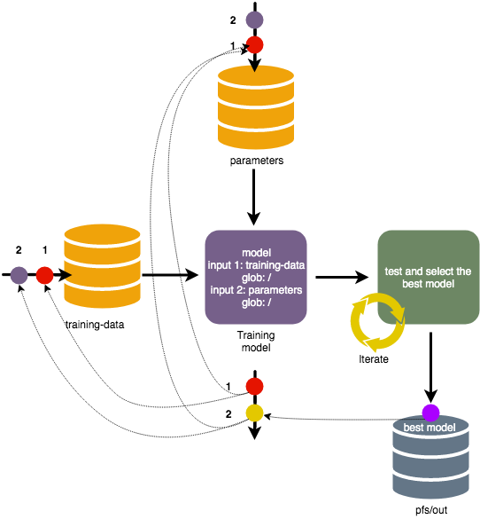

# Provenance

Data versioning enables Pachyderm users to go back in time and see the state
of a dataset or repository at a particular moment in time. Data provenance
(from the French *provenir* which means *the place of origin*),
also known as data lineage, tracks the dependencies and relationships
between datasets. Provenance answers not only the question of
where the data comes from, but also how the data was transformed along
the way. Data scientists use provenance in root cause analysis to improve
their code, workflows, and understanding of the data and its implications
on final results. Data scientists need
to have confidence in the information with which they operate. They need
to be able to reproduce the results and sometimes go through the whole
data transformation process from scratch multiple times, which makes data
provenance one of the most critical aspects of data analysis. If your
computations result in unexpected numbers, the first place to look
is the historical data that gives insights into possible flaws in the
transformation chain or the data itself.

For example, when a bank makes a decision about a mortgage
application, many factors are taken into consideration, including the
credit history, annual income, and loan size. This data goes through multiple
automated steps of analysis with numerous dependencies and decisions made
along the way. If the final decision does not satisfy the applicant,
the historical data is the first place to look for proof of authenticity,
as well as for possible prejudice or model bias against the applicant.
Data provenance creates a complete audit trail that enables data scientists
to track the data from its origin through to the final decision and make
appropriate changes that address issues. With the adoption of General Data
Protection Regulation (GDPR) compliance requirements, monitoring data lineage
is becoming a necessity for many organizations that work with sensitive data.

Pachyderm implements provenance for both commits and repositories.
Therefore, you can track revisions of the data and
understand the connection between the data stored in one repository
and the results in the other
repository. Therefore, you can track the data transformation process across
multiple datasets.

Collaboration takes data provenance even further. You can make any dataset
available to other members of your team. When many data scientists have
access to the same dataset, they can conduct their own experiments with
the data and identify better data analysis processes by using
separate branches.

The following diagram demonstrates how provenance works:

In the diagram above, you can see two input repositories called `parameters`
and `training-data`. The `training-data` repository continuously collects
data from an outside source. The training model pipeline combines the
data from these two repositories, trains many models, and runs tests to select the best
one.

Provenance helps you to understand how and why the best model was
selected and enables you to track the origin of the best model.
In the diagram above, the best model is represented with a purple
circle. By using provenance, you can find that the best model was
created from the commit **2** in the `training-data` repository
and the commit **1** in the `parameters` repository.

Also, Pachyderm provides the `flush commit` command that enables you
to track provenance downstream. That means that you can learn
in which output a certain commit has resulted.

**See Also:**

- [Examining file provenance with flush commit](../../fundamentals/getting_data_out_of_pachyderm.html#examining-file-provenance-with-flush-commit)
