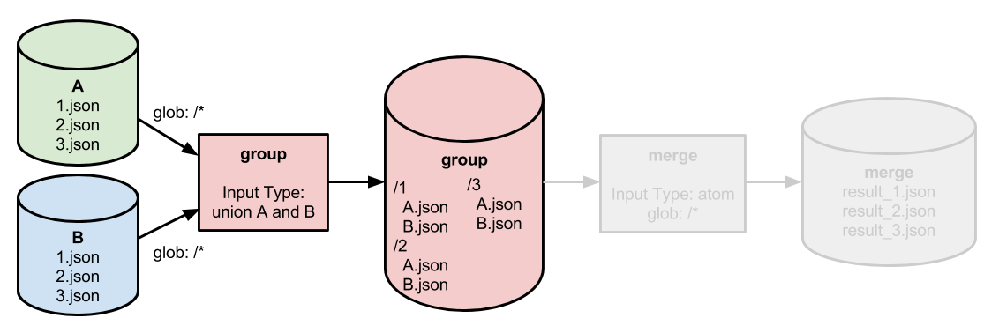
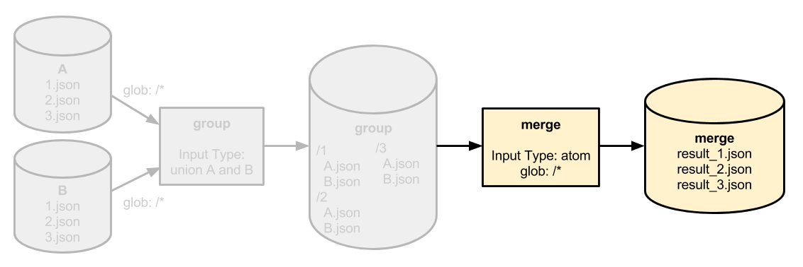

# Combining or Merging Data

There are a variety of use cases in which you would want to match datums from multiple data repositories to do some combined processing, joining, or aggregation.  For example, you may need to process multiple records corresponding to a certain user, a certain experiment, or a certain device together.  In these scenarios, we recommend a 2-stage method of merging your data:

1. [A first pipeline](#grouping-records-that-need-to-be-processed-together) that groups all of the records for a specific key/index.

2. [A second pipeline](#processing-the-grouped-records) that takes that grouped output and performs the merging, joining, or other processing for the group.

## 1. Grouping records that need to be processed together



Let's say that we have two repositories containing JSON records, `A` and `B`.  These repositories may correspond to two experiments, two geographic regions, two different devices generating data, etc.  In any event, the repositories look similar to:

```
$ pachctl list-file A master
NAME                TYPE                SIZE                
1.json              file                39 B                
2.json              file                39 B                
3.json              file                39 B                
$ pachctl list-file B master
NAME                TYPE                SIZE                
1.json              file                39 B                
2.json              file                39 B                
3.json              file                39 B                
```

We need to process `A/1.json` with `B/1.json` to merge their contents or otherwise process them together.  Thus, we need to group each set of JSON records into respective "datums" that can each be processed together by our [second pipeline](#processing-the-grouped-records) (read more about datums and distributed processing [here](http://pachyderm.readthedocs.io/en/latest/fundamentals/distributed_computing.html)).

The first pipeline takes a union of `A` and `B` as inputs, each with glob pattern `/*`.  As each JSON file is processed, it is copied to a folder in the output corresponding to the key/index for that record (in this case, just the number in the file name).  It is also re-named to a unique name corresponding to it's source:

```
/1
  A.json
  B.json
/2
  A.json
  B.json
/3
  A.json
  B.json
```

Note, that when performing this grouping:

- You should use `"lazy": true` to avoid unecessary downloads of data.

- You should use sym-links to avoid unecessary uploads of data and unecessary duplication of data (see more information on "copy elision" [here](http://pachyderm.readthedocs.io/en/latest/managing_pachyderm/data_management.html)).


## 2. Processing the grouped records



Once the records that need to be processed together are grouped by the first pipeline, our second pipeline can take the `group` repository as input with a glob pattern of `/*`.  This will let the second pipeline process each grouping of records in parallel.

The second pipeline will perform any merging, aggregation, or other processing on the respective grouping of records and could, for example, output each respective result to the root of the output directory:

```
$ pachctl list-file merge master
NAME                TYPE                SIZE                
result_1.json              file                39 B                
result_2.json              file                39 B                
result_3.json              file                39 B                
```  

## Implications and Notes

- This 2-stage pattern of combining data could be used for merging or grouped processing of data from various experiments, devices, etc. However, the same pattern can be applied to perform distributed joins of tabular data or data from database tables.  For example, you could join user email records together with user IP records on the key/index of a user ID.

- Each of the 2 stages can be parallelized across workers to scaled with the size of your data and the number of data sources that you are merging.

- In some cases, your data may not be split into separate files for each record.  In these cases, you can utilize [Pachyderm splitting functionality](splitting.html) to prepare your data for this sort of distributed merging/joining. 
