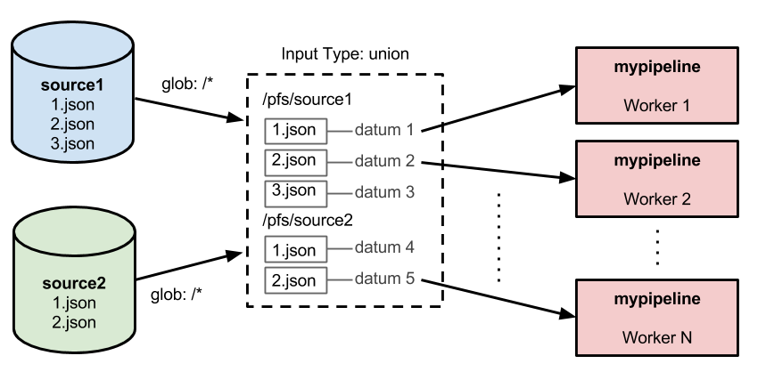
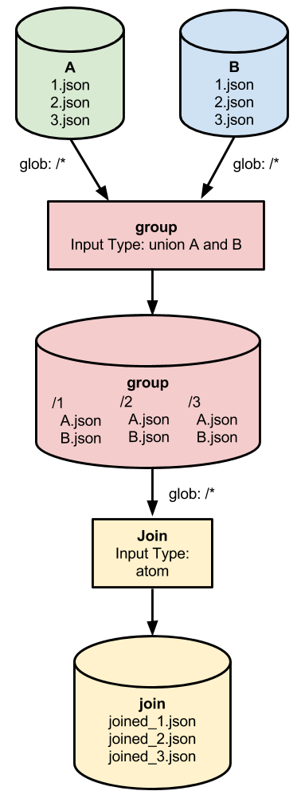

# Combining, Joining, or Merging Data

Pachyderm provides a few basic patterns that can be employed to perform distributed merges, combinations, or joins of data:

- [Creating a data set that is the union of other data sets](#creating-a-data-set-that-is-the-union-of-other-data-sets) (e.g., to create a larger set of "datums" that are to be processed as if they were part of a single data set)

- [Combining or aggregating files/records based on a known key/index](#combining-records-based-on-a-key-or-index) (e.g., to perform a distributed join or aggregation of corresponding files)

## Creating a data set that is the union of other data sets

Let's say that we have two or more sources of data that need to be processed in parallel as one larger data set.  For example, we might be gathering data from multiple IoT sensors (e.g., multiple thermometers or multiple accelerometers), or we might be gathering similar web traffic events from services in multiple regions:

```
$ pachctl list-repo
NAME                CREATED              SIZE                
source2             About a minute ago   2.832 KiB           
source1             About a minute ago   2.823 KiB           
$ pachctl list-file source1 master
NAME                TYPE                SIZE                
1.json              file                59 B                
10.json             file                59 B                
11.json             file                59 B                
12.json             file                59 B                
13.json             file                59 B                
14.json             file                59 B
etc...
$ pachctl list-file source2 master
NAME                TYPE                SIZE                
1.json              file                58 B                
10.json             file                58 B                
11.json             file                58 B                
12.json             file                58 B                
13.json             file                58 B                
14.json             file                58 B
etc... 
```

If we want to process the JSON files under `source1` and the JSON files under `source2` as one large data set, we can "union" these two repositories using an `input` in our pipeline specification similar to the following:

```
    "input": {
      "union": [
        {
          "atom": {
            "glob": "/*",
            "repo": "source1"
          }
        },
        {
          "atom": {
            "glob": "/*",
            "repo": "source2"
          }
        }
      ]
    }
```

The workers that are processing this pipeline will then be passed datums to process from the union of the datums in `source1` (`source1/1.json`, `source1/2.json`, etc.) and the datums in `source2` (`source2/1.json`, `source2/2.json`, etc.).  That is, a first worker might see the following under `/pfs`:

```
/pfs

|-- out

`-- source2

    `-- 5.json
```

because that worker was given a datum from `source2` to process.  Whereas, another worker might see:

```
/pfs

|-- out

`-- source1

    `-- 12.json
```

because that worker was given a datum from `source1` to process. Overall, the workers for this pipeline will process all of the datums in the union of `source1` and `source2` in parallel.  In the simple case of 5 JSON files, this would look like the following: 



## Combining records based on a key or index

In many cases, you don't simply want to process a combination of datums from multiple sources, you want to match up corresponding datums from multiple sources to do a distributed join or aggregation.  For example, let's say that we have one respository with user records that include user emails (fake user emails in this example, of course):

```
$ pachctl list-file emails master
NAME                TYPE                SIZE                
1.json              file                39 B                
10.json             file                39 B                
100.json            file                39 B                
11.json             file                39 B                
12.json             file                39 B
etc...
$ pachctl get-file emails master 1.json
{"id":1,"email":"vgarthside0@php.net"}
$ pachctl get-file emails master 2.json
{"id":2,"email":"gvenart0@facebook.com"} 
```

and we have another repository with user records that include user IP addresses:

```
$ pachctl list-file ips master         
NAME                TYPE                SIZE                
1.json              file                38 B                
10.json             file                38 B                
100.json            file                38 B                
11.json             file                38 B  
etc...
$ pachctl get-file ips master 1.json
{"id":1,"ip_address":"124.82.102.60"}
$ pachctl get-file ips master 2.json
{"id":2,"ip_address":"117.155.40.163"}
```

It's very likely that we would want to combine the user IP record with the corresponding user email record.  That is, we would want to process `emails/1.json` with `ips/1.json`, a "join" with the key/index being the user ID).  

To accomplish this sort of distributed join, we recommend following two step pattern:

1. A first pipeline (called, e.g., `group`) that takes as it's input the union of the data sources and groups all of the records for a specific key into a folder for that key.

    - In the example of email records and IP records, this pipeline would copy each email and IP record into a folder named according to the corresponding user ID:

        ```
        /1
          email.json
          ip.json
        /2
          email.json
          ip.json

        etc...
        ```
    - This pipeline should use `"lazy": true` to avoid unecessary downloads of data across the network.

    - This pipeline should also use sym-links to make the copies (as further discussed [here](http://pachyderm.readthedocs.io/en/latest/managing_pachyderm/data_management.html#shuffling-files)), which avoids any unecesssary uploads.


2. A second pipeline (called, e.g., `join`) that takes that grouped output and performs the joining or aggregation.

    - In the example, this pipeline would operate on each set of `email.json` and `ip.json` records combining the emails and IPs into a single user record.



**Note** - by using this 2-stage method, both the grouping and joining operations can be parallelized, which can provide a huge speedup when joining large amounts of data.  You could accomplish a similar task using a single stage with a `cross` input.  However, the `cross` input type would scale poorly as your number of records and number of data sources increases, because you would be doing a brute force analysis of all combinations (even the ones that don't match).


