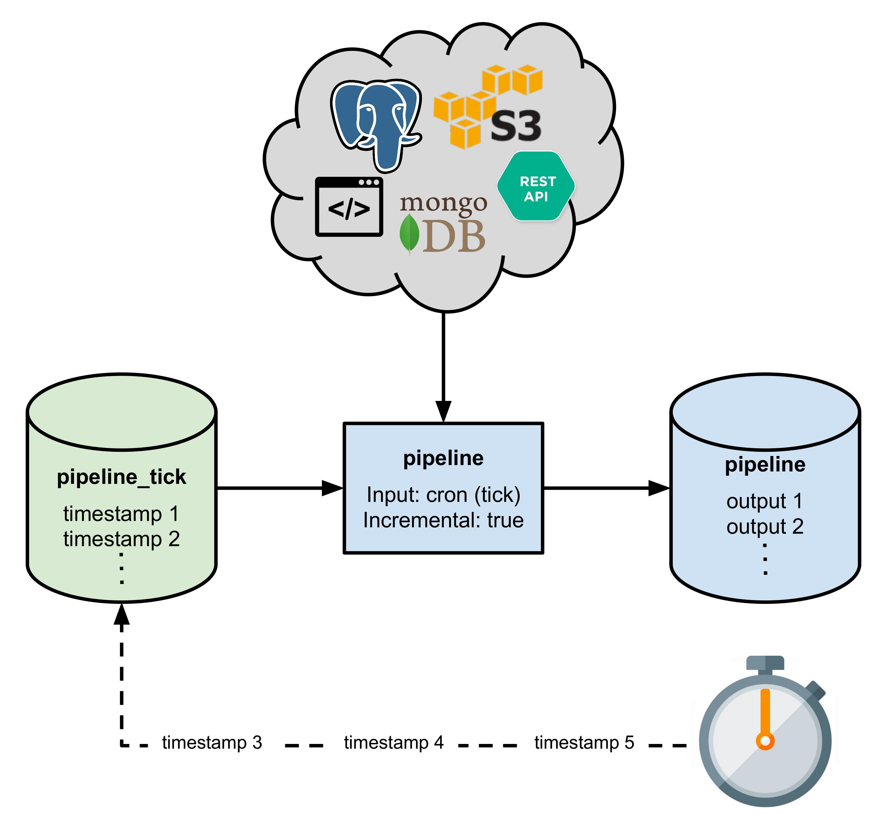

# Triggering Pipelines Periodically (cron)

Pachyderm pipelines are triggered by changes to their input data repositories (as further discussed in [What Happens When You Create a Pipeline](../getting_started/beginner_tutorial.html#what-happens-when-you-create-a-pipeline)). However, if a pipeline consumes data from sources outside of Pachyderm, it can't use Pachyderm's triggering mechanism to process updates from those sources. For example, you might need to:

- Scrape websites
- Make API calls
- Query a database
- Retrieve a file from S3 or FTP

You can schedule pipelines like these to run regularly with Pachyderm's built-in `cron` input type. You can find an example pipeline that queries MongoDB periodically [here](https://github.com/pachyderm/pachyderm/tree/master/doc/examples/cron).

There are two types of cron inputs:

- [Non-incremental `cron` input](#non-incremental-cron) - For when you want to overwrite a single dataset regularly
- [Incremental `cron` input](#incremental-cron) - For when you want to store new datasets alongside previous results.

## Non-Incremental Cron

Let's say that we want to query a database every 10 seconds and update our dataset every time the pipeline is triggered. We could do this with a non-incremental `cron` input as follows:

```
  "input": {
    "cron": {
      "name": "tick",
      "spec": "@every 10s"
    }
  }
```

When we create this pipeline, Pachyderm will create a new input data repository corresponding to the `cron` input. It will then automatically commit an updated timestamp file every 10 seconds to the `cron` input repository, which will automatically trigger our pipeline.


The pipeline will run every 10 seconds, querying our database and updating its output.

We have used the `@every 10s` cron spec here, but you can use any cron spec formatted according to [RFC 3339](https://www.ietf.org/rfc/rfc3339.txt). For example, `*/10 * * * *` would indicate that the pipeline should run every 10 minutes (these time formats should be familiar to those who have used cron in the past, and you can find more examples [here](https://en.wikipedia.org/wiki/Cron))

## Incremental Cron

In the [above example](#non-incremental-cron), Pachyderm will overwrite the output data from our `cron` triggered pipeline each time it runs. This happens because Pachyderm is updating the same input datum (the timestamp) after every period (see [our incremental processing docs](../fundamentals/incrementality.html) for more information on datums and incrementality).

If we don't want to replace our previous datasets during every run, we must enable incrementality in the pipeline specification:

```
{

  ...

  "input": {
    "cron": {
      "name": "tick",
      "spec": "@every 10s"
    }
  },
  "incremental": true
}
```

When we do this, Pachyderm won't update the same timestamp in the `cron` data repository, and we can accumulate results periodically over time:



Note: even with `"incremental": true` you can still overwrite data in the output data repository (e.g. by replacing a file with a new file having the same name). The point is that the pipeline controls this process—it's not automatic.
