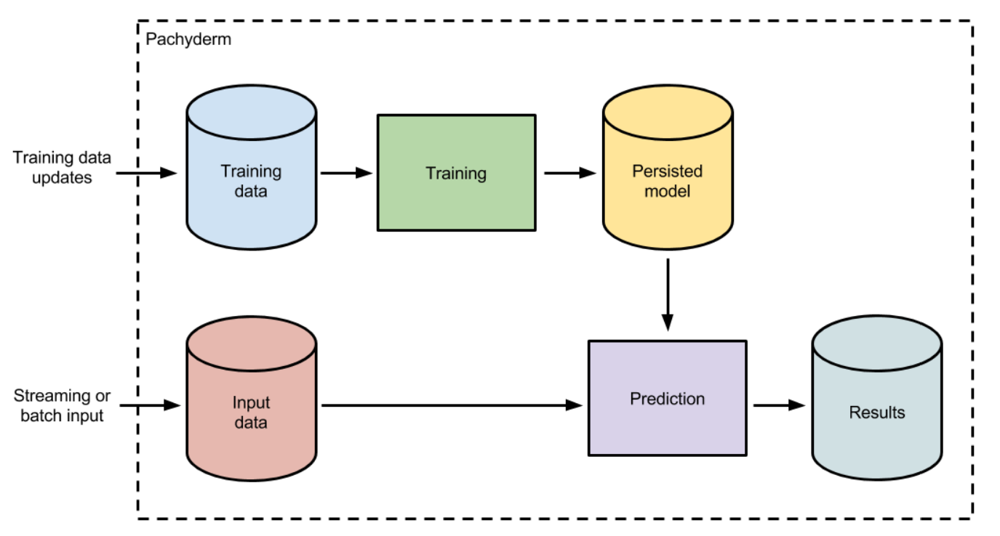

# Creating Machine Learning Workflows

Because Pachyderm is language/framework agnostic and because it easily distributes analyses over large data sets, data scientists can use whatever tooling they like for ML. Even if that tooling isn’t familiar to the rest of an engineering organization, data scientists can autonomously develop and deploy scalable solutions via containers. Moreover, Pachyderm’s pipelining logic paired with data versioning, allows any results to be exactly reproduced (e.g., for debugging or during the development of improvements to a model).

We recommend combining model training processes, persisted models, and a model utilization processes (e.g., making inferences or generating results) into a single Pachyderm pipeline DAG (Directed Acyclic Graph). Such a pipeline allows us to:

- Keep a rigorous historical record of exactly what models were used on what data to produce which results.
- Automatically update online ML models when training data or parameterization changes.
- Easily revert to other versions of an ML model when a new model is not performing or when “bad data” is introduced into a training data set.

This sort of sustainable ML pipeline looks like this:

A data scientist can update the training dataset at any time to automatically train a new persisted model. This training could utilize any language or framework (Spark, Tensorflow, scikit-learn, etc.) and output any format of persisted model (pickle, XML, POJO, etc.).  Regardless of framework, the model will be versioned by Pachyderm, and you will be able to track what "Input data" was input into which model AND exactly what "Training data" was used to train that model.

Any new input data coming into the “Input data” repository will be processed with the updated model. Old predictions can be re-computed with the updated model, or new models could be backtested on previously input and versioned data. This will allow you to avoid manual updates to historical results or having to worry about how to swap out ML models in production!

## Examples

We have implemented this machine learning workflow in [some example pipelines](http://docs.pachyderm.io/en/latest/examples/readme.html#machine-learning) using a couple of different frameworks.  These examples are a great starting point if you are trying to implement ML in Pachyderm.  
