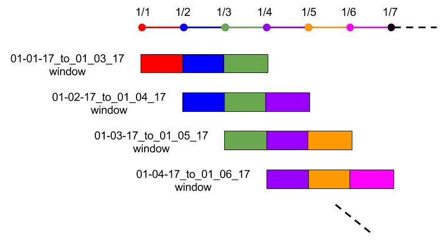

# Processing Time-Windowed Data

If you are analyzing data that is changing over time, chances are that you will want to perform some sort of analysis on "the last two weeks of data," "January's data," or some other moving or static time window of data.  There are a few different ways of doing these types of analyses in Pachyderm, depending on your use case.  We recommend one of the following patterns for:

1. [Fixed time windows](#fixed-time-windows) - for rigid, fixed time windows, such as months (Jan, Feb, etc.) or days (01-01-17, 01-02-17, etc.).

2. [Moving or rolling time windows](#moving-or-rolling-time-windows) - for rolling time windows of data, such as three day windows or two week windows. 

## Fixed time windows

As further discussed in [Creating Analysis Pipelines](http://docs.pachyderm.io/en/latest/fundamentals/creating_analysis_pipelines.html) and [Distributed Computing](http://docs.pachyderm.io/en/latest/fundamentals/distributed_computing.html), the basic unit of data partitioning in Pachyderm is a "datum" which is defined by a glob pattern. When analyzing data within fixed time windows (e.g., corresponding to fixed calendar times/dates), we recommend organizing your data repositories such that each of the time windows that you are going to analyze corresponds to a separate files or directories in your repository. By doing this, you will be able to:

- Analyze each time window in parallel.
- Only re-process data within a time window when that data, or a corresponding data pipeline, changes.

For example, if you have monthly time windows of JSON sales data that need to be analyzed, you could create a `sales` data repository and structure it like:

```
sales
├── January
|   ├── 01-01-17.json
|   ├── 01-02-17.json
|   └── etc...
├── February
|   ├── 01-01-17.json
|   ├── 01-02-17.json
|   └── etc...
└── March
    ├── 01-01-17.json
    ├── 01-02-17.json
    └── etc...
```

When you run a pipeline with an input repo of `sales` having a glob pattern of `/*`, each month's worth of sales data is processed in parallel (if possible). Further, when you add new data into a subset of the months or add data into a new month (e.g., May), only those updated datums will be re-processed.

More generally, this structure allows you to create:

- Pipelines that aggregate, or otherwise process, daily data on a monthly basis via a `/*` glob pattern.
- Pipelines that only analyze a certain month's data via, e.g., a `/January/*` or `/January/` glob pattern.
- Pipelines that process data on a daily basis via a `/*/*` glob pattern.
- Any combination of the above.

## Moving or rolling time windows

In certain use cases, you need to run analyses for moving or rolling time windows, even when those don't correspond to certain calendar months, days, etc.  For example, you may need to analyze the last three days of data, the three days of data prior to that, the three days of data prior to that, etc.  In other words, you need to run an analysis for every rolling length of time.

For rolling or moving time windows, there are a couple of recommended patterns:

1. Bin your data in repository folders for each of the rolling/moving time windows.

2. Maintain a time windowed set of data corresponding to the latest of the rolling/moving time windows.

### Binning data into rolling/moving time windows

In this method of processing rolling time windows, we'll use a two-pipeline [DAG](http://docs.pachyderm.io/en/latest/fundamentals/creating_analysis_pipelines.html) to analyze time windows efficiently:

- *Pipeline 1* - Read in data, determine which bins the data corresponds to, and write the data into those bins   

- *Pipeline 2* - Read in and analyze the binned data. 

By splitting this analysis into two pipelines we can benefit from parallelism at the file level.  In other words, *Pipeline 1* can be easily parallelized for each file, and *Pipeline 2* can be parallelized per bin. Now we can scale the pipelines easily as the number of files increases.

Let's take the three day rolling time windows as an example, and let's say that we want to analyze three day rolling windows of sales data.  In a first repo, called `sales`, a first day's worth of sales data is committed:

```
sales
└── 01-01-17.json
```

We then create a first pipeline to bin this into a repository directory corresponding to our first rolling time window from 01-01-17 to 01-03-17:

```
binned_sales
└── 01-01-17_to_01-03-17
    └── 01-01-17.json
```

When our next day's worth of sales is committed,

```
sales
├── 01-01-17.json
└── 01-02-17.json
```

the first pipeline executes again to bin the 01-02-17 data into any relevant bins.  In this case, we would put it in the previously created bin for 01-01-17 to 01-03-17, but we would also put it into a bin starting on 01-02-17:

```
binned_sales
├── 01-01-17_to_01-03-17
|   ├── 01-01-17.json
|   └── 01-02-17.json
└── 01-02-17_to_01-04-17
    └── 01-02-17.json
```

As more and more daily data is added, you will end up with a directory structure that looks like:

```
binned_sales
├── 01-01-17_to_01-03-17
|   ├── 01-01-17.json
|   ├── 01-02-17.json
|   └── 01-03-17.json
├── 01-02-17_to_01-04-17
|   ├── 01-02-17.json
|   ├── 01-03-17.json
|   └── 01-04-17.json
├── 01-03-17_to_01-05-17
|   ├── 01-03-17.json
|   ├── 01-04-17.json
|   └── 01-05-17.json
└── etc...
```

and is maintained over time as new data is committed:



Your second pipeline can then process these bins in parallel, via a glob pattern of `/*`, or in any other relevant way as discussed further in the ["Fixed time windows" section](#fixed-time-window-directory-structures).  Both your first and second pipelines can be easily parallelized.

**Note** - When looking at the above directory structure, it may seem like there is an uneccessary duplication of the data.  However, under the hood Pachyderm deduplicates all of these files and maintains a space efficient representation of your data.  The binning of the data is merely a structural re-arrangement to allow you to process these types of rolling time windows.  

**Note** - It might also seem as if there is unecessary data transfers over the network to perform the above binning.  Pachyderm can ensure that performing these types of "shuffles" doesn't actually require transferring data over the network. Read more about that [here](../managing_pachyderm/data_management.html#shuffling-files). 

### Maintaining a single time-windowed data set

The advantage of the binning pattern above is that any of the rolling time windows are available for processing.  They can be compared, aggregated, combined, etc. in any way, and any results or aggregations are kept in sync with updates to the bins.  However, you do need to put in some logic to maintain the binning directory structure.  

There is another pattern for moving time windows that avoids the binning of the above approach and maintains an up-to-date version of a moving time-windowed data set.  It also involves two pipelines:

- *Pipeline 1* - Read in data, determine which files belong in your moving time window, and write the relevant files into an updated version of the moving time-windowed data set.  

- *Pipeline 2* - Read in and analyze the moving time-windowed data set.

Let's utilize our sales example again to see how this would work.  In the example, we want to keep a moving time window of the last three days worth of data.  Now say that our daily `sales` repo looks like the following:

```
sales
├── 01-01-17.json
├── 01-02-17.json
├── 01-03-17.json
└── 01-04-17.json
```

When the January 4th file, `01-04-17.json`, is committed, our first pipeline pulls out the last three days of data and arranges it like so:

```
last_three_days
├── 01-02-17.json
├── 01-03-17.json
└── 01-04-17.json
```

Think of this as a "shuffle" step.  Then, when the January 5th file, `01-05-17.json`, is commited,  

```
sales
├── 01-01-17.json
├── 01-02-17.json
├── 01-03-17.json
├── 01-04-17.json
└── 01-05-17.json
```

the first pipeline would again update the moving window:

```
last_three_days
├── 01-03-17.json
├── 01-04-17.json
└── 01-05-17.json
```

Whatever analysis we need to run on the moving windowed data set in `moving_sales_window` can use a glob pattern of `/` or `/*` (depending on whether we need to process all of the time windowed files together or they can be processed in parallel).

**Warning** - When creating this type of moving time-windowed data set, the concept of "now" or "today" is relative.  It is important that you make a sound choice for how to define time based on your use case (e.g., by defaulting to UTC). You should not use a function such as `time.now()` to figure out a current day. The actual time at which this analysis is run may vary. If you have further questions about this issue, please do not hesitate to reach out to us via [Slack](http://slack.pachyderm.io/) or at support@pachyderm.io.
