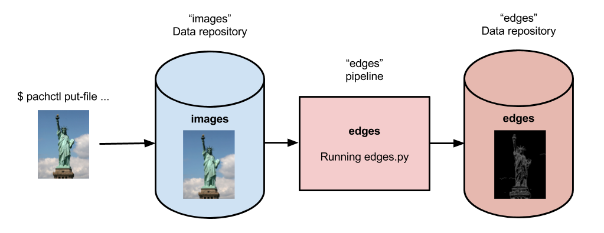

# Beginner Tutorial

Welcome to the beginner tutorial for Pachyderm! If you have already installed
Pachyderm, this tutorial should take about 15 minutes to complete. This tutorial
introduces basic Pachyderm concepts.

!!! tip
    If you are new to Pachyderm, try [Pachyderm Shell](../../deploy-manage/manage/pachctl_shell/).
    This handy tool suggests you `pachctl` commands as you type and
    helps you learn Pachyderm faster.

## Image processing with OpenCV

This tutorial walks you through the deployment of a Pachyderm pipeline
that performs [edge
detection](https://en.wikipedia.org/wiki/Edge_detection) on a few
images. Thanks to Pachyderm's built-in processing primitives, we can
keep our code simple but still run the pipeline in a
distributed, streaming fashion. Moreover, as new data is added, the
pipeline automatically processes it and outputs the results.

If you hit any errors not covered in this guide, get help in our [public
community Slack](http://slack.pachyderm.io), submit an issue on
[GitHub](https://github.com/pachyderm/pachyderm), or email us at
<support@pachyderm.io>. We are more than happy to help!

### Prerequisites

This guide assumes that you already have Pachyderm running locally.
If you haven't done so already, install Pachyderm on your local
machine as described in [Local Installation](local_installation.md).

### Create a Repo

A `repo` is the highest level data primitive in Pachyderm. Like many
things in Pachyderm, it shares its name with a primitive in Git and is
designed to behave analogously. Generally, repos should be dedicated to
a single source of data such as log messages from a particular service,
a users table, or training data for an ML model. Repos are easy to create
and do not take much space when empty so do not worry about making
tons of them.

For this demo, we create a repo called `images` to hold the
data we want to process:

```shell
pachctl create repo images
```

Verify that the repository was created:

```shell
pachctl list repo
```

**System response:**

```shell
NAME   CREATED       SIZE (MASTER)
images 7 seconds ago 0B
```

This output shows that the repo has been successfully created. Because we
have not added anything to it yet, the size of the repository HEAD commit
on the master branch is 0B.

### Adding Data to Pachyderm

Now that we have created a repo it is time to add some data. In
Pachyderm, you write data to an explicit `commit`. Commits are immutable
snapshots of your data which give Pachyderm its version control properties.
You can add, remove, or update `files` in a given commit.

Let's start by just adding a file, in this case an image, to a new
commit. We have provided some sample images for you that we host on
Imgur.

Use the `pachctl put file` command along with the `-f` flag.  The `-f` flag can
take either a local file, a URL, or a object storage bucket which it
scrapes automatically. In this case, we simply pass the URL.

Unlike Git, commits in Pachyderm must be explicitly started and finished
as they can contain huge amounts of data and we do not want that much
*dirty* data hanging around in an unpersisted state. `pachctl put file`
automatically starts and finishes a commit for you so you can add files
more easily. If you want to add many files over a period of time, you
can do `pachctl start commit` and `pachctl finish commit` yourself.

We also specify the repo name `"images"`, the branch name `"master"`,
and the file name: `"liberty.png"`.

Here is an example atomic commit of the file `liberty.png` to the
`images` repo `master` branch:

```shell
pachctl put file images@master:liberty.png -f http://imgur.com/46Q8nDz.png
```

We can check to make sure the data we just added is in Pachyderm.

* Use the `pachctl list repo` command to check that data has been added:

  ```shell
  pachctl list repo
  ```

  **System response:**

  ```
  NAME   CREATED            SIZE (MASTER)
  images About a minute ago 57.27KiB
  ```

* View the commit that was just created:

  ```shell
  pachctl list commit images
  ```

  **System response:**

  ```
  REPO   COMMIT                           PARENT STARTED        DURATION           SIZE
  images d89758a7496a4c56920b0eaa7d7d3255 <none> 29 seconds ago Less than a second 57.27KiB
  ```

* View the file in that commit:

  ```shell
  pachctl list file images@master
  ```

  **System response:**

  ```
  COMMIT                           NAME         TYPE COMMITTED          SIZE 
  d89758a7496a4c56920b0eaa7d7d3255 /liberty.png file About a minute ago 57.27KiB
  ```

Also, you can view the file you have just added to Pachyderm. Because this is an
image, you cannot just print it out in the terminal, but the following
commands will let you view it easily:


* on macOS prior to Catalina, run:

    ```
    pachctl get file images@master:liberty.png | open -f -a Preview.app
    ```

* on macOS Catalina, run:

    ```
    pachctl get file images@master:liberty.png | open -f -a Preview.app
    ```

* on Linux 64-bit, run:

    ```
    pachctl get file images@master:liberty.png | display
    ```

### Create a Pipeline

Now that you have some data in your repo, it is time to do something
with it. Pipelines are the core processing primitive in Pachyderm and
you can define them with a JSON encoding. For this example, we have
already created the pipeline for you and you can find the [code on
GitHub](https://github.com/pachyderm/pachyderm/blob/1.13.x/examples/opencv).

When you want to create your own pipelines later, you can refer to the
full [Pipeline Specification](../../reference/pipeline_spec) to use
more advanced options. Options include building your own code into a
container instead of the pre-built Docker image that we are
using in this tutorial.

For now, we are going to create a single pipeline that takes in images
and does some simple edge detection.



Below is the pipeline spec and python code that we are using. Let's walk
through the details.

```shell
# edges.json
{
  "pipeline": {
    "name": "edges"
  },
  "description": "A pipeline that performs image edge detection by using the OpenCV library.",
  "transform": {
    "cmd": [ "python3", "/edges.py" ],
    "image": "pachyderm/opencv"
  },
  "input": {
    "pfs": {
      "repo": "images",
      "glob": "/*"
    }
  }
}
```

Our pipeline spec contains a few simple sections. First, it is the pipeline
`name`, edges. Then we have the `transform` which specifies the docker
image we want to use, `pachyderm/opencv` (defaults to DockerHub as the
registry), and the entry point `edges.py`. Lastly, we specify the input.
Here we only have one PFS input, our images repo with a particular glob
pattern.

The glob pattern defines how the input data can be broken up if we want
to distribute our computation. `/*` means that each file can be
processed individually, which makes sense for images. Glob patterns are
one of the most powerful features in  Pachyderm.

The following text is the Python code that we run in this pipeline:

``` python
# edges.py
import cv2
import numpy as np
from matplotlib import pyplot as plt
import os

# make_edges reads an image from /pfs/images and outputs the result of running
# edge detection on that image to /pfs/out. Note that /pfs/images and
# /pfs/out are special directories that Pachyderm injects into the container.
def make_edges(image):
   img = cv2.imread(image)
   tail = os.path.split(image)[1]
   edges = cv2.Canny(img,100,200)
   plt.imsave(os.path.join("/pfs/out", os.path.splitext(tail)[0]+'.png'), edges, cmap = 'gray')

# walk /pfs/images and call make_edges on every file found
for dirpath, dirs, files in os.walk("/pfs/images"):
   for file in files:
       make_edges(os.path.join(dirpath, file))
```

The code simply walks over all the images in `/pfs/images`, performs edge
detection, and writes the result to `/pfs/out`.

`/pfs/images` and `/pfs/out` are special local directories that
Pachyderm creates within the container automatically. All the input data
for a pipeline is stored in `/pfs/<input_repo_name>` and your code
should always write out to `/pfs/out`. Pachyderm automatically
gathers everything you write to `/pfs/out` and version it as this
pipeline output.

Now, let's create the pipeline in Pachyderm:

```shell
pachctl create pipeline -f https://raw.githubusercontent.com/pachyderm/pachyderm/1.13.x/examples/opencv/edges.json
```

### What Happens When You Create a Pipeline

Creating a pipeline tells Pachyderm to run your code on the data in your
input repo (the HEAD commit) as well as **all future commits** that
occur after the pipeline is created. Our repo already had a commit, so
Pachyderm automatically launched a `job` to process that data.

The first time Pachyderm runs a pipeline job, it needs to download the
Docker image (specified in the pipeline spec) from the specified Docker
registry (DockerHub in this case). This first run this might take a
minute or so because of the image download, depending on your Internet
connection. Subsequent runs will be much faster.

You can view the job with:

``` bash
pachctl list job
```

**System response:**

```shell
ID                               PIPELINE STARTED        DURATION           RESTART PROGRESS  DL       UL       STATE
0f6a53829eeb4ca193bb7944fe693700 edges    16 seconds ago Less than a second 0       1 + 0 / 1 57.27KiB 22.22KiB success
```

Yay! Our pipeline succeeded! Pachyderm creates a corresponding output
repo for every pipeline. This output repo will have the same name as the
pipeline, and all the results of that pipeline will be versioned in this
output repo. In our example, the `edges` pipeline created a repo
called `edges` to store the results.

``` bash
pachctl list repo
```

**System response:**

```shell
NAME   CREATED       SIZE (MASTER)
edges  2 minutes ago 22.22KiB
images 5 minutes ago 57.27KiB
```

### Reading the Output

We can view the output data from the `edges` repo in the same fashion
that we viewed the input data.

* On macOS prior to Catalina, run:

   ```
   pachctl get file edges@master:liberty.png | open -f -a Preview.app
   ```

* On macOS Catalina, run:

   ```
   pachctl get file edges@master:liberty.png | open -f -a Preview.app
   ```

* On Linux 64-bit, run:

   ```
   pachctl get file edges@master:liberty.png | display
   ```

The output should look similar to:


### Processing More Data

Pipelines will also automatically process the data from new commits as
they are created. Think of pipelines as being subscribed to any new
commits on their input repo(s). Also similar to Git, commits have a
parental structure that tracks which files have changed. In this case
we are going to be adding more images.

Let's create two new commits in a parental structure. To do this we
will simply do two more `put file` commands and by specifying `master`
as the branch, it automatically parents our commits onto each other.
Branch names are just references to a particular HEAD commit.

```shell
pachctl put file images@master:AT-AT.png -f http://imgur.com/8MN9Kg0.png
pachctl put file images@master:kitten.png -f http://imgur.com/g2QnNqa.png
```

Adding a new commit of data will automatically trigger the pipeline to
run on the new data we've added. We'll see corresponding jobs get
started and commits to the output "edges" repo. Let's also view our
new outputs.

View the list of jobs that have started:

``` bash
pachctl list job
```

**System response:**

```
ID                                STARTED        DURATION           RESTART PROGRESS  DL       UL       STATE
81ae47a802f14038b95f8f248cddbed2  7 seconds ago  Less than a second 0       1 + 2 / 3 102.4KiB 74.21KiB success
ce448c12d0dd4410b3a5ae0c0f07e1f9  16 seconds ago Less than a second 0       1 + 1 / 2 78.7KiB  37.15KiB success
490a28be32de491e942372018cd42460  9 minutes ago  35 seconds         0       1 + 0 / 1 57.27KiB 22.22KiB success
```

View the output data

* On macOS, run:

  ```shell
  pachctl get file edges@master:AT-AT.png | open -f -a Preview.app
  pachctl get file edges@master:kitten.png | open -f -a Preview.app
  ```

* On Linux, run:

  ```shell
  pachctl get file edges@master:AT-AT.png | display
  pachctl get file edges@master:kitten.png | display
  ```

### Adding Another Pipeline

We have successfully deployed and used a single stage Pachyderm pipeline.
Now, let's add a processing stage to illustrate a multi-stage Pachyderm
pipeline. Specifically, let's add a `montage` pipeline that take our
original and edge detected images and arranges them into a single
montage of images:


Below is the pipeline spec for this new pipeline:

```shell
# montage.json
{
  "pipeline": {
    "name": "montage"
  },
  "description": "A pipeline that combines images from the `images` and `edges` repositories into a montage.",
  "input": {
    "cross": [ {
      "pfs": {
        "glob": "/",
        "repo": "images"
      }
    },
    {
      "pfs": {
        "glob": "/",
        "repo": "edges"
      }
    } ]
  },
  "transform": {
    "cmd": [ "sh" ],
    "image": "v4tech/imagemagick",
    "stdin": [ "montage -shadow -background SkyBlue -geometry 300x300+2+2 $(find /pfs -type f | sort) /pfs/out/montage.png" ]
  }
}
```

This `montage` pipeline spec is similar to our `edges` pipeline except
for the following differences:

1. We are using a different Docker image that
has `imagemagick` installed.
2. We are executing a `sh` command with
`stdin` instead of a python script.
3. We have multiple input data repositories.

In the `montage` pipeline we are combining our multiple input data
repositories using a `cross` pattern. This `cross` pattern creates a
single pairing of our input images with our edge detected images. There
are several interesting ways to combine data in Pachyderm, which are
discussed
[here](../../reference/pipeline_spec/#input-required)
and
[here](../../concepts/pipeline-concepts/datum/join/).

We create the `montage` pipeline as before, with `pachctl`:

```shell
pachctl create pipeline -f https://raw.githubusercontent.com/pachyderm/pachyderm/1.13.x/examples/opencv/montage.json
```

Pipeline creating triggers a job that generates a montage for all the
current HEAD commits of the input repos:

```shell
pachctl list job
```

**System response:**

```shell
ID                                  STARTED        DURATION           RESTART PROGRESS  DL       UL       STATE
92cecc40c3144fd5b4e07603bb24b104    45 seconds ago 6 seconds          0       1 + 0 / 1 371.9KiB 1.284MiB success
81ae47a802f14038b95f8f248cddbed2    2 minutes ago  Less than a second 0       1 + 2 / 3 102.4KiB 74.21KiB success
ce448c12d0dd4410b3a5ae0c0f07e1f9    2 minutes ago  Less than a second 0       1 + 1 / 2 78.7KiB  37.15KiB success
490a28be32de491e942372018cd42460    11 minutes ago 35 seconds         0       1 + 0 / 1 57.27KiB 22.22KiB success
```

View the generated montage image by running one of
the following commands:


* On macOS prior to Catalina, run:

   ```
   pachctl get file montage@master:montage.png | open -f -a Preview.app
   ```


* On macOS Catalina, run:

   ```
   pachctl get file montage@master:montage.png | open -f -a Preview.app
   ```


* On Linux 64-bit, run:

   ```
   pachctl get file montage@master:montage.png | display
   ```

  

Exploring your DAG in the Pachyderm dashboard
---------------------------------------------

When you deployed Pachyderm locally, the Pachyderm Enterprise dashboard
was also deployed by default. This dashboard will let you interactively
explore your pipeline, visualize the structure of the pipeline, explore
your data, debug jobs, etc. To access the dashboard visit
`localhost:30080` in an Internet browser (e.g., Google Chrome). You
should see something similar to this:


Enter your email address if you would like to obtain a free trial token
for the dashboard. Upon entering this trial token, you will be able to
see your pipeline structure and interactively explore the various pieces
of your pipeline as pictured below:


Next Steps
----------

Pachyderm is now running locally with data and a pipeline! To play with
Pachyderm locally, you can use what you've learned to build on or
change this pipeline. You can also dig in and learn more details about:

- [Deploying Pachyderm to the cloud or on prem](../deploy-manage/deploy/index.md)
- [Load Your Data into Pachyderm](../how-tos/basic-data-operations/load-data-into-pachyderm.md)
- [Working with Pipelines](../how-tos/developer-workflow/working-with-pipelines.md)

We'd love to help and see what you come up with, so submit any
issues/questions you come across on
[GitHub](https://github.com/pachyderm/pachyderm),
[Slack](http://slack.pachyderm.io), or email at <support@pachyderm.io>
if you want to show off anything nifty you've created!
