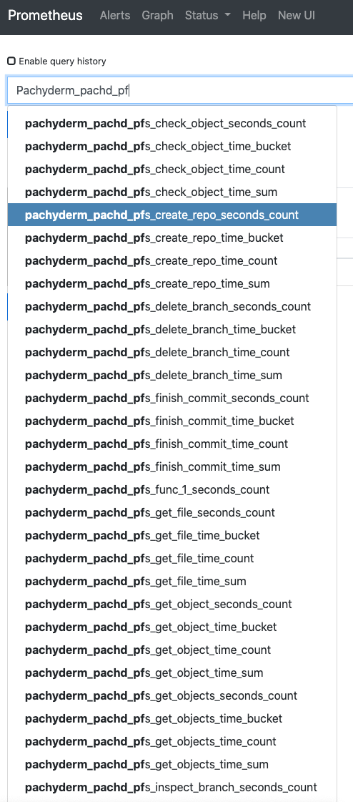

!!! note 
    To monitor a Pachyderm cluster
    with Prometheus, 
    a ***Pachyderm Enterprise License*** is required. 

# Monitor your Pachyderm cluster with Prometheus
1. Helm install [kube-prometheus-stack](https://github.com/prometheus-community/helm-charts/tree/main/charts/kube-prometheus-stack#kube-prometheus-stack),
Prometheus' **Kubernetes cluster monitoring** using the Prometheus Operator:

    - Get Repo Info
    ```shell
    helm repo add prometheus-community https://prometheus-community.github.io/helm-charts
    helm repo update
    ```

    - Install the Prometheus-operator helm chart
    ```shell
    $ helm install <a-release-name> prometheus-community/kube-prometheus-stack
    ```

1. Create a ServiceMonitor for Pachyderm in Kubernetes:
    - Create a <myprometheusservice>.yaml
        ```shell
        apiVersion: monitoring.coreos.com/v1
        kind: ServiceMonitor
        metadata:
        name: pachyderm-scraper
        labels:
            release: <a-release-name>
        spec:
        selector:
            matchLabels:
            suite: pachyderm
        namespaceSelector:
            matchNames:
            - default
        endpoints:
        - port: prometheus-metrics
            interval: 30s
        ```
    - Create a ServiceMonitor looking to scrape metrics from `suite: pachyderm`:
        ```shell
        $ kubectl create -f <myprometheusservice>.yaml
        ```
        The prometheus-operator will search for the pods based on the label selector `<a-release-name>`
        and creates a prometheus target so prometheus will scrape the metrics endpoint `prometheus-metrics`.

        In this case it looks for anything with the label `suite: pachyderm` -
        which is by default associated with all Pachyderm resources.

    !!! Note
            Our Service Monitor `pachyderm-scraper` above maps the endpoint port `prometheus-metrics`
            to a corresponding `prometheus-metrics` port described in Pachyderm's configuration file.
            Let's take a quick look at this file:
            
            ```shell
            $ pachctl deploy local --dry-run > pachd.json
            ```
            In pachd.json, find:
            ```shell
            - name: prometheus-metrics
                nodePort: 30656
                port: 656
                protocol: TCP
                targetPort: 656
            ```
    

1. One last step before you can collect your metrics:

    ```shell
    $   kubectl port-forward pod/prometheus-<a-release-name>-kube-prometheus-stack-prometheus-0 9090
    ```

1. You can now browse your targets (http://localhost:9090/targets).
    Run a pipeline of your choice. The `pachyderm-scraper` should be visible:

    

    In the ClassicUI tab, you should be able to see the new pachyderm metrics:

    


## References

* Kube Prometheus Stack - https://github.com/prometheus-community/helm-charts/tree/main/charts/kube-prometheus-stack
* Prometheus documentation - https://prometheus.io/docs/introduction/overview/