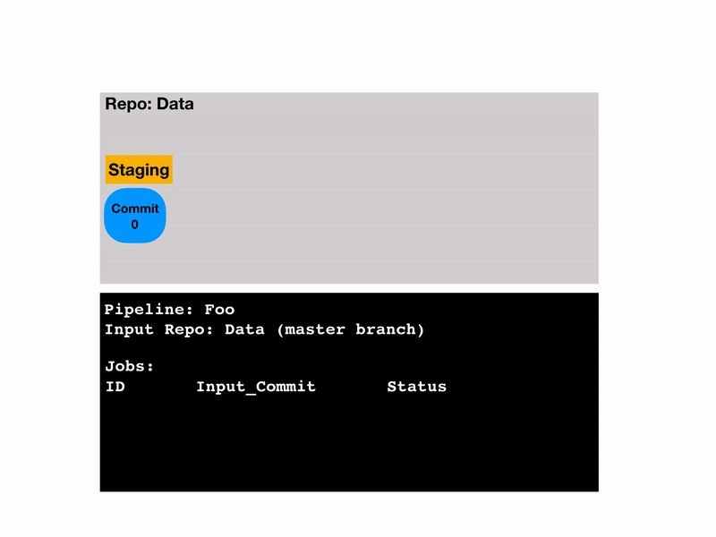

# Deferred Processing of Data

While a Pachyderm pipeline is running, it processes any new data that you
commit to its input branch. However, in some cases, you
want to commit data more frequently than you want to process it.

Because Pachyderm pipelines do not reprocess the data that has
already been processed, in most cases, this is not an issue. But, some
pipelines might need to process everything from scratch. For example,
you might want to commit data every hour, but only want to retrain a
machine learning model on that data daily because it needs to train
on all the data from scratch.

In these cases, you can leverage a massive performance benefit from deferred
processing. This section covers how to achieve that and control
what gets processed.

Pachyderm controls what is being processed by using the _filesystem_,
rather than at the pipeline level. Although pipelines are inflexible,
they are simple and always try to process the data at the heads of
their input branches. In contrast, the filesystem is very flexible and
gives you the ability to commit data in different places and then efficiently
move and rename the data so that it gets processed when you want.

## Configure a Staging Branch in an Input repository

When you want to load data into Pachyderm without triggering a pipeline,
you can upload it to a staging branch and then submit accumulated
changes in one batch by re-pointing the `HEAD` of your `master` branch
to a commit in the staging branch.

Although, in this section, the branch in which you consolidate changes
is called `staging`, you can name it as you like. Also, you can have multiple
staging branches. For example, `dev1`, `dev2`, and so on.

In the example below, the repository that is created called `data`.

To configure a staging branch, complete the following steps:

1. Create a repository. For example, `data`.

   ```shell
   pachctl create repo data
   ```

1. Create a `master` branch.

   ```shell
   pachctl create branch data@master
   ```

1. View the created branch:

   ```shell
   pachctl list branch data

   BRANCH HEAD
   master -
   ```

   No `HEAD` means that nothing has yet been committed into this
   branch. When you commit data to the `master` branch, the pipeline
   immediately starts a job to process it.
   However, if you want to commit something without immediately
   processing it, you need to commit it to a different branch.

1. Commit a file to the staging branch:

   ```shell
   pachctl put file data@staging -f <file>
   ```

   Pachyderm automatically creates the `staging` branch.
   Your repo now has 2 branches, `staging` and `master`. In this
   example, the `staging` name is used, but you can
   name the branch as you want.

1. Verify that the branches were created:

   ```shell
   pachctl list branch data

   BRANCH  HEAD
   
   staging f3506f0fab6e483e8338754081109e69
   master  -
   ```

   The `master` branch still does not have a `HEAD` commit, but the
   new branch, `staging`, does. There still have been no jobs, because
   there are no pipelines that take `staging` as inputs. You can
   continue to commit to `staging` to add new data to the branch, and the
   pipeline will not process anything.

1. When you are ready to process the data, update the `master` branch
   to point it to the head of the staging branch:

   ```shell
   pachctl create branch data@master --head staging
   ```

1. List your branches to verify that the master branch has a `HEAD`
   commit:

   ```shell
   pachctl list branch data

   staging f3506f0fab6e483e8338754081109e69
   master  f3506f0fab6e483e8338754081109e69
   ```

   The `master` and `staging` branches now have the same `HEAD` commit.
   This means that your pipeline has data to process.

1. Verify that the pipeline has new jobs:

   ```shell
   pachctl list job

   ID                               PIPELINE STARTED        DURATION           RESTART PROGRESS  DL   UL  STATE
   061b0ef8f44f41bab5247420b4e62ca2 test     32 seconds ago Less than a second 0       6 + 0 / 6 108B 24B success
   ```

   You should see one job that Pachyderm created for all the changes you
   have submitted to the `staging` branch. While the commits to the
   `staging` branch are ancestors of the current `HEAD` in  `master`,
   they were never the actual `HEAD` of `master` themselves, so they
   do not get processed. This behavior works for most of the use cases
   because commits in Pachyderm are generally additive, so processing
   the HEAD commit also processes data from previous commits.



## Process Specific Commits

Sometimes you want to process specific intermediary commits
that are not in the `HEAD` of the branch.
To do this, you need to set `master` to have these commits as `HEAD`.
For example, if you submitted ten commits in the `staging` branch and you
want to process the seventh, third, and most recent commits, you need
to run the following commands respectively:

```shell
pachctl create branch data@master --head staging^7
pachctl create branch data@master --head staging^3
pachctl create branch data@master --head staging
```

When you run the commands above, Pachyderm creates a job for each
of the commands one after another. Therefore, when one job is completed,
Pachyderm starts the next one. To verify
that Pachyderm created jobs for these commands, run `pachctl list job`.

### Change the HEAD of your Branch

You can move backward to previous commits as easily as advancing to the
latest commits. For example, if you want to change the final output to be
the result of processing `staging^1`, you can *roll back* your HEAD commit
by running the following command:

```shell
pachctl create branch data@master --head staging^1
```

This command starts a new job to process `staging^1`. The `HEAD` commit on
your output repo will be the result of processing `staging^1` instead of
`staging`.

## Copy Files from One Branch to Another

Using a staging branch allows you to defer processing. To use
this functionality you need to know your input commits in advance.
However, sometimes you want to be able to commit data in an ad-hoc,
disorganized manner and then organize it later. Instead of pointing
your `master` branch to a commit in a staging branch, you can copy
individual files from `staging` to `master`.
When you run `copy file`, Pachyderm only copies references to the files and
does not move the actual data for the files around.

To copy files from one branch to another, complete the following steps:

1. Start a commit:

   ```shell
   pachctl start commit data@master
   ```

1. Copy files:

   ```shell
   pachctl copy file data@staging:file1 data@master:file1
   pachctl copy file data@staging:file2 data@master:file2
   ...
   ```

1. Close the commit:

   ```shell
   pachctl finish commit data@master
   ```

While the commit is open, you can run `pachctl delete file` if you want to remove something from
the parent commit or `pachctl put file`if you want to upload something that is not in a repo yet.

## Deferred Processing in Output Repositories

You can perform the same deferred processing operations with data in output
repositories. To do so, rather than committing to a
`staging` branch, configure the `output_branch` field
in your pipeline specification.

To configure deffered processing in an output repository, complete the
following steps:

1. In the pipeline specification, add the `output_branch` field with
   the name of the branch in which you want to accumulate your data
   before processing:

   ```
   "output_branch": "staging"
   ```

1. When you want to process data, run:

   ```shell
   pachctl create branch pipeline@master --head staging
   ```

## Automate Deferred Processing With Branch Triggers

Typically, repointing from one branch to another happens when a certain
condition is met. For example, you might want to repoint your branch when you
have a specific number of commits, or when the amount of unprocessed data
reaches a certain size, or at a specific time interval, such as daily, or
other. This can be automated using branch triggers. A trigger is a relationship
between two branches, such as `master` and `staging` in the examples above,
that says: when the head commit of `staging` meets a certain condition it
should trigger `master` to update its head to that same commit. In other words it
does `pachctl create branch data@master --head staging` automatically when the
trigger condition is met.

Building on the example above, to make `master` automatically trigger when
there's 1 Megabyte of new data on `staging`, run:

```shell
pachctl create branch data@master --trigger staging --trigger-size 1MB
pachctl list branch data

BRANCH  HEAD                             TRIGGER
staging 8b5f3eb8dc4346dcbd1a547f537982a6 -
master  -                                staging on Size(1MB)
```

When you run that command, it may or may not set the head of `master`.  It depends
on the difference between the size of the head of `staging` and the existing
head of `master`, or `0` if it doesn't exist. Notice that in the example above
`staging` had an existing head with less than a MB of data in it so `master`
still has no head. If you don't see `staging` when you `list branch` that's ok,
triggers can point to branches that don't exist yet. The head of `master` will
update if you add a MB of new data to `staging`:

```shell
dd if=/dev/urandom bs=1MiB count=1 | pachctl put file data@staging:/file
pachctl list branch data

BRANCH  HEAD                             TRIGGER
staging 64b70e6aeda84845858c42d755023673 -
master  64b70e6aeda84845858c42d755023673 staging on Size(1MB)
```

Triggers automate deferred processing, but they don't prevent manually updating
the head of a branch. If you ever want to trigger `master` even though the
trigger condition hasn't been met you can run:

```shell
pachctl create branch data@master --head staging
```

Notice that you don't need to re-specify the trigger when you call `create
branch` to change the head. If you do want to clear the trigger delete the
branch and recreate it.

There are three conditions on which you can trigger the repointing of a branch.

- time, using a cron specification (--trigger-cron)
- size (--trigger-size)
- number of commits (--trigger-commits)

When more than one is specified, a branch repoint will be triggered when any of
the conditions is met. To guarantee that they all must be met, add
--trigger-all.

To experiment further, see the full [triggers example](https://github.com/pachyderm/examples/tree/master/deferred-processing/triggers).

## Embed Triggers in Pipelines

Triggers can also be specified in the pipeline spec and automatically created
when the pipeline is created. For example, this is the edges pipeline from our
our OpenCV demo modified to only trigger when there is a 1 Megabyte of new images:

```
{
  "pipeline": {
    "name": "edges"
  },
  "description": "A pipeline that performs image edge detection by using the OpenCV library.",
  "input": {
    "pfs": {
      "glob": "/*",
      "repo": "images",
      "trigger": {
          "size": "1MB"
      }
    }
  },
  "transform": {
    "cmd": [ "python3", "/edges.py" ],
    "image": "pachyderm/opencv"
  }
}
```

When you create this pipeline, Pachyderm will also create a branch in the input
repo that specifies the trigger and the pipeline will use that branch as its
input. The name of the branch is auto-generated with the form
`<pipeline-name>-trigger-n`. You can manually update the heads of these branches
to trigger processing just like in the previous example.

!!! note
   Deleting or updating a pipeline **will not clean up** the trigger branch that it has created.
   In fact, the trigger branch has a lifetime that is not tied to the pipeline's lifetime.
   There is no guarantee that other pipelines are not using that trigger branch.
   A trigger branch can, however, be deleted manually.

## More advanced automation

More advanced use cases might not be covered by the trigger methods above. For
those, you need to create a Kubernetes application that uses Pachyderm APIs and
watches the repositories for the specified condition. When the condition is
met, the application switches the Pachyderm branch from `staging` to `master`.
