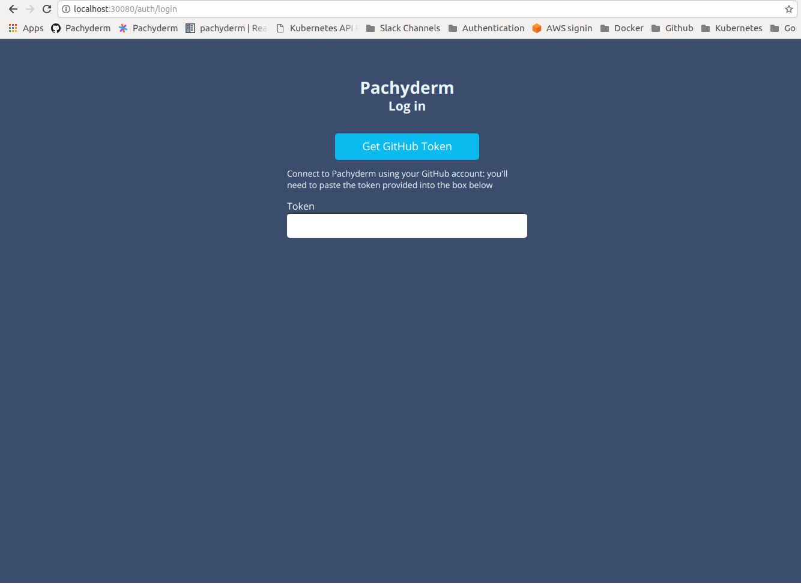
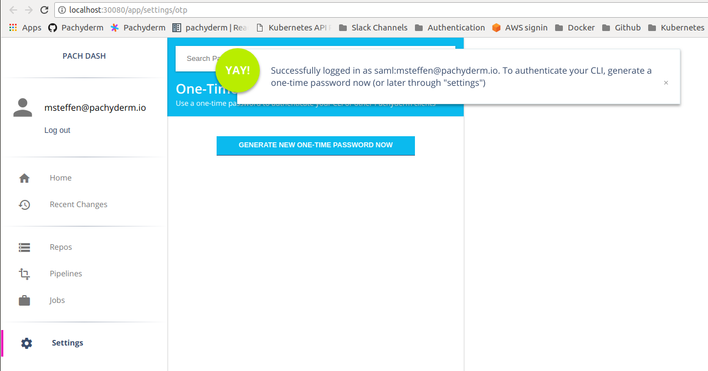
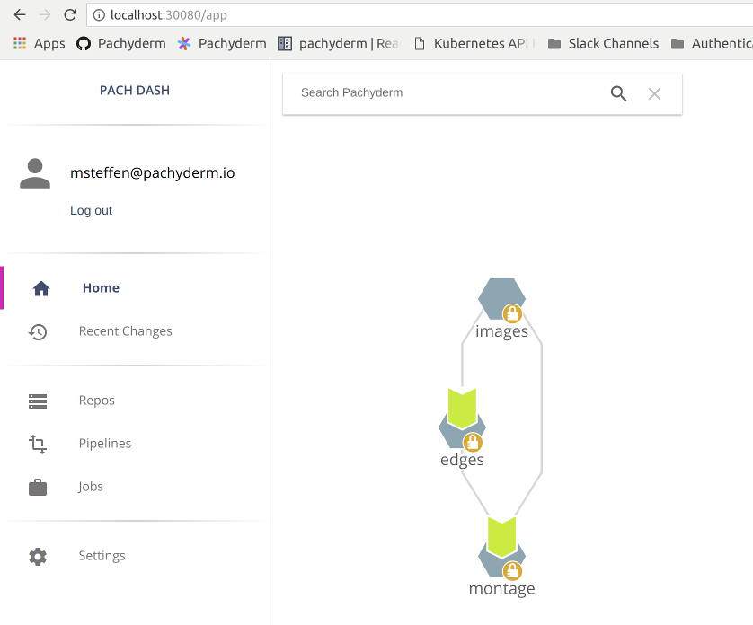
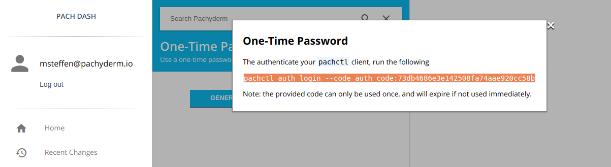
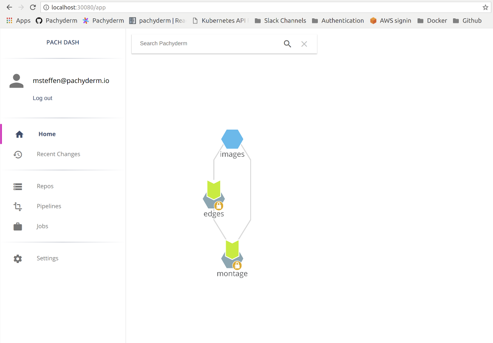
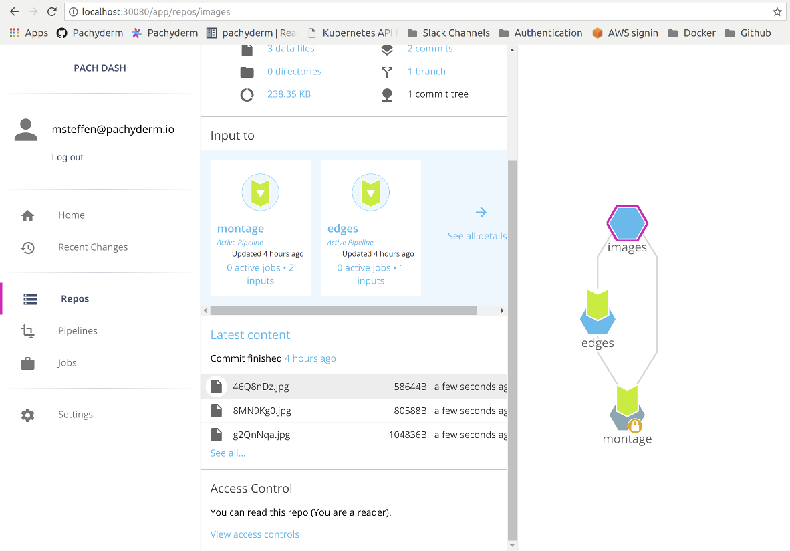
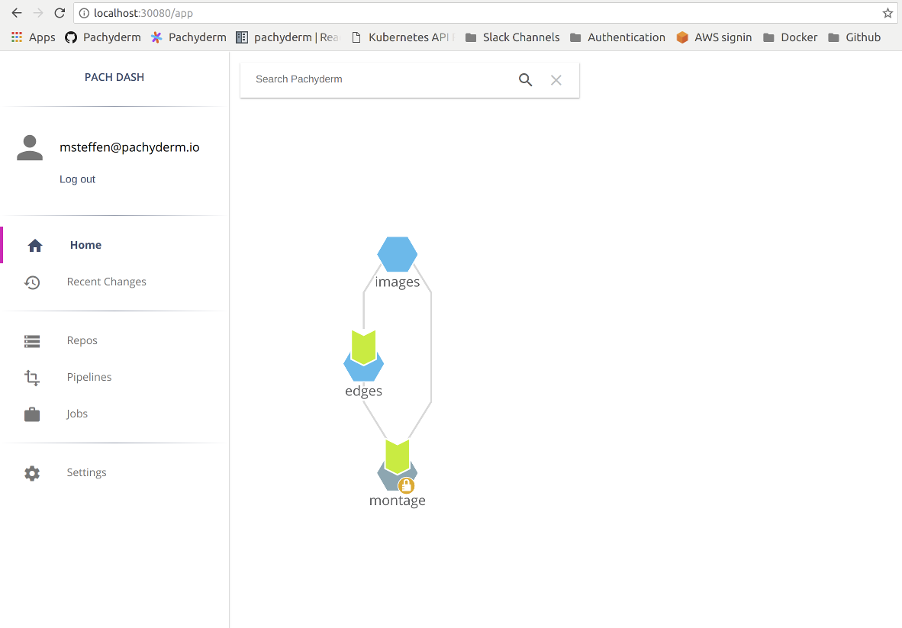
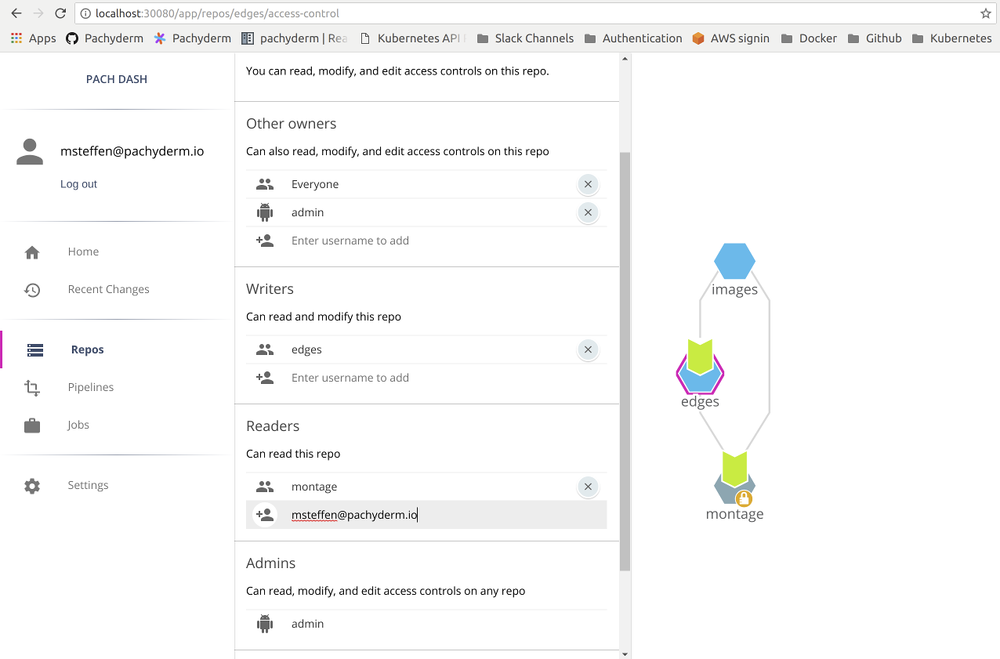

# Authentication and Authorization using SAML IDP - An example

## Run pipelines on your cluster as a cluster admin
Before you start, follow the instructions in [Configure SAML](index.md) to enable auth in a
Pachyderm cluster and connect it to a SAML ID provider. 

We will then authenticate as a **cluster admin** in one console and run our [open CV
demo](https://github.com/pachyderm/pachyderm/blob/1.13.x/examples/opencv/README.md).

- In the CLI, that would look like:

    ```shell
    pachctl auth use-auth-token
    ```

    **System response:**
    ```
    Please paste your Pachyderm auth token:
    <auth token>
    ```

    ```shell
    pachctl auth whoami
    ```

    **System response:**
    ```
    You are "robot:admin"
    You are an administrator of this Pachyderm cluster
    ```

- As the **cluster admin**, create a repository, pipelines, and put files into the
repository.

    ```shell
    pachctl create repo images
    pachctl create pipeline -f examples/opencv/edges.json
    pachctl create pipeline -f examples/opencv/montage.json
    pachctl put file images@master -i examples/opencv/images.txt
    pachctl put file images@master -i examples/opencv/images2.txt
    ```

    View the list of existing repositories:

    ```shell
    pachctl list repo
    ```

    **System response:**
    ```
    NAME    CREATED       SIZE (MASTER) ACCESS LEVEL
    montage 2 minutes ago 1.653MiB      OWNER
    edges   2 minutes ago 133.6KiB      OWNER
    images  2 minutes ago 238.3KiB      OWNER
    ```

    ... And the list of jobs:

    ```shell
    pachctl list job
    ```

    **System response:**
    ```shell
    ID                               OUTPUT COMMIT                            STARTED       DURATION  RESTART PROGRESS  DL       UL       STATE
    023a478b16e849b4996c19632fee6782 montage/e3dd7e9cacc5450c92e0e62ab844bd26 2 minutes ago 8 seconds 0       1 + 0 / 1 371.9KiB 1.283MiB success
    fe8b409e0db54f96bbb757d4d0679186 edges/9cc634a63f794a14a78e931bea47fa73   2 minutes ago 5 seconds 0       2 + 1 / 3 181.1KiB 111.4KiB success
    152cb8a0b0854d44affb4bf4bd57228f montage/82a49260595246fe8f6a7d381e092650 2 minutes ago 5 seconds 0       1 + 0 / 1 79.49KiB 378.6KiB success
    86e6eb4ae1e74745b993c2e47eba05e9 edges/ee7ebdddd31d46d1af10cee25f17870b   2 minutes ago 4 seconds 0       1 + 0 / 1 57.27KiB 22.22KiB success
    ```
## Authenticating via a SAML ID Provider in the dashboard as a non admin user
Before authenticating, navigating to the dash will yield a blank screen:



Even through the dash suggests logging in via GitHub, we will log in using a
SAML IdP (which has hopefully already been configured). To see your Pachyderm
DAG, navigate to your SAML ID provider and sign in to your Pachyderm cluster.

Once you have authenticated, you will be redirected to the Pachyderm Dash (the
redirect URL is configured in the Pachyderm auth system). You will be given the
opportunity to generate a one-time password (OTP), though you can always do this
later from the settings panel.



After closing the OTP panel, you will be able to see the Pachyderm DAG, but you
may not have access to any of the repos inside (a repo that you cannot read is
indicated by a lock symbol):



## Authenticating in the CLI as a non admin user
After authenticating in the dash, you will be given the opportunity to generate a
one-time password (OTP) and sign in on the CLI. You can also generate an OTP
from the settings panel:



```shell
    pachctl auth login --code auth_code:73db4686e3e142508fa74aae920cc58b
    pachctl auth whoami
```

**System response:**

```
    You are "saml:msteffen@pachyderm.io"
    session expires: 14 Sep 18 20:55 PDT
```

Note that this session expires after 8 hours. The duration of sessions is
configurable in the Pachyderm auth config, but it is important that they be
relatively short, as SAML group memberships are only updated when users sign in.
If a user is removed from a group, they will still be able to access the group's
resources until their session expires.

## Authorizing a user or group to access data

We will give the example of an **admin granting a user access**. This can be
accomplished on the CLI :

```shell
    pachctl auth set saml:msteffen@pachyderm.io reader images
```

Now, the `images` repo is no longer locked when that user views the DAG:



At this point, you can click on the `images` repo and preview data inside:



Likewise, you can grant access to repos via **groups**. You will need a SAML ID
provider that supports group attributes, and you will need to put the name of that
attribute in the Pachyderm auth config. Here, we will grant access to the *Everyone*
group:

```shell
    pachctl auth set group/saml:Everyone owner edges
```

Now, the edges repo is also not locked:



!!! Note
    Because `msteffen@pachyderm.io` has OWNER provileges in the `edges` repo
    (via the *Everyone* group), the ACL for `edges` can be edited.
    `msteffen@pachyderm.io` will use OWNER privileges gained via the Everyone group
    to add `msteffen@pachyderm.io` (the user principal) directly to that ACL:

    

    This change is reflected in the CLI as well:

    ```shell
        pachctl auth get edges
    ```
    **System response:**

    ```
        pipeline:edges: WRITER
        pipeline:montage: READER
        group/saml:Everyone: OWNER
        saml:msteffen@pachyderm.io: READER
        robot:admin: OWNER
    ```

