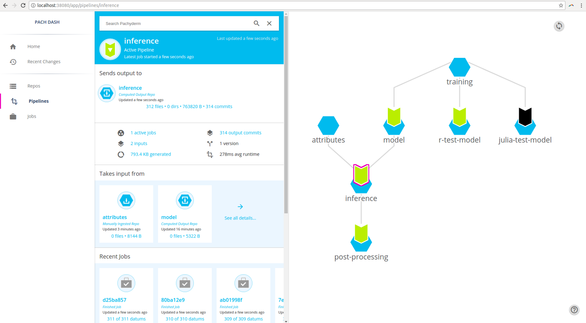
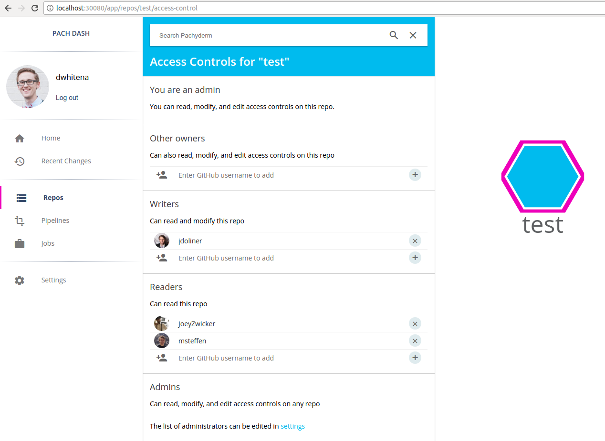
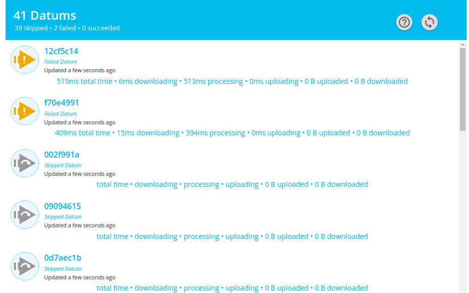

# Overview

Pachyderm Enterprise Edition includes everything you need to scale and manage Pachyderm data pipelines in an enterprise setting. It delivers the most recent version of the Community Edition of Pachyderm along with:

- [**A visual and interactive interface to Pachyderm**](#pipeline-visualization-and-data-exploration) 
- [**Administrative and security features**](#access-control) needed for enterprise-scale implementations of Pachyderm  
- [**Detailed job and data statistics**](#advanced-statistics) for faster development and data insight

Pachyderm Enterprise Edition can be deployed easily on top of an existing or new deployment of Pachyderm, and we have engineers available to help enterprise customers get up and running very quickly.  To get more information about Pachyderm Enterprise Edition, to ask questions, or to get access for evaluation, please contact us at [sales@pachyderm.io](mailto:sales@pachyderm.io) or on our [Slack](https://www.pachyderm.com/slack/). 

!!! Warning "THE ENTERPRISE EDITION LIFTS **ALL SCALING LIMITATIONS**"
     Note that the activation of the Enterprise Edition [**lifts all scaling limits of the Community Edition**](../../reference/scaling-limits/). You can run as many pipelines as you need and parallelize your jobs without constraints.

## Pipeline Visualization and Data Exploration

Pachyderm Enterprise Edition includes a full UI for visualizing pipelines and exploring data.  Pachyderm Enterprise will automatically infer the structure of data scientists' DAG pipelines and display them visually.  Data scientists and cluster admins can even click on individual segments of the pipelines to see what data is being processed, how many jobs have run, what images and commands are being run, and much more!  Data scientists can also explore the versioned data in Pachyderm data repositories and see how the state of data has changed over time.  

## Access Control

Enterprise-scale deployments require access controls and multitenancy.  Pachyderm Enterprise Edition gives teams the ability to control access to production pipelines, data, and configuration.  Administrators can silo data, prevent unintended modifications to production pipelines, and support multiple data scientists or even multiple data science groups.

## Advanced Statistics 

Pachyderm Enterprise Edition gives data scientists advanced insights into their data, jobs, and results. For example, data scientists can see how much time jobs spend downloading/uploading data, what data was processed or skipped, and which workers were given particular datums. This information can be explored programmatically or via a number of charts and plots that help users parse the information quickly.

