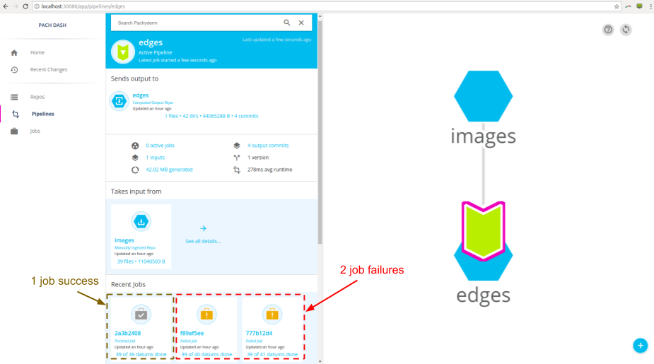
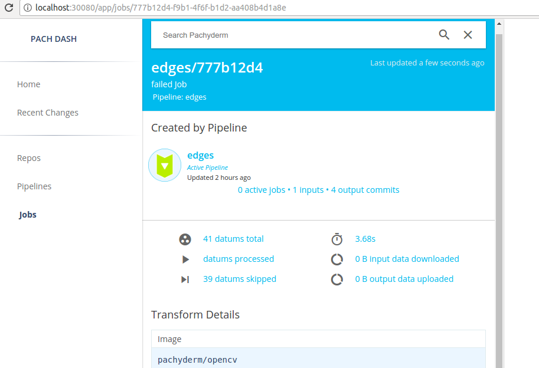
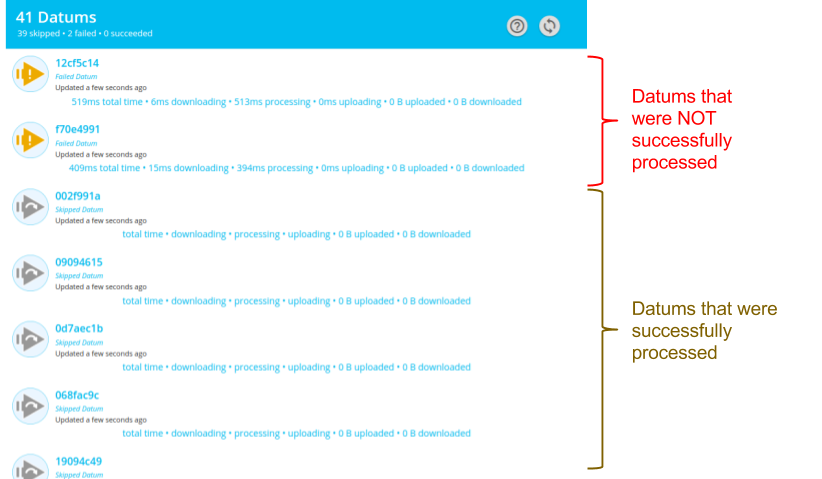
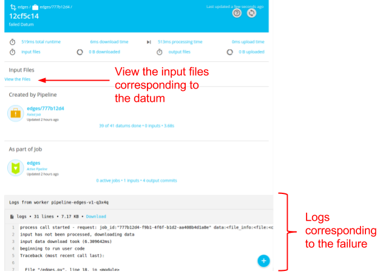

# Advanced Statistics

To use the advanced statistics features in Pachyderm, you need to:

1. Run your pipelines on a Pachyderm cluster.
2. Enable stats collection in your pipelines by including
   `"enable_stats": true` in your [pipeline specification](https://docs.pachyderm.com/latest/reference/pipeline_spec/#enable-stats-optional).

Advanced statistics provides the following information for any jobs
corresponding to your pipelines:

- The amount of data that was uploaded and downloaded during the job and on a per-datum
  level.
- The time spend uploading and downloading data on a per-datum level.
- The amount of data uploaded and downloaded on a per-datum level.
- The total time spend processing on a per-datum level.
- Success/failure information on a per-datum level.
- The directory structure of input data that was seen by the job.

The primary and recommended way to view this information is via the
Pachyderm Enterprise dashboard. However, the same information is
available through the `pachctl inspect datum` and `pachctl list datum`
commands or through their language client equivalents.

!!! note
    Pachyderm recommends that you enable stats for all of your pipelines
    and only disabling the feature for very stable, long-running pipelines.
    In most cases, the debugging and maintenance benefits of the stats data
    outweigh any disadvantages of storing the extra data associated with
    the stats. Also note, none of your data is duplicated in producing the stats.

## Enabling Stats for a Pipeline

As mentioned above, enabling stats collection for a pipeline is as simple as
adding the `"enable_stats": true` field to a pipeline specification. For
example, to enable stats collection for the [OpenCV demo pipeline](../getting_started/beginner_tutorial.md),
modify the pipeline specification as follows:

!!! example

    ```shell
    {
      "pipeline": {
        "name": "edges"
      },
      "input": {
        "pfs": {
          "glob": "/*",
          "repo": "images"
        }
      },
      "transform": {
        "cmd": [ "python3", "/edges.py" ],
        "image": "pachyderm/opencv"
      },
      "enable_stats": true
    }
    ```

## Listing Stats for a Pipeline

Once the pipeline has been created and you have use it to process data,
you can confirm that stats are being collected with `list file`. There
should now be stats data in the output repo of the pipeline under a
branch called `stats`:

!!! example

    ```shell
    pachctl list file edges@stats
    ```

    **System response:**

    ```shell
    NAME                                                               TYPE                SIZE
    002f991aa9db9f0c44a92a30dff8ab22e788f86cc851bec80d5a74e05ad12868   dir                 342.7KiB
    0597f2df3f37f1bb5b9bcd6397841f30c62b2b009e79653f9a97f5f13432cf09   dir                 1.177MiB
    068fac9c3165421b4e54b358630acd2c29f23ebf293e04be5aa52c6750d3374e   dir                 270.3KiB
    0909461500ce508c330ca643f3103f964a383479097319dbf4954de99f92f9d9   dir                 109.6KiB
    ...
    ```

## Accessing Stats through the command line

To view the stats for a specific datum you can use a `list file`:

!!! example

    ```shell
    pachctl list file edges@stats:/002f991aa9db9f0c44a92a30dff8ab22e788f86cc851bec80d5a74e05ad12868
    ```

    **System response:**

    ```shell
    NAME                                                                                                   TYPE SIZE     
    /002f991aa9db9f0c44a92a30dff8ab22e788f86cc851bec80d5a74e05ad12868/index                                file 1B       
    /002f991aa9db9f0c44a92a30dff8ab22e788f86cc851bec80d5a74e05ad12868/job:e448275f92604db0aa77770bddf24610 file 0B       
    /002f991aa9db9f0c44a92a30dff8ab22e788f86cc851bec80d5a74e05ad12868/logs                                 file 0B       
    /002f991aa9db9f0c44a92a30dff8ab22e788f86cc851bec80d5a74e05ad12868/pfs                                  dir  115.9KiB 
    /002f991aa9db9f0c44a92a30dff8ab22e788f86cc851bec80d5a74e05ad12868/stats                                file 136B
    ```

The files: index, job, logs and stats are metadata files that can be accessed using a `get file`:

!!! example

    ```shell
    pachctl get file edges@stats:/002f991aa9db9f0c44a92a30dff8ab22e788f86cc851bec80d5a74e05ad12868/stats
    ```

    **System response:**

    ```shell    {"downloadTime":"0.211353702s","processTime":"0.474949018s","uploadTime":"0.567586547s","downloadBytes":"80588","uploadBytes":"38046"}
    ```

The pfs directory has both the input and the output data that was committed in this datum:

!!! example

    ```shell
    pachctl list file edges@stats:/002f991aa9db9f0c44a92a30dff8ab22e788f86cc851bec80d5a74e05ad12868/pfs
    ```

    **System response:**

    ```shell    NAME                                                                         TYPE SIZE     
    /002f991aa9db9f0c44a92a30dff8ab22e788f86cc851bec80d5a74e05ad12868/pfs/images dir  78.7KiB  
    /002f991aa9db9f0c44a92a30dff8ab22e788f86cc851bec80d5a74e05ad12868/pfs/out    dir  37.15KiB
    ```

## Accessing Stats Through the Dashboard

If you have deployed and activated the Pachyderm Enterprise
Edition, you can explore advanced statistics through the dashboard. For example, if you
navigate to the `edges` pipeline, you might see something similar to this:



In this example case, you can see that the pipeline has 1 recent successful
job and 2 recent job failures. Pachyderm advanced stats can be very helpful
in debugging these job failures. When you click on one of the job failures,
can see general stats about the failed job, such as total time, total data
upload/download, and so on:



To get more granular per-datum stats, click on the `41 datums total`, to get
the following information:



You can identify the exact datums that caused the pipeline to fail, as well
as the associated stats:

- Total time
- Time spent downloading data
- Time spent processing
- Time spent uploading data
- Amount of data downloaded
- Amount of data uploaded

If we need to, you can even go a level deeper and explore the exact details
of a failed datum. Clicking on one of the failed datums reveals the logs
that corresponds to the datum processing failure along with the exact input
files of the datum:


