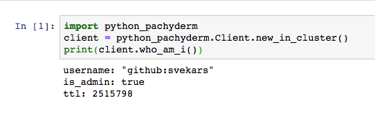

# Using `python-pachyderm` with Pachyderm IDE

If you deployed Pachyderm IDE,
the `python-pachyderm` client is preinstalled in your Pachyderm IDE instance.

This section describes a few basic operations that you can execute from Pachyderm IDE
to interact with Pachyderm.

After you log in, use the [python-pachyderm](https://pachyderm.github.io/python-pachyderm/python_pachyderm.html#header-functions)
client API to manage Pachyderm directly from your Jupyter notebook.

The following code initializes the Python Pachyderm client in Pachyderm IDE:

```python
import python_pachyderm
client = python_pachyderm.Client.new_in_cluster()
```

For example, you can check the current user by
running the following code:

```python
import python_pachyderm
client = python_pachyderm.Client.new_in_cluster()
print(client.who_am_i())
```

The following screenshot demonstrates how this looks in Pachyderm IDE:


!!! note
    If you have not enabled Pachyderm authentication, this
    code returns an error.

## Create a Pipeline

As discussed in [Difference in Pipeline Creation Methods](../../use-pachyderm-ide/#difference-in-pipeline-creation-methods),
you can use the standard `create_pipeline` method or `create_python_pipeline`
function to create Pachyderm pipelines in Pachyderm IDE. Depending on your
choice, use one of the following examples to create a pipeline:

* By using the `create_python_pipeline` method:

    ```python
    import python_pachyderm
    client = python_pachyderm.Client.new_in_cluster()

    def relpath(path):
        return os.path.join(os.path.dirname(os.path.abspath(__file__)), path)

    python_pachyderm.create_python_pipeline(
        client,
        relpath("test"),
        python_pachyderm.Input(pfs=python_pachyderm.PFSInput(glob="/*", repo="input_repo")),
    )
    client.list_pipeline()
    ```

    This code likely will not work as is. To run a pipeline, you need to specify
    `main.py` and `requirements.txt` files in the root directory of your
    JupyterHub notebook. For more information, see the
    [OpenCV example](https://github.com/pachyderm/python-pachyderm/blob/1.13.x/examples/opencv/opencv.py).

* By using the `create_pipeline` method:

    !!! note
        The input repository must exist. Therefore, in the
        code below we first create the repository and then
        create the pipeline.

    ```python
    import python_pachyderm
    client = python_pachyderm.Client.new_in_cluster()
    client.create_repo('test')

    client.create_pipeline(
        "test",
        transform=python_pachyderm.Transform(cmd=["python3", "/test.py"], image="mytest/testimage"),
        input=python_pachyderm.Input(pfs=python_pachyderm.PFSInput(glob="/", repo="input_repo")),
    )
    client.list_pipeline()
    ```

    **System response:**

    ```
    pipeline_info {
      pipeline {
        name: "test"
      }
      transform {
        image: "mytest/testimage"
        cmd: "python3"
        cmd: "/test.py"
      }
      created_at {
        seconds: 1578520420
        nanos: 789017291
      }
      version: 1
      output_branch: "master"
      resource_requests {
        memory: "64M"
      }
      input {
        pfs {
          name: "input_repo"
          repo: "input_repo"
          branch: "master"
          glob: "/"
        }
      }
      cache_size: "64M"
      salt: "8e57267114c24419a685e250e0fd491b"
      max_queue_size: 1
      spec_commit {
        repo {
          name: "__spec__"
        }
        id: "c83631246a2142cdb93c7a6e4d16fcd2"
      }
      datum_tries: 3
    }
    ```

For more information, see the
[OpenCV example](https://github.com/pachyderm/python-pachyderm/blob/1.13.x/examples/opencv/opencv.py).

## Create a Repository

To create a repository, run the following code:

```python
import python_pachyderm
client = python_pachyderm.Client.new_in_cluster()
client.create_repo('<repo-name>')
client.list_repo()
```

**Example:**

```python
import python_pachyderm
client = python_pachyderm.Client.new_in_cluster()
client.create_repo('test')
client.list_repo()
```

**System Response:**

```
[repo {
name: "test"
}
created {
  seconds: 1576869000
  nanos: 886123695
}
auth_info {
  access_level: OWNER
}
]
```

## Add Files to a Repository

To add a file to a repository, run the following code:

```python
client.put_file_url("<repo-name>/<branch>", "<filename>", "<path-to-file>")
```

**Example:**

```python
client.put_file_url("images/master", "46Q8nDz.jpg", "http://imgur.com/46Q8nDz.jpg")
```

## Delete a Repository

To delete a repository, run the following code:

```python
import python_pachyderm
client = python_pachyderm.Client.new_in_cluster()
client.delete_repo('test')
client.list_repo()
```

**System Response:**

```
[]
```

## Update Your Pipeline

When you need to update your pipeline, you can do so directly in the
Pachyderm IDE by modifying the corresponding notebook and running it
again. If you use the `create_python_pipeline` function that uses the
code stored in a local directory, you can update the pipeline directly
in the Pachyderm IDE by adding the `update=True` parameter to your
code into a new Jupyter notebook cell and running it.

**Example:**

```python hl_lines="8"
import os
import python_pachyderm
client = python_pachyderm.Client.new_in_cluster()
python_pachyderm.create_python_pipeline(
    client,
    "./edges",
    python_pachyderm.Input(pfs=python_pachyderm.PFSInput(glob="/*", repo="images")),
    update=True
)
```

If you are using the standard `create_pipeline` method,
you need to rebuild and push your Docker container to your image
registry. Then, you need to update the image tag in your pipeline
creation code and run `create_pipeline` with `update=True`.

## Example

To get started with Pachyderm IDE, try the
[OpenCV example for JupyterHub](https://github.com/pachyderm/jupyterhub-pachyderm/blob/master/doc/opencv.md).

This example walks you through the same steps as in the
[Beginner Tutorial](../../../getting-started/beginner-tutorial/) but using the
`python-pachyderm` client instead of `pachctl` or the Pachyderm UI.
