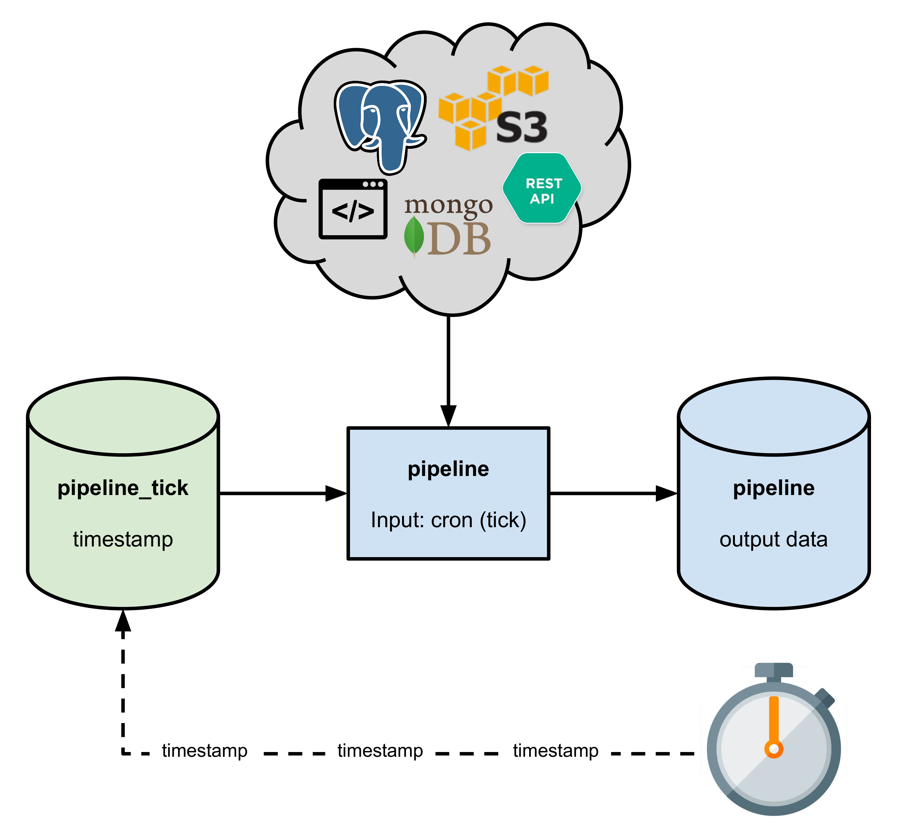

# Cron Pipeline

Pachyderm triggers pipelines when new changes appear in the input repository.
However, if you want to trigger a pipeline based on time instead of upon
arrival of input data, you can schedule such pipelines to run periodically
by using the Pachyderm built-in cron input type.

A standard pipeline with a PFS input might not satisfy
the requirements of the following tasks:

- Scrape websites
- Make API calls
- Query a database
- Retrieve a file from a location accessible through an S3 protocol
or a File Transfer Protocol (FTP).

A minimum cron pipeline must include the following parameters:

| Parameter  | Description  |
| ---------- | ------------ |
| `"name"`   | A descriptive name of the cron pipeline. |
| `"spec"`   | An interval between scheduled cron jobs. You can specify any value that is <br> formatted according to [RFC 3339](https://www.ietf.org/rfc/rfc3339.txt){target=_blank}. <br> For example, if you set `*/10 * * * *`, the pipeline runs every ten minutes. |

## Example of a Cron Pipeline

For example, you want to query a database every ten seconds and update your
dataset with the new data every time the pipeline is triggered. The following
pipeline extract illustrates how you can specify this configuration.

!!! example

    ```json
      "input": {
        "cron": {
          "name": "tick",
          "spec": "@every 10s"
        }
      }
    ```

When you create this pipeline, Pachyderm creates a new input data repository
that corresponds to the `cron` input. Then, Pachyderm automatically commits
a timestamp file to the `cron` input repository every ten seconds, which
triggers the pipeline.



The pipeline runs every ten seconds, queries the database and updates its
output. By default, each cron trigger adds a new tick file to the cron input
repository, accumulating more datums over time. This behavior works for some
pipelines. For others, you might want each tick file to overwrite the
previous one. You can set the overwrite flag to true to overwrite the
timestamp file on each tick. To learn more about overwriting commits in
Pachyderm, see [Datum processing](../datum/index.md).

!!! example

    ```json
      "input": {
        "cron": {
          "name": "tick",
          "spec": "@every 10s",
          "overwrite": true
        }
      }
    ```

!!! note "See Also:"
    [Periodic Ingress from MongoDB](https://github.com/pachyderm/pachyderm/tree/2.0.x/examples/db){target=_blank}
