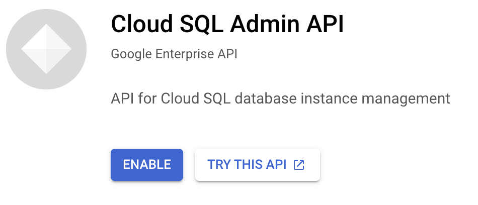

# Google Cloud Platform

For a quick test installation of Pachyderm on GCP (suitable for development), jump to our [Quickstart page](../quickstart/).

!!! Important "Before your start your installation process." 
      - Refer to our generic ["Helm Install"](./helm-install.md) page for more information on how to install and get started with `Helm`.
      - Read our [infrastructure recommendations](../ingress/). You will find instructions on how to set up an ingress controller, a load balancer, or connect an Identity Provider for access control. 
      - If you are planning to install Pachyderm UI. Read our [Console deployment](../console/) instructions. Note that, unless your deployment is `LOCAL` (i.e., on a local machine for development only, for example, on Minikube or Docker Desktop), the deployment of Console requires, at a minimum, the set up of an Ingress.

The following section walks you through deploying a Pachyderm cluster on [Google Kubernetes Engine](https://cloud.google.com/kubernetes-engine/){target=_blank} (GKE). 

In particular, you will:

1. Make a few [client installations](#1-prerequisites) before you start.
1. [Deploy Kubernetes](#2-deploy-kubernetes).

    !!! Attention
        For users who want to use an existing cluster, make sure to enable [Workload Identity](https://cloud.google.com/kubernetes-engine/docs/how-to/workload-identity){target=_blank}. For users creating a new cluster, the script provided in this documentation takes care of it.

1. [Create an GCS bucket](#3-create-a-gcs-bucket) for your data and grant Pachyderm access.
1. [Enable The Creation of Persistent Volumes](#4-persistent-volumes-creation)
1. [Create A GCP Managed PostgreSQL Instance](#5-create-a-gcp-managed-postgresql-database)
1. [Deploy Pachyderm ](#6-deploy-pachyderm)
1. Finally, you will need to install [pachctl](../../../getting-started/local-installation/#install-pachctl) to [interact with your cluster](#7-have-pachctl-and-your-cluster-communicate).
1. And check that your cluster is [up and running](#8-check-that-your-cluster-is-up-and-running)

!!! Warning "TL;DR - Give me the script"

    [This script](https://github.com/pachyderm/pachyderm/blob/2.0.x/etc/deploy/gcp/gcp-doco-script.sh){target=_blank} will create a GKE cluster, the workload identity service accounts and permissions you need, a static IP, the cloud SQL instance and databases, and a cloud storage bucket. It will also install Pachyderm into the cluster. 

      - Before running it, update the global variables at the top of the script and make sure to go through the [prerequisites](#1-prerequisites), as we are assuming that you have created a project and enabled the necessary APIs.  
      Note that it will also create a file called ${NAME}.values.yaml in the current directory.

    - Once your script has run, [configure your context](#7-have-pachctl-and-your-cluster-communicate)   and [check that your cluster is up and running](#8-check-that-your-cluster-is-up-and-running).


## 1. Prerequisites

Install the following clients:

- [Google Cloud SDK](https://cloud.google.com/sdk/){target=_blank} >= 124.0.0
- [kubectl](https://kubernetes.io/docs/tasks/tools/){target=_blank}
- [pachctl](../../../getting-started/local-installation/#install-pachctl)
- [jq](https://stedolan.github.io/jq/download/){target=_blank}

If this is the first time you use the SDK, follow
the [Google SDK QuickStart Guide](https://cloud.google.com/sdk/docs/quickstarts){target=_blank}.

!!! tip
    You can install `kubectl` by using the Google Cloud SDK and
    running the following command:

    ```shell
    gcloud components install kubectl
    ```

Additionally, before you begin your installation: 

- make sure to [create a new Project](https://cloud.google.com/resource-manager/docs/creating-managing-projects){target=_blank} or retrieve the ID of an existing Project you want to deploy your cluster on. 

    All of the commands in this section are **assuming that you are going to set your gcloud config to automatically select your project**.  Please take the time to do so now with the following command, or be aware you will need to pass additional project parameters to the rest of the commands in this documentation.

    ```shell
    PROJECT_ID=<your project ID>

    gcloud config set project ${PROJECT_ID}
    ```

- [Enable the GKE API on your project](https://console.cloud.google.com/apis/library/container.googleapis.com?q=kubernetes%20engine){target=_blank} if you have not done so already.

- Enable the [CloudSQL Admin API](https://cloud.google.com/sql/docs/postgres/admin-api){target=_blank} to administer your instance. 

    - In Google Cloud Console, on your Project's *Dashboard* View, click the *Go to APIs Overview* link in the APIs Section.
    - On the *APIs & Services* page, click the *+Enable APIs and Services* tab, search for `CloudSQL Admin`, then click *Cloud SQL Admin API*. Click the *Enable* button. Et voilà!

  


## 2. Deploy Kubernetes

!!! Attention
    Pachyderm recommends running your cluster on Kubernetes 1.19.0 and above.


To create a new Kubernetes cluster by using GKE, run:

```shell
CLUSTER_NAME=<any unique name, e.g. "pach-cluster">

GCP_ZONE=<a GCP availability zone. e.g. "us-west1-a">

gcloud config set compute/zone ${GCP_ZONE}

gcloud config set container/cluster ${CLUSTER_NAME}

MACHINE_TYPE=<machine type for the k8s nodes, we recommend "n1-standard-4" or larger>
```

!!! Note
    Adding `--scopes storage-rw` to the `gcloud container clusters create ${CLUSTER_NAME} --machine-type ${MACHINE_TYPE}` command below will grant the rw scope to whatever service account is on the cluster, which if you don’t provide it, is the default compute service account for the project which has Editor permissions. While this is **not recommended in any production settings**, this option can be useful for a quick setup in development. In that scenario, you do not need any service account or additional GCP Bucket permission (see below).


```shell
# By default the following command spins up a 3-node cluster. You can change the default with `--num-nodes VAL`.

gcloud container clusters create ${CLUSTER_NAME} \
 --machine-type=${MACHINE_TYPE} \
 --workload-pool=${PROJECT_ID}.svc.id.goog \
 --enable-ip-alias \
 --create-subnetwork="" \
 --enable-stackdriver-kubernetes \
 --enable-dataplane-v2 \
 --enable-shielded-nodes \
 --release-channel="regular" \
 --workload-metadata="GKE_METADATA" \
 --enable-autorepair \
 --enable-autoupgrade \
 --disk-type="pd-ssd" \
 --image-type="COS_CONTAINERD"
```
```shell
# By default, GKE clusters have RBAC enabled. To allow the 'helm install' to give the 'pachyderm' service account
# the requisite privileges via clusterrolebindings, you will need to grant *your user account* the privileges
# needed to create those clusterrolebindings.
#
# Note that this command is simple and concise, but gives your user account more privileges than necessary. See
# https://docs.pachyderm.io/en/latest/deploy-manage/deploy/rbac/ for the complete list of privileges that the
# pachyderm serviceaccount needs.
kubectl create clusterrolebinding cluster-admin-binding --clusterrole=cluster-admin --user=$(gcloud config get-value account)
```

This might take a few minutes to start up. You can check the status on
the [GCP Console](https://console.cloud.google.com/compute/instances){target=_blank}.
A `kubeconfig` entry is automatically generated and set as the current
context. As a sanity check, make sure your cluster is up and running
by running the following `kubectl` command:

```shell
# List all pods in the kube-system namespace.
kubectl get pods -n kube-system
```

**System Response:**

```shell
NAME                                                        READY   STATUS    RESTARTS   AGE
event-exporter-gke-67986489c8-j4jr8                         2/2     Running   0          3m21s
fluentbit-gke-499hn                                         2/2     Running   0          3m6s
fluentbit-gke-7xp2f                                         2/2     Running   0          3m6s
fluentbit-gke-jx7wt                                         2/2     Running   0          3m6s
gke-metrics-agent-jmqsl                                     1/1     Running   0          3m6s
gke-metrics-agent-rd5pr                                     1/1     Running   0          3m6s
gke-metrics-agent-xxl52                                     1/1     Running   0          3m6s
kube-dns-6c7b8dc9f9-ff4bz                                   4/4     Running   0          3m16s
kube-dns-6c7b8dc9f9-mfjrt                                   4/4     Running   0          2m27s
kube-dns-autoscaler-58cbd4f75c-rl2br                        1/1     Running   0          3m16s
kube-proxy-gke-nad-cluster-default-pool-2e5710dd-38wz       1/1     Running   0          105s
kube-proxy-gke-nad-cluster-default-pool-2e5710dd-4b7j       1/1     Running   0          3m6s
kube-proxy-gke-nad-cluster-default-pool-2e5710dd-zmzh       1/1     Running   0          3m5s
l7-default-backend-66579f5d7-2q64d                          1/1     Running   0          3m21s
metrics-server-v0.3.6-6c47ffd7d7-k2hmc                      2/2     Running   0          2m38s
pdcsi-node-7dtbc                                            2/2     Running   0          3m6s
pdcsi-node-bcbcl                                            2/2     Running   0          3m6s
pdcsi-node-jl8hl                                            2/2     Running   0          3m6s
stackdriver-metadata-agent-cluster-level-85d6d797b4-4l457   2/2     Running   0          2m14s
```

If you *don't* see something similar to the above output,
you can point `kubectl` to the new cluster manually by running
the following command:

```shell
# Update your kubeconfig to point at your newly created cluster.
gcloud container clusters get-credentials ${CLUSTER_NAME}
```
Once your Kubernetes cluster is up, and your infrastructure configured, you are ready to prepare for the installation of Pachyderm. Some of the steps below will require you to keep updating the values.yaml started during the setup of the recommended infrastructure:
## 3. Create a GCS Bucket

### Create an GCS object store bucket for your data

Pachyderm needs a [GCS bucket](https://cloud.google.com/storage/docs/){target=_blank} (Object store) to store your data. You can create the bucket by running the following commands:

!!! Warning
     The GCS bucket name must be globally unique.

* Set up the following system variables:

      * `BUCKET_NAME` — A globally unique GCP bucket name where your data will be stored.
      * `GCP_REGION` — The GCP region of your Kubernetes cluster e.g. "us-west1".

* Create the bucket:
     ```
     gsutil mb -l ${GCP_REGION}  gs://${BUCKET_NAME} 
     ```

* Check that everything has been set up correctly:

     ```shell
     gsutil ls
     # You should see the bucket you created.
     ```

You now need to **give Pachyderm access to your GCP resources**.

### Set Up Your GCP Service Account
To access your GCP resources, Pachyderm uses a GCP Project Service Account with permissioned access to your desired resources. 

* Create a Service Account with Google Cloud Console

    In the **IAM & Admin** section of your Google Cloud Console sidebar, select *Service Accounts*. To create a new service, select the *Create Service Account* button at the top. 

    Fill in the Service Account *Name*, *ID* and *Description* then click *Create*. Keep the full name of your service account handy, you will need it soon.

* Alternatively, you can use Google cli 

    ```shell
    GSA_NAME=<Your Google Service Account Name>

    gcloud iam service-accounts create ${GSA_NAME}
    ```
    
More information about the creation and management of a Service account on [GCP documentation](https://cloud.google.com/iam/docs/creating-managing-service-accounts){target=_blank}.

### Configure Your Service Account Permissions

For Pachyderm to access your Google Cloud Resources, run the following:

- Create the following set of variables

    ```shell
    SERVICE_ACCOUNT="${GSA_NAME}@${PROJECT_ID}.iam.gserviceaccount.com"

    # "default" or the namespace in which your cluster was deployed
    K8S_NAMESPACE="default" 

    PACH_WI="serviceAccount:${PROJECT_ID}.svc.id.goog[${K8S_NAMESPACE}/pachyderm]"
    SIDECAR_WI="serviceAccount:${PROJECT_ID}.svc.id.goog[${K8S_NAMESPACE}/pachyderm-worker]"
    CLOUDSQLAUTHPROXY_WI="serviceAccount:${PROJECT_ID}.svc.id.goog[${K8S_NAMESPACE}/k8s-cloudsql-auth-proxy]"
    ```

- Grant access to cloudSQL and your bucket to the Service Account

    ```shell
    # Grant access to cloudSQL to the Service Account
    gcloud projects add-iam-policy-binding ${PROJECT_ID} \
        --member="serviceAccount:${SERVICE_ACCOUNT}" \
        --role="roles/cloudsql.client"

    # Grant access to storage (bucket + volumes) to the Service Account
    gcloud projects add-iam-policy-binding ${PROJECT_ID} \
        --member="serviceAccount:${SERVICE_ACCOUNT}" \
        --role="roles/storage.admin"
    ```

- Use [Workload Identity](https://cloud.google.com/kubernetes-engine/docs/how-to/workload-identity){target=_blank} to run Pachyderm Services as the Service Account 

    Workload Identity is the recommended way to access Google Cloud services from applications running within GKE. 

    ```shell
    gcloud iam service-accounts add-iam-policy-binding ${SERVICE_ACCOUNT} \
        --role roles/iam.workloadIdentityUser \
        --member "${PACH_WI}"

    gcloud iam service-accounts add-iam-policy-binding ${SERVICE_ACCOUNT} \
        --role roles/iam.workloadIdentityUser \
        --member "${SIDECAR_WI}"

    gcloud iam service-accounts add-iam-policy-binding ${SERVICE_ACCOUNT} \
        --role roles/iam.workloadIdentityUser \
        --member "${CLOUDSQLAUTHPROXY_WI}"
    ```

For a set of standard roles, read the [GCP IAM permissions documentation](https://cloud.google.com/storage/docs/access-control/iam-permissions#bucket_permissions){target=_blank}.

## 4. Persistent Volumes Creation

etcd and PostgreSQL (metadata storage) each claim the creation of a [persistent disk](https://cloud.google.com/compute/docs/disks/){target=_blank}. 

If you plan to deploy Pachyderm with its default bundled PostgreSQL instance, read the warning below, and jump to the [deployment section](#6-deploy-pachyderm): 

!!! Info   
    When deploying Pachyderm on GCP, your persistent volumes are automatically created and assigned the **default disk size of 50 GBs**. Note that StatefulSets is a default as well .

!!! Warning
    Each persistent disk generally requires a small persistent volume size but **high IOPS (1500)**. If you choose to overwrite the default disk size, depending on your disk choice, you may need to oversize the volume significantly to ensure enough IOPS. For reference, 1GB should work fine for 1000 commits on 1000 files. 10GB is often a sufficient starting
    size, though we recommend provisioning at least 1500 write IOPS, which requires at least 50GB of space on SSD-based PDs and 1TB of space on Standard PDs. 

If you plan to deploy a managed PostgreSQL instance (CloudSQL), read the following section. Note that this is the **recommended setup in production**. 
## 5. Create a GCP Managed PostgreSQL Database

By default, Pachyderm runs with a bundled version of PostgreSQL. 
For production environments, it is **strongly recommended that you disable the bundled version and use a CloudSQL instance**. 

This section will provide guidance on the configuration settings you will need to: 

- Create a GCP CloudSQL Instance.
- Create **two databases** (`pachyderm` and `dex`).
- Update your values.yaml to turn off the installation of the bundled postgreSQL and provide your new instance information.

!!! Note
      It is assumed that you are already familiar with CloudSQL, or will be working with an administrator who is.

### Create A CloudSQL Instance

Find the details of the steps and available parameters to create a CloudSQL instance in [GCP  Documentation: "Create instances: CloudSQL for PostgreSQL"](https://cloud.google.com/sql/docs/postgres/create-instance#gcloud){target=_blank}.

* Set up the following system variable:

     `INSTANCE_NAME` — Your Cloud SQL instance name.

* See the illustrative example below:
```shell
gcloud sql instances create ${INSTANCE_NAME} \
--database-version=POSTGRES_13 \
--cpu=2 \
--memory=7680MB \
--zone=${GCP_ZONE} \
--availability-type=ZONAL \
--storage-size=50GB \
--storage-type=SSD \
--storage-auto-increase \
--root-password="<InstanceRootPassword>"
```

When you create a new Cloud SQL for PostgreSQL instance, a [default admin user](https://cloud.google.com/sql/docs/postgres/users#default-users){target=_blank} `Username: "postgres"` is created. It will later be used by Pachyderm to access its databases. Note that the `--root-password` flag above sets the password for this user.

Check out Google documentation for more information on how to [Create and Manage PostgreSQL Users](https://cloud.google.com/sql/docs/postgres/create-manage-users){target=_blank}.

### Create Your Databases
After the instance is created, those two commands create the databases that pachyderm uses.

```shell
gcloud sql databases create dex -i ${INSTANCE_NAME}
gcloud sql databases create pachyderm -i ${INSTANCE_NAME}
```
Pachyderm will use the same user "postgres" to connect to `pachyderm` as well as to `dex`. 

### Update your values.yaml 
Once your databases have been created, add the following fields to your Helm values:

!!! Note
    To identify a Cloud SQL instance, you can find the INSTANCE_NAME on the Overview page for your instance in the Google Cloud Console, or by running the following command: 
    `gcloud sql instances describe INSTANCE_NAME`
    For example: myproject:myregion:myinstance.

You will need to retrieve the name of your Cloud SQL connection: 

```shell
CLOUDSQL_CONNECTION_NAME=$(gcloud sql instances describe ${INSTANCE_NAME} --format=json | jq ."connectionName")
```


```yaml
cloudsqlAuthProxy:
  enabled: true
  connectionName: "<CLOUDSQL_CONNECTION_NAME>"
  serviceAccount: "<SERVICE_ACCOUNT>"
  resources:
    requests:
      memory: "500Mi"
      cpu:    "250m"

postgresql:
  # turns off the install of the bundled postgres.
  # If not using the built in Postgres, you must specify a Postgresql
  # database server to connect to in global.postgresql
  enabled: false

global:
  postgresql:
    # The postgresql database host to connect to. Defaults to postgres service in subchart
    postgresqlHost: "cloudsql-auth-proxy.default.svc.cluster.local."
    # The postgresql database port to connect to. Defaults to postgres server in subchart
    postgresqlPort: "5432"
    postgresqlSSL: "disable"
    postgresqlUsername: "postgres"
    postgresqlPassword: "<InstanceRootPassword>"
```

## 6. Deploy Pachyderm
You have set up your infrastructure, created your GCP bucket and a CloudSQL instance, and granted your cluster access to both: you can now finalize your values.yaml and deploy Pachyderm.

!!! Warning "Optional: If you plan to deploy with Console"
    If you plan to deploy Pachyderm with Console, follow these [additional instructions](../console) and **add the relevant fields in your values.yaml**.

### Update Your Values.yaml   

[See an example of values.yaml here](https://github.com/pachyderm/pachyderm/blob/2.0.x/etc/helm/examples/gcp-values.yaml){target=_blank}. 
 
You might want to create a static IP address to access your cluster externally. Refer to our [infrastructure documentation](../ingress/#loadbalancer) for more details or check the example below:

```shell
STATIC_IP_NAME=<your address name>

gcloud compute addresses create ${STATIC_IP_NAME} --region=${GCP_REGION}

STATIC_IP_ADDR=$(gcloud compute addresses describe ${STATIC_IP_NAME} --region=${GCP_REGION} --format=json --flatten=address | jq '.[]' )
```

!!! Note
     If you have not created a Managed CloudSQL instance, **replace the Postgresql section below** with `postgresql:enabled: true` in your values.yaml and remove the `cloudsqlAuthProxy` fields. This setup is **not recommended in production environments**.

Retrieve these additional variables, then fill in their values in the YAML file below:

```shell
echo $BUCKET_NAME
echo $SERVICE_ACCOUNT
echo $CLOUDSQL_CONNECTION_NAME
```

```yaml
deployTarget: GOOGLE

pachd:
  enabled: true
  externalService:
    enabled: true
    aPIGrpcport:    31400
    loadBalancerIP: "<STATIC_IP_ADDR>"
  storage:
    google:
      bucket: "<BUCKET_NAME"
  serviceAccount:
    additionalAnnotations:
      iam.gke.io/gcp-service-account: "<SERVICE_ACCOUNT>"
    name:   "pachyderm"
  worker:
    serviceAccount:
      additionalAnnotations:
        iam.gke.io/gcp-service-account: "<SERVICE_ACCOUNT>"
    name:   "pachyderm-worker"

cloudsqlAuthProxy:
  enabled: true
  connectionName: "<CLOUDSQL_CONNECTION_NAME>"
  serviceAccount: "<SERVICE_ACCOUNT>"
  resources:
    requests:
      memory: "500Mi"
      cpu:    "250m" 

postgresql:
  enabled: false

global:
  postgresql:
    postgresqlHost: "cloudsql-auth-proxy.default.svc.cluster.local."
    postgresqlPort: "5432"
    postgresqlSSL: "disable"
    postgresqlUsername: "postgres"
    postgresqlPassword: "<InstanceRootPassword>"
```

!!! Note
    Check the [list of all available helm values](../../../reference/helm-values/) at your disposal in our reference documentation or on [github](https://github.com/pachyderm/pachyderm/blob/2.0.x/etc/helm/pachyderm/values.yaml){target=_blank}.
### Deploy Pachyderm on the Kubernetes cluster

- You can now deploy a Pachyderm cluster by running this command:

    ```shell
    helm repo add pach https://helm.pachyderm.com
    helm repo update
    helm install pachyderm -f my_values.yaml pach/pachyderm
    ```

    **System Response:**

    ```
    NAME: pachyderm
    LAST DEPLOYED: Mon Nov  8 16:48:49 2021
    NAMESPACE: default
    STATUS: deployed
    REVISION: 1
    ```

    !!! note "Important"
        If RBAC authorization is a requirement or you run into any RBAC
        errors see [Configure RBAC](rbac.md).

    It may take a few minutes for the pachd nodes to be running because Pachyderm
    pulls containers from DockerHub. You can see the cluster status with
    `kubectl`, which should output the following when Pachyderm is up and running:

    ```shell
    kubectl get pods
    ```
    Once the pods are up, you should see a pod for `pachd` running 
    (alongside etcd, pg-bouncer or postgres, console, depending on your installation). 

    **System Response:**

    ```
    NAME                     READY   STATUS    RESTARTS   AGE
    etcd-0                   1/1     Running   0          4m50s
    pachd-5db79fb9dd-b2gdq   1/1     Running   2          4m49s
    postgres-0               1/1     Running   0          4m50s
    ```

    If you see a few restarts on the `pachd` pod, you can safely ignore them.
    That simply means that Kubernetes tried to bring up those containers
    before other components were ready, so it restarted them.

- Finally, make sure that [`pachctl` talks with your cluster](#7-have-pachctl-and-your-cluster-communicate)

## 7. Have 'pachctl' and your Cluster Communicate
Assuming your `pachd` is running as shown above, make sure that `pachctl` can talk to the cluster.

If you are exposing your cluster publicly:

  1. Retrieve the external IP address of your TCP load balancer or your domain name:
    ```shell
    kubectl get services | grep pachd-lb | awk '{print $4}'
    ```

  1. Update the context of your cluster with their direct url, using the external IP address/domain name above:

      ```shell
      echo '{"pachd_address": "grpc://<external-IP-address-or-domain-name>:30650"}' | pachctl config set context "<your-cluster-context-name>" --overwrite
      ```
      ```shell
      pachctl config set active-context "<your-cluster-context-name>"
      ```

  1. Check that your are using the right context: 

      ```shell
      pachctl config get active-context
      ```

      Your cluster context name should show up.

If you're not exposing `pachd` publicly, you can run:

  ```shell
  # Background this process because it blocks.
  pachctl port-forward
  ``` 

## 8. Check That Your Cluster Is Up And Running
You are done! You can make sure that your cluster is working
by running `pachctl version` or creating a new repo.

!!! Attention
    If Authentication is activated (When you deploy Console, for example), you will need to run `pachct auth login`, then authenticate to Pachyderm with your User, before you use `pachctl`. 

```shell
pachctl version
```

**System Response:**

```shell
COMPONENT           VERSION
pachctl             {{ config.pach_latest_version }}
pachd               {{ config.pach_latest_version }}
```


