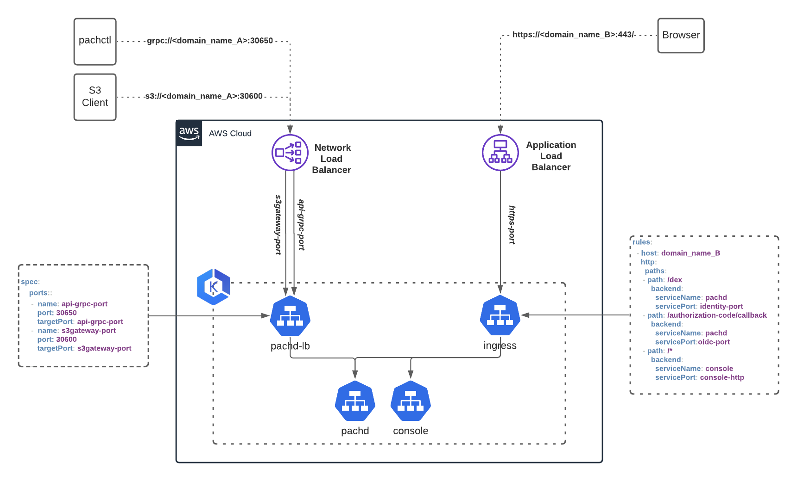

# Infrastructure Recommendations

In the simplest case, such as running a Pachyderm cluster locally, implicit and
explicit port-forwarding enables you to communicate with `pachd`, the Pachyderm
API pod, and `console`, the Pachyderm UI. Port-forwarding can be used in
cloud environments as well, but a production environment might require you to
define **additional inbound connection rules**.

Before we dive into the delivery of external traffic to Pachyderm, 
read the following recommendations to set up your infrastructure in production.

!!! Note
    - Refer to our generic ["Helm Install"](../helm-install/) page for more information on how to install and get started with `Helm`.
## Pachyderm Infrastructure Recommendations

For production deployments,
we recommend that you:

* **Use a secure connection**

    Make sure that you have Transport
    Layer Security (TLS) enabled for Ingress connections.
    You can deploy `pachd` and `console` with different certificates
    if required. Self-signed certificates might require additional configuration.
    For instructions on deployment with TLS, 
    see [Deploy Pachyderm with TLS](../deploy-w-tls/).

    !!! Note
        Optionally, you can use a certificate manager such as [cert-manager](https://cert-manager.io/docs/){target=_blank} to refresh certificates and inject them as kubernetes secrets into your cluster for the ingress and load balancer to use.
  
   
* **Use Pachyderm authentication/authorization**

    Pachyderm authentication is an additional
    security layer to protect your data from unauthorized access.
    See the [authentication and authorization section](../../../enterprise/auth/) to activate access control and set up an IdP.

* **Add an [Ingress Controller](#ingress) to your cluster** for HTTP/HTTPS incoming traffic.

* **Provision a [TCP load balancer](#loadbalancer)** for gRPC incoming traffic.
Provision a TCP load balancer with port `30650` (gRPC port) and `30600` (s3gateway port) forwarding to pachd.

* **Configure access to your external IP addresses through firewalls or your Cloud Provider Network Security.**

* (Optional) **Create a DNS entry for each public IP (each Load Balancer)**

Once you have your networking infrastructure setup, check the [deployment page of your cloud provider](../../). The following section comes back to the setup of an Ingress and a TCP Load Balancer in details.

## Deliver External Traffic To Pachyderm
Pachyderm provides multiple ways to deliver external traffic to services. 

However, we recommend to set up the following resources in a production environment:

- An **Ingress Controller** to manage **HTTP/HTTPS** external access to the `Console` and authentication services (`oidc` and `identity` services).
- A **TCP Load Balancer** to manage **gRPC** external access to `pachd`.

The diagram below gives a quick overview of those recommendations on AWS EKS:


### `NodePort`
By default, the local deployment of Pachyderm deploys the `pachd` service as  `type:NodePort`. However, `NodePort` is a limited solution that is not recommended in production deployments. Therefore, Pachyderm services are otherwise exposed on the cluster internal IP (ClusterIP) instead of each node’s IP (Nodeport). 

### `Ingress` 
An Ingress exposes HTTP and HTTPS routes from outside the cluster to services in the cluster such as Console or Authentication services. 

To configure the Ingress, enable the `ingress` field in your values.yaml, and chose one of the following:

- deploy your preferred Ingress Controller ([Traefik](./pach-ui-ingress/), NGINX). 
- or, provide any specific Kubernetes Ingress annotations to customize your ingress controller behavior.


If your `ingress` is enabled: 

- Cloud providers may provision a Load balancer automatically. For example, AWS will provision an Application Load Balancer (ALB) in front of Console.
- The deployment of Pachyderm (Check our [Helm documentation](../helm-install/)) automatically creates the following set of rules:
```yaml
    - host: <your_domain_name>
    http:
        paths:
        - path: "/dex"
            backend:
            serviceName: "pachd"
            servicePort: "identity-port"
        - path: "/authorization-code/callback"
            backend:
            serviceName: "pachd"
            servicePort: "oidc-port"
        - path: "/*"
            backend:
            serviceName: "console"
            servicePort: "console-http"
```

See our [reference values.yaml](https://github.com/pachyderm/pachyderm/blob/42462ba37f23452a5ea764543221bf8946cebf4f/etc/helm/pachyderm/values.yaml#L143){target=_blank} for all available fields.

!!! Info
    You might choose to deploy your preferred Ingress Controller (Traefik, NGINX). Read about the installation and configuration of [Traefik](./pach-ui-ingress/) on a cluster.

!!! Warning
    To have the ingress routes use the https protocol without enabling the cert secret configuration, set `ingress.uriHttpsProtoOverride` to true in your values.yaml.


=== "Example on AWS EKS"

    In the example below, we are opening the HTTPS port and enabling TLS.

    ```yaml
    ingress:
        enabled: true
        annotations: 
            alb.ingress.kubernetes.io/certificate-arn: arn:aws:acm:region:account-id:certificate/aaaa-bbbb-cccc
            alb.ingress.kubernetes.io/group.name: pachyderm # lets multiple ingress resources be configured into one load balancer
            alb.ingress.kubernetes.io/listen-ports: '[{"HTTPS": 443}]'
            alb.ingress.kubernetes.io/scheme: internal
            alb.ingress.kubernetes.io/security-groups: sg-aaaa
            alb.ingress.kubernetes.io/subnets: subnet-aaaa, subnet-bbbb, subnet-cccc
            alb.ingress.kubernetes.io/target-type: ip
            kubernetes.io/ingress.class: alb
        host: "your_domain_name"
        tls:
            enabled: true
            secretName: "pach-tls"
    ```
=== "Example on GCP GKE"

    In the example below using the ingress controller [Traefik](./pach-ui-ingress/), we are opening the HTTPS port and enabling TLS.

    ```yaml
    ingress:
        enabled: true
        annotations: 
          kubernetes.io/ingress.clas: traefik
        host: "your_domain_name"
        tls:
            enabled: true
            secretName: "pach-tls"
    ```
=== "Example on Azure AKS"

    In the example below, we are using the ingress controller Nginx, and opening the HTTP port.

    ```yaml
    ingress:
        enabled: true
        annotations:
            kubernetes.io/ingress.class: "nginx"
        host: "your_domain_name" 
        tls:
            enabled: true
            secretName: "pach-tls" 
    ```
    **ATTENTION: You must use TLS when deploying on Azure.**


As of today, few Ingress Controller offer full support of the gRPC protocol. To access `pachd` over gRPC (for example, when using `pachctl` or the s3Gateway, we recommend using a Load Balancer instead.

!!! See "See Also" 
     * Kubernetes [Ingress](https://kubernetes.io/docs/concepts/services-networking/ingress/){target=_blank}.
     * Kubernetes [Ingress Controller](https://kubernetes.io/docs/concepts/services-networking/ingress-controllers/){target=_blank}.

### `LoadBalancer`
You should load balance **all gRPC and S3 incoming traffic** to a TCP LB (load balanced at L4 of the OSI model) deployed in front of the `pachd` service. To automatically provision an external load balancer in your current cloud (if supported), enable the `externalService` field of the `pachd` service in your values.yaml as follow:


```yaml
# If enabled, External service creates a service which is safe to
# be exposed externally
pachd:
  externalService:
    enabled: true
    apiGRPCPort: 30650
    s3GatewayPort: 30600
    annotations: {see example below}
```

See our [reference values.yaml](https://github.com/pachyderm/pachyderm/blob/42462ba37f23452a5ea764543221bf8946cebf4f/etc/helm/pachyderm/values.yaml#L197){target=_blank} for all available fields.

!!! Note
        When externalService is enabled, Pachyderm creates a corresponding `pachd-lb` service of `type:LoadBalancer` allowing your cloud platform (AWS, GKE...) to provision a TCP Load Balancer automatically.

Add the appropriate annotations to attach any Load Balancer configuration information to the metadata of your service.

=== "Example on AWS EKS"
    In the following example, we deploy an NLB and enable TLS on AWS EKS:

    ``` yaml
    pachd:
      externalService:
        enabled: true
        apiGRPCPort: 30650
        s3GatewayPort: 30600
        annotations:
            service.beta.kubernetes.io/aws-load-balancer-type: "external"
            service.beta.kubernetes.io/aws-load-balancer-nlb-target-type: "ip"
            service.beta.kubernetes.io/aws-load-balancer-scheme: "internal"
            service.beta.kubernetes.io/aws-load-balancer-subnets: "subnet-aaaaa,subnet-bbbbb,subnet-ccccc"
            service.beta.kubernetes.io/aws-load-balancer-ssl-cert: "arn:aws:acm:region:account-id:certificate/aaa-bbb-cccc"
            service.beta.kubernetes.io/aws-load-balancer-ssl-ports: "30600,30650,30657,30658"
    ```
=== "Example on GCP GKE"
    In the following example, we pre created a static IP by running `gcloud compute addresses create ADDRESS_NAME --global --ip-version IPV4`, then passed this external IP to the values.yaml as follow:

    ``` yaml
    pachd:
      externalService:
        enabled: true
        apiGRPCPort: 30650
        s3GatewayPort: 30600
        loadBalancerIP: ${ADDRESS_NAME}
    ```
=== "Example on Azure AKS"
    This example is identical to the example on Google GKE.

    ``` yaml
    pachd:
      externalService:
        enabled: true
        apiGRPCPort: 30650
        s3GatewayPort: 30600
        loadBalancerIP: ${ADDRESS_NAME}
    ```

Next:   Find the [deployment page that matches your cloud provider](../../)
