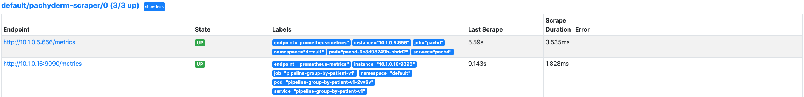

!!! Note 
    To monitor a Pachyderm cluster
    with Prometheus, 
    a ***Pachyderm Enterprise License*** is required. 

# Monitor your Pachyderm cluster with Prometheus

Pachyderm's deployment manifest exposes Prometheus metrics, 
allowing an easy set up of the monitoring of your cluster.
Only available for self-managed deployments today. 


!!! Warning 
    These installation steps are for **Informational Purposes** ONLY. 
    Please refer to your full Prometheus documentation 
    for further installation details and any troubleshooting advice.
## Prometheus installation and Service Monitor creation
1. Helm install [kube-prometheus-stack](https://github.com/prometheus-community/helm-charts/tree/main/charts/kube-prometheus-stack#kube-prometheus-stack){target=_blank},
Prometheus' **Kubernetes cluster monitoring** using the Prometheus Operator:

    - Get Repo Info
    ```shell
    helm repo add prometheus-community https://prometheus-community.github.io/helm-charts
    helm repo update
    ```

    - Install the Prometheus-operator helm chart
    ```shell
    helm install <a-release-name> prometheus-community/kube-prometheus-stack
    ```

1. Create a ServiceMonitor for Pachyderm in Kubernetes:
    - Create a myprometheusservice.yaml
        ```shell
        apiVersion: monitoring.coreos.com/v1
        kind: ServiceMonitor
        metadata:
          name: pachyderm-scraper
          labels:
            release: <a-release-name>
        spec:
            selector:
                matchLabels:
                  suite: pachyderm
            namespaceSelector:
                matchNames:
                - default
            endpoints:
            - port: prom-metrics
              interval: 30s
        ```
    - Create a ServiceMonitor looking to scrape metrics from `suite: pachyderm`:
        ```shell
        kubectl create -f myprometheusservice.yaml
        ```
        The prometheus-operator will search for the pods based on the label selector `<a-release-name>`
        and creates a prometheus target so prometheus will scrape the metrics endpoint `prom-metrics`.

        In this case, it looks for anything with the label `suite: pachyderm` -
        which is by default associated with all Pachyderm resources.

    !!! Note
            Our Service Monitor `pachyderm-scraper` above maps the endpoint port `prom-metrics`
            to a corresponding `prom-metrics` port described in Pachyderm's deployment manifest.
            Let's take a quick look at this file:
            
            ```shell
            kubectl -o json get service/pachd
            ```
            In the json file, find:
            ```json
                {
                "name": "prom-metrics",
                "port": 1656,
                "protocol": "TCP",
                "targetPort": "prom-metrics"
                }
            ```
    
## Port-Forward
One last step before you can collect your metrics:
If you followed the instruction above, you can connect to Prometheus by using kubectl port-forward.

```shell
  kubectl port-forward pod/prometheus-<a-release-name>-kube-prometheus-stack-prometheus-0 9090
```
If you have an existing Prometheus deployment, please navigate to your Prometheus GUI.

## Browse
You can now browse your targets (http://localhost:9090/targets){target=_blank}.
Run a pipeline of your choice. The `pachyderm-scraper` should be visible:



In the ClassicUI tab, you should be able to see the new pachyderm metrics.

## References
<! --* Find the full list of Pachyderm metrics here:
    - [Pachd metrics](./pachd-metrics)
    - [Pipeline metrics](./job-metrics) ->
* [Kube Prometheus Stack](https://github.com/prometheus-community/helm-charts/tree/main/charts/kube-prometheus-stack){target=_blank} documentation.
* Prometheus [documentation](https://prometheus.io/docs/introduction/overview/){target=_blank}.
