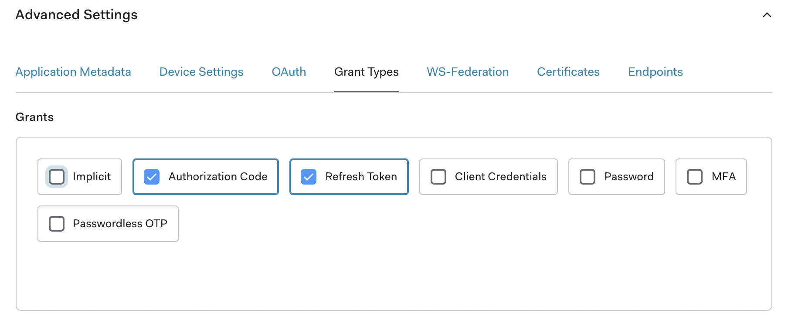
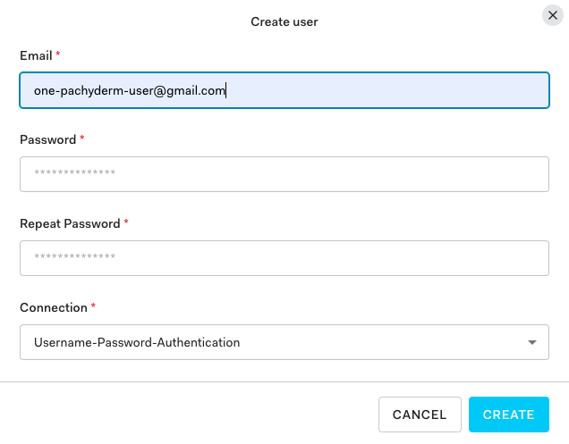

# Pachyderm Integration with Identity Providers

!!! Note
    - Return to our [Enterprise landing page](https://docs.pachyderm.com/latest/enterprise/){target=_blank} if you do not have an enterprise key.
    - Before connecting your IdP to Pachyderm, verify that
    the [Authentication](../../#activate-user-access-management) is enabled by running `pachctl auth whoami`. The command should return `You are "pach:root" `(i.e., your are the **Root User** with `clusterAdmin` privileges). 
    Alternatively, [**you have the option to set your IdP values directly through Helm**](https://github.com/pachyderm/pachyderm/blob/2.0.x/etc/helm/pachyderm/values.yaml#L489){target=_blank}. 
    In any case, we recommend going through this page to understand the specifics of all the fields you will need to set up.
    - Run `pachctl auth use-auth-token` to login as a Root User.
    

Enable your users to authenticate to Pachyderm by logging into their favorite Identity Provider in 3 steps:

1. [Register the Pachyderm Application with your IdP](#1-register-a-pachyderm-application-with-your-idp).
1. [Set up and create your Idp-Pachyderm connector](#2-set-up-and-create-an-idp-pachyderm-connector).
1. [Login](#3-login).

Your users should now be able to [login to Pachyderm](./login.md).

We chose to illustrate those steps
by using Auth0 as our Identity Provider.
([Auth0](https://auth0.com/){target=_blank} is an open source, online authentication platform that
users can use to log in to various applications).

However, Pachyderm's Identity Service is based on [Dex](https://dexidp.io/docs/){target=_blank}
and can therefore provide connectors to a large [variety of IdPs](https://dexidp.io/docs/connectors/){target=_blank} (LDAP, GitHub, SAML, OIDC...). 
Use the IdP of your choice.

<! More IdP connectors example:

#- [Okta](./connectors/okta.md)/>

For now, let's configure Pachyderm so that our
Pachyderm users can log in through Auth0.

## 1- Register a Pachyderm Application with your IdP

!!! TLDR
    The one important and invariant element of this step, 
    no matter what your IdP choice might be, is the **callback URL**.
    Callback URLs are the URLs that your IdP invokes after the authentication process. 
    The IdP redirects back to this URL once a user is authenticated.

    For security reasons, you need to add your application's URL to your client's Allowed Callback URLs.
    This enables your IdP to recognize these URLs as valid. 

    **For Local or “Quick” deployment cases where you do not have a public DNS entry or public IP address, set the following field `config.insecureSkipIssuerCallbackDomainCheck` to `true` in your connector file below.**

    The format of the URL is described below. 


If you do not have an Auth0 account, sign up for one
at https://auth0.com and create your Pool of Users 
(although this step might be done later).

Then, complete the following steps:

1. Log in to your Auth0 account.
1. In **Applications**, click **Create Application**.
1. Type the name of your application, such as **Pachyderm**.
1. In the application type, select **Regular Web Application**.
1. Click **Create**.
1. Go to the application settings.
1. Scroll down to **Application URIs**.
1. In the **Allowed Callback URLs**, add the Pachyderm callback link in the
   following format:

    ```shell
    # Dex's issuer URL + "/callback"
    http://<ip>:30658/callback
    ```

    The IP address is the address of your Pachyderm host. For example,
    if you are running Pachyderm in Minikube, you can find the IP
    address by running `minikube ip`. 

1. Scroll down to **Show Advanced Settings**.
1. Select **Grant Types**.
1. Verify that **Authorization Code** and **Refresh Token** are selected.

   

!!! Note
    For this Auth0 example, we have created a user in Auth0 in **User Management/Users**.
    We will log in to Pachyderm as this user once our IdP connection is completed.
    

## 2- Set up and create an Idp-Pachyderm connector

### Create A Connector Configuration File
To configure your Idp-Pachyderm integration, **create a connector configuration file** corresponding to your IdP. 

!!! Info
    For a list of available connectors and their configuration options, see [Dex documentation](https://dexidp.io/docs/connectors/){target=_blank}.

In the case of our integration with Auth0, we will use an oidc connector with the following parameters:

!!! Note
    Pachyderm supports the JSON and YAML formats for its connector files. 

See our oidc connector example in JSON and YAML formats below.
=== "oidc-dex-connector.json"

    ``` json
    {
    "type": "oidc",
    "id": "auth0",
    "name": "Auth0",
    "version": 1,
    "config":{
        "issuer": "https://dev-k34x5yjn.us.auth0.com/",
        "clientID": "hegmOc5rTotLPu5ByRDXOvBAzgs3wuw5",
        "clientSecret": "7xk8O71Uhp5T-bJp_aP2Squwlh4zZTJs65URPma-2UT7n1iigDaMUD9ArhUR-2aL",
        "redirectURI": "http://<ip>:30658/callback",
        "insecureEnableGroups": true,
        "insecureSkipEmailVerified": true,
        "insecureSkipIssuerCallbackDomainCheck": false,
        "forwardedLoginParams": ["login_hint"] 
        }
    }
    ```
=== "oidc-dex-connector.yaml"

    ``` yaml
        type: oidc
        id: auth0
        name: Auth0
        version: 1
        config:
            issuer: https://dev-k34x5yjn.us.auth0.com/
            clientID: hegmOc5rTotLPu5ByRDXOvBAzgs3wuw5
            clientSecret: 7xk8O71Uhp5T-bJp_aP2Squwlh4zZTJs65URPma-2UT7n1iigDaMUD9ArhUR-2aL
            redirectURI: http://<ip>:30658/callback
            insecureEnableGroups: true
            insecureSkipEmailVerified: true
            insecureSkipIssuerCallbackDomainCheck: false,
            forwardedLoginParams:
            - login_hint
    ```

You will need to replace the following placeholders with relevant values:

- `id`: The unique identifier of your connector (string).

- `name`: Its full name (string).

- `type`: The type of connector. (oidc, saml).

- `version`:The version of your connector (integer - default to 0 when creating a new connector)

- `issuer` — The domain of your application (here in Auth0). For example,
`https://dev-k34x5yjn.us.auth0.com/`. **Note the trailing slash**.

- `client_id` — The Pachyderm **Client ID** (here in Auth0). The client ID
consists of alphanumeric characters and can be found on the application
settings page.

- `client_secret` - The Pachyderm client secret (here in Auth0) located
on the application settings page.

- `redirect_uri` - This parameter should match what you have added
to **Allowed Callback URLs** when registering Pachyderm on your IdP website.

!!! Warning
    **When using an [ingress](../../../../deploy-manage/deploy/ingress/#ingress)**:

    - `redirect_uri` must be changed to point to `https://domain-name/dex/callback`. (Note the additional **/dex/**) 
    - TLS requires all non-localhost redirectURIs to be **HTTPS**.
    - AZURE USERS: 
        - You must use TLS when deploying on Azure.
        - When using Azure Active Directory, add the following to the oidc config:
        ``` yaml
        "config":{
            "claimMapping": {
                "email": "preferred_username"
            } 
        }      
        ```


!!! Note

    Note that Pachyderm's YAML format is **a simplified version** of Dex's [sample config](https://dexidp.io/docs/connectors/oidc/){target=_blank}.

### Create Your Idp-Pachyderm Connection
Once your Pachyderm application is registered with your IdP (here Auth0), 
and your IdP-Pachyderm connector config file created (here with the Auth0 parameters), **connect your IdP to Pachyderm** by running the following command:

```shell
pachctl idp create-connector --config oidc-dex-connector.json
```
or
```shell
pachctl idp create-connector --config oidc-dex-connector.yaml
```
Check your connector's parameters by running:
```shell
pachctl idp get-connector <your connector id: auth0>
```

Per default, the `version` field of the connector is set to 0 when created.
However, you can set its value to a different integer.

You will specifically need to increment this value when updating your connector.
```shell
pachctl idp update-connector <your connector id: auth0> --version 1
```
or
```shell
pachctl idp update-connector --config oidc-dex-connector.yaml
```
!!! Info
    Run `pachctl idp --help` for a full list of commands.
    In particular, those commands let you create, update, delete, list, or get a specific connector.

## 3- Login
The users registered with your IdP are now ready to [Log in to Pachyderm](./login.md)
