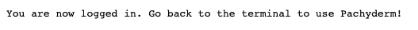

# Pachyderm Authentication flow

!!! Note
      In order for the users registered with your IdP to log in to Pachyderm,
      your [IdP connector must be set](./idp-dex.md).

## Login to a cluster as an IDP user
1. We will illustrate the login flow of an IdP user, 
by login in as the [user created in Auth0](../idp-dex/#1-register-a-pachyderm-application-with-your-idp):`one-pachyderm-user@gmail.com`

      To start a login flow, run the following command in your terminal:

      ```shell
      pachctl auth login
      ```

      You will be prompted to a web-browser. 

      - If your application is linked to several IdP connectors, 
      choose the connector that applies to the IdP you are registered with.

      - If you are not logged in your Idp already, you will be asked to enter your credentials. Your identity will be checked against the IdP and the login will go through.

      You should see the following message printed out in your browser:
      

1. Check who you logged in as:

      ```shell
      pachctl auth whoami
      ```

      **Example of System Response:**

      ```shell
      You are "user:one-pachyderm-user@gmail.com"
      session expires: 08 May 21 13:59 EDT
      ```

Your Authentication is all set. 

Next - (Optional)[Configure the User Access to Pachyderm Ressources](../authorization/role-binding.md).


