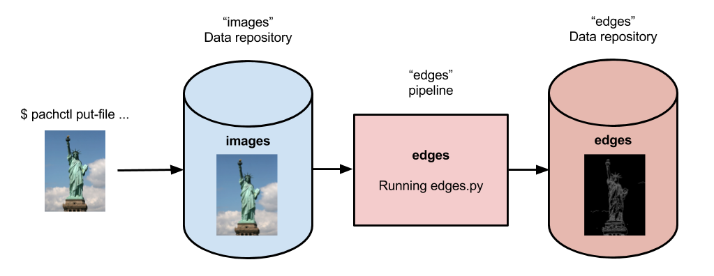
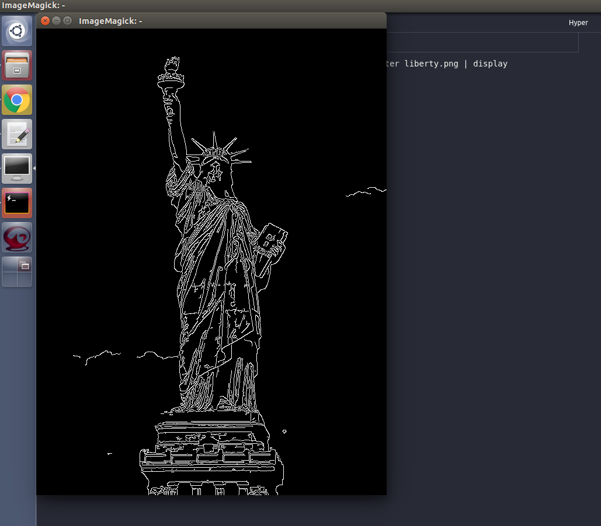
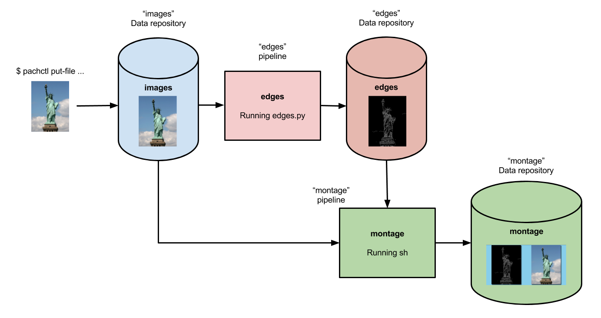
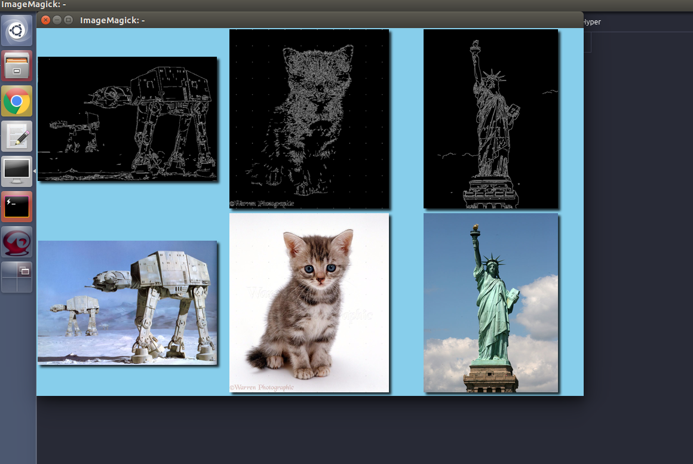

# Beginner Tutorial

Welcome to the beginner tutorial for Pachyderm! 
This tutorial should take about 15 minutes
to complete and introduce you to Pachyderm's original concepts.

### Prerequisites

This guide assumes that you already have Pachyderm running.

- For an easy and quick start, install Pachyderm on your local machine as described in our [Local Installation](../local-installation/) page and start experimenting.

- Or check out our [Quick Install](../../deploy-manage/deploy/quickstart/) page to deploy on your favorite cloud.

!!! tip
    If you are new to Pachyderm, try [Pachyderm Shell](../../deploy-manage/manage/pachctl-shell/).
    This handy tool suggests `pachctl` commands as you type and
    helps you learn Pachyderm faster.

## Image processing with OpenCV

This tutorial walks you through the deployment of a Pachyderm pipeline
that performs [edge
detection](https://en.wikipedia.org/wiki/Edge_detection){target=_blank} on a few
images. Thanks to Pachyderm's built-in processing primitives, we can
keep our code simple but still run the pipeline in a
distributed, streaming fashion. Moreover, **as new data is added, the
pipeline automatically processes it** and outputs the results.

If you hit any errors not covered in this guide, get help in our [public
community Slack](https://www.pachyderm.com/slack/){target=_blank}, submit an issue on
[GitHub](https://github.com/pachyderm/pachyderm){target=_blank}, or email us at
<support@pachyderm.io>. We are here to help!

### Create a Repo

A `repo` is the highest level data primitive in Pachyderm. Like many
things in Pachyderm, it shares its name with a primitive in Git and is
designed to behave analogously. Generally, repos should be dedicated to
a single source of data such as log messages from a particular service,
a users table, or training data for an ML model. Repos are easy to create
and do not take much space when empty so do not worry about making
tons of them.

!!! Info
    More about the concepts of [`Repository`](../../concepts/data-concepts/repo/#repository) and [`Branch`](../../concepts/data-concepts/branch/#branch) in Pachyderm.

For this demo, we create a repo called `images` to hold the
data we want to process:

```shell
pachctl create repo images
```

Verify that the repository was created:

```shell
pachctl list repo
```

**System response:**

```shell
NAME   CREATED       SIZE (MASTER) ACCESS LEVEL
images 4 seconds ago ≤ 0B          [repoOwner]
```

This output shows that the repo has been successfully created. Because we
have not added anything to it yet, the size of the repository HEAD commit
on the master branch is 0B.

### Adding Data to Pachyderm

Now that we have created a repo, it is time to add some data. In
Pachyderm, you write data to an explicit `commit`. Commits are immutable
snapshots of your data which give Pachyderm its version control properties.
You can add, remove, or update `files` in a given commit.

!!! Info
    More about the concept of [`Commit`](../../concepts/data-concepts/commit/#commit) in Pachyderm.

Let's start by just adding a file, in this case an image, to a new
commit. We have provided some sample images for you that we host on
Imgur.

Use the `pachctl put file` command along with the `-f` flag.  The `-f` flag can
take either a local file, a URL, or a object storage bucket which it
scrapes automatically. In this case, we simply pass the URL.

Unlike Git, commits in Pachyderm must be explicitly started and finished
as they can contain huge amounts of data and we do not want that much
*dirty* data hanging around in an unpersisted state. `pachctl put file`
**automatically starts and finishes a commit for you** so you can add files
more easily. If you want to add many files over a period of time, you
can do `pachctl start commit` and `pachctl finish commit` yourself.

We also specify the repo name `"images"`, the branch name `"master"`,
and the file name: `"liberty.png"`.

Here is an example atomic commit of the file `liberty.png` to the
`images` repo `master` branch:

```shell
pachctl put file images@master:liberty.png -f http://imgur.com/46Q8nDz.png
```

We can check to make sure the data we just added is in Pachyderm.

* Use the `pachctl list repo` command to check that data has been added:

  ```shell
  pachctl list repo
  ```

  **System response:**

  ```
  NAME   CREATED       SIZE (MASTER) ACCESS LEVEL
  images 2 minutes ago ≤ 57.27KiB    [repoOwner]
  ```

* View the commit that was just created:

  ```shell
  pachctl list commit images
  ```

  **System response:**

  ```
  REPO   BRANCH COMMIT                           FINISHED       SIZE     ORIGIN DESCRIPTION
  images master 89a5ab3a23c949949f763943dd7a8aac 55 seconds ago 57.27KiB USER
  ```

* View the file in that commit:

  ```shell
  pachctl list file images@master
  ```

  **System response:**

  ```
  NAME         TYPE SIZE
  /liberty.png file 57.27KiB
  ```

Now you can view the file by retrieving it from Pachyderm. Because this is an
image, you cannot just print it out in the terminal, but the following
command will let you view it:

* On macOS, run:

```shell
pachctl get file images@master:liberty.png | open -f -a Preview.app
```

* On Linux 64-bit, run:

```shell
pachctl get file images@master:liberty.png | display
```

### Create a Pipeline

Now that you have some data in your repo, it is time to do something
with it. Pipelines are the core processing primitive in Pachyderm.
Pipelines are defined with a simple JSON file called a pipeline
specification or pipeline spec for short. For this [example](https://github.com/pachyderm/pachyderm/blob/2.0.x/examples/opencv){target=_blank}, we already
[created the pipeline spec for you](https://github.com/pachyderm/pachyderm/blob/2.0.x/examples/opencv/edges.json){target=_blank}.

When you want to create your own pipeline specification later, you can refer to the
full [Pipeline Specification](../../reference/pipeline-spec) to use
more advanced options. Options include building your own code into a
container. In this tutorial, we are using a pre-built Docker image.

!!! Info
    More about the concept of [`Pipeline`](../../concepts/pipeline-concepts/pipeline/) in Pachyderm.

For now, we are going to create a single pipeline spec that takes in images
and does some simple edge detection.



Below is the `edges.json` pipeline spec. Let's walk
through the details.

```json
{
  "pipeline": {
    "name": "edges"
  },
  "description": "A pipeline that performs image edge detection by using the OpenCV library.",
  "transform": {
    "cmd": [ "python3", "/edges.py" ],
    "image": "pachyderm/opencv"
  },
  "input": {
    "pfs": {
      "repo": "images",
      "glob": "/*"
    }
  }
}
```

The pipeline spec contains a few simple sections. The pipeline section contains
a `name`, which is how you will identify your pipeline. **Your pipeline will also
automatically create an output repo with the same name**. The `transform` section
allows you to specify the docker image you want to use. In this case,
`pachyderm/opencv` is the docker image (defaults to DockerHub as the registry),
and the entry point is `edges.py`. The input section specifies repos visible
to the running pipeline, and how to process the data from the repos. **Commits to
these repos will automatically trigger the pipeline to create new jobs to
process them**. In this case, `images` is the repo, and `/*` is the glob pattern.

The glob pattern defines how the input data will be transformed into datums if you want
to distribute computation. `/*` means that each file can be
processed individually, which makes sense for images. Glob patterns are
one of the most powerful features in Pachyderm.

!!! Info
    More about the concept of [`Glob Pattern`](../../concepts/pipeline-concepts/datum/glob-pattern/#glob-pattern) 
    in Pachyderm and the fundamental notion of [`Datums`](../../concepts/pipeline-concepts/datum/relationship-between-datums/).


The following text is the Python code run in this pipeline:

```python
import cv2
import numpy as np
from matplotlib import pyplot as plt
import os

# make_edges reads an image from /pfs/images and outputs the result of running
# edge detection on that image to /pfs/out. Note that /pfs/images and
# /pfs/out are special directories that Pachyderm injects into the container.
def make_edges(image):
   img = cv2.imread(image)
   tail = os.path.split(image)[1]
   edges = cv2.Canny(img,100,200)
   plt.imsave(os.path.join("/pfs/out", os.path.splitext(tail)[0]+'.png'), edges, cmap = 'gray')

# walk /pfs/images and call make_edges on every file found
for dirpath, dirs, files in os.walk("/pfs/images"):
   for file in files:
       make_edges(os.path.join(dirpath, file))
```

The code simply walks over all the images in `/pfs/images`, performs edge
detection, and writes the result to `/pfs/out`.

`/pfs/images` and `/pfs/out` are special local directories that
Pachyderm creates within the container automatically. All the input data
for a pipeline is stored in `/pfs/<input_repo_name>` and **your code
should always write out to `/pfs/out`**  (see the function `make_edges(image)` above). 
Pachyderm automatically gathers everything you write to `/pfs/out`, versions it as this pipeline output, and maps it
to the appropriate output repo of your pipeline.

Now, let's create the pipeline in Pachyderm:

```shell
pachctl create pipeline -f https://raw.githubusercontent.com/pachyderm/pachyderm/2.0.x/examples/opencv/edges.json
```

### What Happens When You Create a Pipeline

Creating a pipeline tells Pachyderm to run your code on the data in your
input repo (the HEAD commit) as well as **all future commits** that
occur after the pipeline is created. Our repo already had a commit, so
Pachyderm automatically launched a `job` to process that data.

!!! Info
    More about the concept of [`Job`](../../concepts/pipeline-concepts/job/#job) in Pachyderm.


The first time Pachyderm runs a pipeline job, it needs to download the
Docker image (specified in the pipeline spec) from the specified Docker
registry (DockerHub in this case). This first run might take a
minute or so because of the image download, depending on your Internet
connection. Subsequent runs will be much faster.

You can view the job with:

```shell
pachctl list job
```

**System response:**

```
ID                               SUBJOBS PROGRESS CREATED       MODIFIED
23378d899d3d45738f55df3809841145 1       ▇▇▇▇▇▇▇▇ 5 seconds ago 5 seconds ago
```

You can check the state of your pipeline by running `pachctl list pipeline`.

**System response:**

```
NAME  VERSION INPUT     CREATED       STATE / LAST JOB  DESCRIPTION
edges 1       images:/* 2 minutes ago running / success A pipeline that performs image edge detection by using the OpenCV library.
```

Yay! Your pipeline succeeded! Pachyderm creates a corresponding output
repo for every pipeline. This output repo will have the same name as the
pipeline, and all the results of that pipeline will be versioned in this
output repo. In our example, the `edges` pipeline created an output repo
called `edges` to store the results written to `/pfs/out`.


```shell
pachctl list repo
```

**System response:**

```
NAME   CREATED        SIZE (MASTER) ACCESS LEVEL
edges  10 minutes ago ≤ 22.22KiB    [repoOwner]  Output repo for pipeline edges.
images 3 hours ago    ≤ 57.27KiB    [repoOwner]
```

### Reading the Output

We can view the output data from the `edges` repo in the same fashion
that we viewed the input data.

* On macOS, run:

```shell
pachctl get file edges@master:liberty.png | open -f -a Preview.app
```

* On Linux 64-bit, run:

```shell
pachctl get file edges@master:liberty.png | display
```

The output should look similar to:



### Processing More Data

**Pipelines will automatically process the data from new commits as
they are created**. Think of pipelines as being subscribed to any new
commits on their input repo(s). Also similar to Git, commits have a
parental structure that tracks which files have changed. In this case
we are going to be adding more images.

Let's create two new commits in a parental structure. To do this we
will simply do two more `put file` commands and by specifying `master`
as the branch, it automatically parents our commits onto each other.
Branch names are just references to a particular HEAD commit.

```shell
pachctl put file images@master:AT-AT.png -f http://imgur.com/8MN9Kg0.png
pachctl put file images@master:kitten.png -f http://imgur.com/g2QnNqa.png
```

**Adding a new commit of data will automatically trigger the pipeline to
run on the new data we have added**. We will see corresponding jobs get
started and commits to the output `edges` repo. Let's also view our
new outputs.

View the list of jobs that have started:

```shell
pachctl list job
```

**System response:**

```
ID                               SUBJOBS PROGRESS CREATED        MODIFIED
1c1a9d7d36944eabb4f6f14ebca25bf1 1       ▇▇▇▇▇▇▇▇ 31 seconds ago 31 seconds ago
fe5c4f70ac4347fd9c5934f0a9c44651 1       ▇▇▇▇▇▇▇▇ 47 seconds ago 47 seconds ago
23378d899d3d45738f55df3809841145 1       ▇▇▇▇▇▇▇▇ 12 minutes ago 12 minutes ago
```

View the output data

* On macOS, run:

  ```shell
  pachctl get file edges@master:AT-AT.png | open -f -a Preview.app
  pachctl get file edges@master:kitten.png | open -f -a Preview.app
  ```

* On Linux, run:

  ```shell
  pachctl get file edges@master:AT-AT.png | display
  pachctl get file edges@master:kitten.png | display
  ```

### Adding Another Pipeline

We have successfully deployed and used a single stage Pachyderm pipeline.
Now, let's add a processing stage to illustrate a multi-stage Pachyderm
pipeline. Specifically, let's add a `montage` pipeline that take our
original and edge detected images and arranges them into a single
montage of images:



Below is the pipeline spec for this new pipeline:

```json
{
  "pipeline": {
    "name": "montage"
  },
  "description": "A pipeline that combines images from the `images` and `edges` repositories into a montage.",
  "input": {
    "cross": [ {
      "pfs": {
        "glob": "/",
        "repo": "images"
      }
    },
    {
      "pfs": {
        "glob": "/",
        "repo": "edges"
      }
    } ]
  },
  "transform": {
    "cmd": [ "sh" ],
    "image": "v4tech/imagemagick",
    "stdin": [ "montage -shadow -background SkyBlue -geometry 300x300+2+2 $(find /pfs -type f | sort) /pfs/out/montage.png" ]
  }
}
```

This `montage` pipeline spec is similar to our `edges` pipeline except
for the following differences:

1. We are using a different Docker image that
has `imagemagick` installed.
1. We are executing a `sh` command with
`stdin` instead of a python script in the pipeline's `transform` section.
1. We have multiple input data repositories (`images` and `edges`).

In the `montage` pipeline we are combining our multiple input data
repositories using a `cross` pattern. This `cross` pattern creates a
single pairing of our input images with our edge detected images. There
are several interesting ways to combine data in Pachyderm, which are
discussed in
[pipelines' concepts](../../concepts/pipeline-concepts/datum/)
and
[our pipeline specification page](../../reference/pipeline-spec/#pfs-input).

We create the `montage` pipeline as before, with `pachctl`:

```shell
pachctl create pipeline -f https://raw.githubusercontent.com/pachyderm/pachyderm/2.0.x/examples/opencv/montage.json
```

The pipeline creation triggers a job that generates a montage for all the
current HEAD commits of the input repos:

```shell
pachctl list job
```

**System response:**

```shell
ID                               SUBJOBS PROGRESS CREATED        MODIFIED
01e0c8040e18429daf7f67ce34c3a5d7 1       ▇▇▇▇▇▇▇▇ 11 seconds ago 11 seconds ago
1c1a9d7d36944eabb4f6f14ebca25bf1 1       ▇▇▇▇▇▇▇▇ 12 minutes ago 12 minutes ago
fe5c4f70ac4347fd9c5934f0a9c44651 1       ▇▇▇▇▇▇▇▇ 12 minutes ago 12 minutes ago
23378d899d3d45738f55df3809841145 1       ▇▇▇▇▇▇▇▇ 24 minutes ago 24 minutes ago
```

View the generated montage image by running one of
the following commands:

* On macOS, run:

```shell
pachctl get file montage@master:montage.png | open -f -a Preview.app
```

* On Linux 64-bit, run:

```shell
pachctl get file montage@master:montage.png | display
```



## Exploring your DAG in Pachyderm Console

Console is Pachyderm's GUI. It will help you interactively
visualize and explore your pipelines, your data, debug jobs, read logs, etc...

!!! Note
     You will need an Enterprise Key when deploying with Console, locally or otherwise. 
     To request a FREE trial enterprise license key, [click here](../../enterprise).

If you deployed locally, the Pachyderm Enterprise Console
is also deployed by default.  To access it, visit
`localhost:30080` in your favorite browser. You
should see something similar to this:


Upon clicking on **View Project**, 
you will be able to see your DAG's structure, and interactively explore your repos and pipelines:


Click on a repo to visualize its commits, see the related jobs, or inspect the files of a given commit:


Or click on a pipeline to visualize its specification file, list its jobs, or view the details of a particular job.


## Next Steps

You can use what you have learned to build on or
change these pipelines. 
You can also dig in and learn more details about:

- [Working with Pipelines](../how-tos/developer-workflow/working-with-pipelines.md)
- [Load Your Data into Pachyderm](../how-tos/basic-data-operations/load-data-into-pachyderm.md)
- [Deploying Pachyderm to the cloud or on prem](../deploy-manage/deploy/index.md)

Again, we would love to help and see what you come up with! Submit any
questions, comment, contribution on
[GitHub](https://github.com/pachyderm/pachyderm){target=_blank},
[Slack](https://www.pachyderm.com/slack/){target=_blank}, or email at <support@pachyderm.io>
if you want to show off anything nifty you've created!
