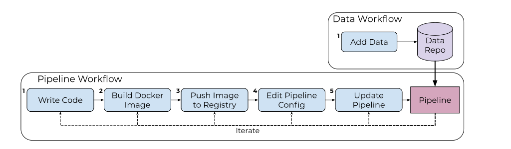

# Working with Pipelines

A typical Pachyderm workflow involves multiple iterations of
experimenting with your code and pipeline specs.

!!! info
    Before you read this section, make sure that you
    understand basic Pachyderm pipeline concepts described in
    [Concepts](../../concepts/pipeline-concepts/index.md).

In general, there are five steps to working with a pipeline. The stages can be summarized in the image below. 



We will walk through each of the stages in detail.

## Step 1: Write Your Analysis Code

Because Pachyderm is completely language-agnostic, the code
that is used to process data in Pachyderm can
be written in any language and can use any libraries of choice. Whether
your code is as simple as a bash command or as complicated as a
TensorFlow neural network, it needs to be built with all the required
dependencies into a container that can run anywhere, including inside
of Pachyderm. See [Examples](https://github.com/pachyderm/pachyderm/tree/2.0.x/examples){target=_blank}.

Your code does not have to import any special Pachyderm
functionality or libraries. However, it must meet the
following requirements:

* **Read files from a local file system**. Pachyderm automatically
  mounts each input data repository as `/pfs/<repo_name>` in the running
  containers of your Docker image. Therefore, the code that you write needs
  to read input data from this directory, similar to any other
  file system.

  Because Pachyderm automatically spreads data across parallel
  containers, your analysis code does not have to deal with data
  sharding or parallelization. For example, if you have four
  containers that run your Python code, Pachyderm automatically
  supplies 1/4 of the input data to `/pfs/<repo_name>` in
  each running container. These workload balancing settings
  can be adjusted as needed through Pachyderm tunable parameters
  in the pipeline specification.

* **Write files into a local file system**, such as saving results.
  Your code must write to the `/pfs/out` directory that Pachyderm
  mounts in all of your running containers. Similar to reading data,
  your code does not have to manage parallelization or sharding.

## Step 2: Build Your Docker Image

When you create a Pachyderm pipeline, you need
to specify a Docker image that includes the code or binary that
you want to run. Therefore, every time you modify your code,
you need to build a new Docker image, push it to your image registry,
and update the image tag in the pipeline spec. This section
describes one way of building Docker images, but
if you have your own routine, feel free to apply it.

To build an image, you need to create a `Dockerfile`. However, do not
use the `CMD` field in your `Dockerfile` to specify the commands that
you want to run. Instead, you add them in the `cmd` field in your pipeline
specification. Pachyderm runs these commands inside the
container during the job execution rather than relying on Docker
to run them.
The reason is that Pachyderm cannot execute your code immediately when
your container starts, so it runs a shim process in your container
instead, and then, it calls your pipeline specification's `cmd` from there.

!!! note
    The `Dockerfile` example below is provided for your reference
    only. Your `Dockerfile` might look completely different.

To build a Docker image, complete the following steps:

1. If you do not have a registry, create one with a preferred provider.
If you decide to use DockerHub, follow the [Docker Hub Quickstart](https://docs.docker.com/docker-hub/){target=_blank} to
create a repository for your project.
1. Create a `Dockerfile` for your project. See the [OpenCV example](https://github.com/pachyderm/pachyderm/blob/2.0.x/examples/opencv/Dockerfile){target=_blank}.
1. Build a new image from the `Dockerfile` by specifying a tag:

   ```shell
   docker build -t <image>:<tag> .
   ```

For more information about building Docker images, see
[Docker documentation](https://docs.docker.com/engine/tutorials/dockerimages/){target=_blank}.

## Step 3: Push Your Docker Image to a Registry

Once your image is built and tagged, you need to upload the image into
a public or private image registry, such as
[DockerHub](https://hub.docker.com){target=_blank}.

Alternatively, you can use the Pachyderm's built-in functionality to
tag, and push images by running the `pachctl update pipeline` command
with the `--push-images` flag. For more information, see
[Update a pipeline](../../pipeline-operations/updating-pipelines).

1. Log in to an image registry.

   * If you use DockerHub, run:

     ```shell
     docker login --username=<dockerhub-username> --password=<dockerhub-password> <dockerhub-fqdn>
     ```

1. Push your image to your image registry.

   * If you use DockerHub, run:

     ```shell
     docker push <image>:tag
     ```

!!! note
    Pipelines require a unique tag to ensure the appropriate image is pulled. If a floating tag, such as `latest`, is used, the Kubernetes cluster may become out of sync with the Docker registry, concluding it already has the `latest` image.

## Step 4: Create/Edit the Pipeline Config

Pachyderm's pipeline specification files store the configuration information
about the Docker image and code that Pachyderm should run, the input repo(s) of the pipeline, parallelism settings, GPU usage etc...
Pipeline specifications are stored in JSON or YAML format.

A standard pipeline specification must include the following
parameters:

- `name`
- `transform`
- `input`

!!! note
    Some special types of pipelines, such as a spout pipeline, do not
    require you to specify all of these parameters. 
    Spout pipelines, for example, do not have input repos.

Check our reference [pipeline specification](../../../reference/pipeline-spec) page, for a list of all available fields in a pipeline specification file.

You can store your pipeline specifications locally or in a remote location, such
as a GitHub repository.

A simple pipeline specification file in JSON would look like the example below.
The pipeline takes its data from the input repo `data`, runs worker containers with the defined image `<image>:<tag>` and `command`, then outputs the resulting processed data in the `my-pipeline` output repo.  During a job execution, each worker sees and reads from the local file system `/pfs/data` containing only matched data from the `glob` expression, and writes its output to `/pfs/out` with standard file system functions; Pachyderm handles the rest. 

```shell
# my-pipeline.json
{
  "pipeline": {
    "name": "my-pipeline"
  },
  "transform": {
    "image": "<image>:<tag>",
    "cmd": ["command", "/pfs/data", "/pfs/out"]
  },
  "input": {
      "pfs": {
        "repo": "data",
        "glob": "/*"
      }
  }
}
```

## Step 5: Deploy/Update the Pipeline

As soon as you create a pipeline, Pachyderm spins up one or more Kubernetes pods in which the pipeline code runs. By default, after the pipeline finishes
running, the pods continue to run while waiting for the new data to be
committed into the Pachyderm input repository. You can configure this
parameter, as well as many others, in the pipeline specification.

1. Create a Pachyderm pipeline from the spec:

     ```shell
     pachctl create pipeline -f my-pipeline.json
     ```

     You can specify a local file or a file stored in a remote
     location, such as a GitHub repository. For example,
     `https://raw.githubusercontent.com/pachyderm/pachyderm/2.0.x/examples/opencv/edges.json`.

1. If your pipeline specification changes, you can update the pipeline 
   by running

     ```shell
     pachctl update pipeline -f my-pipeline.json
     ```

!!! note "See Also:"
    - [Updating Pipelines](../../pipeline-operations/updating-pipelines)
 

