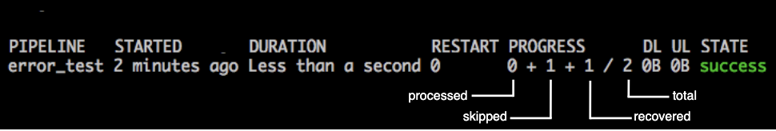

# Datum Processing States

When a pipeline runs, it processes your datums.
Some of them get processed successfully and some might
be skipped or even fail. Generally, processed datums
fall into either successful or failure state category.

The following table describes the processing states
of datums that can occur in Pachyderm:

**Successful States**

| State      | Description |
| ---------- | ----------- |
| Success    | The datum has been successfully processed in this job. |
| Skipped    | The datum has been successfully processed in a previous job, has not changed since then, and therefore, it was skipped in the current job. |

**Failure States**

| State      | Description |
| ---------- | ----------- |
| Failed     | The datum failed to be processed. Any failed datum in a job fails the whole job. |
| Recovered  | The datum failed, but was recovered by the user's error handling code. Although the datum is marked as *recovered*, Pachyderm does not process it in the downstream pipelines. A recovered datum does not fail the whole job. Just like failed datums, recovered datums are retried on the next run of the pipeline. |

You can view the information about datum processing states in the output of
the `pachctl list job <jobID>` command:

!!! Note
    Datums that failed are still included in the total, but not
    shown in the progress indicator.
