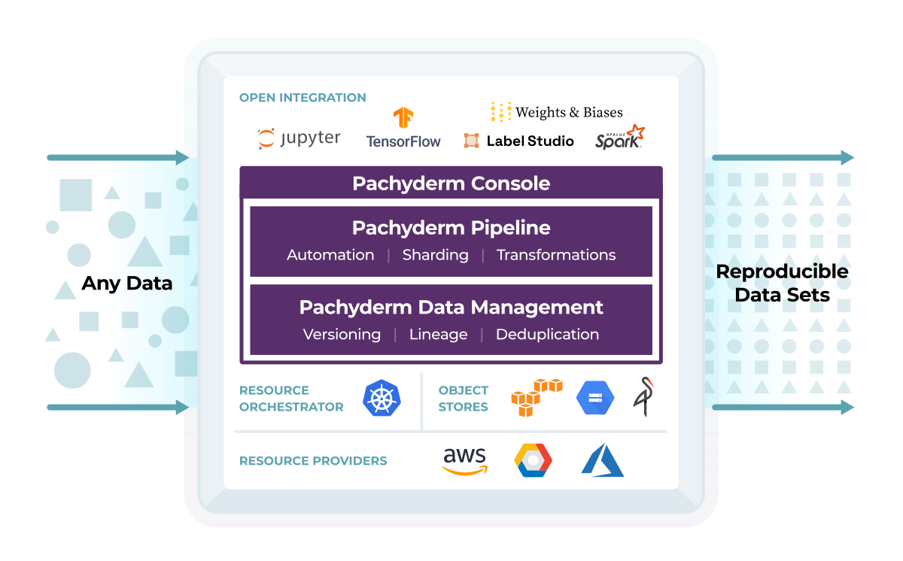

# Getting Started

Pachyderm is a **data-centric pipelining and versioning tool** that allows ML and Data-Science teams to automate and collaborate on their organization's data while maintaining full reproducibility.

For a quick start, deploy Pachyderm on your [local machine](./local-installation/), on your [favorite cloud](../deploy-manage/deploy/quickstart/) provider, or get an [introduction to pachyderm](https://public-sandbox.workspace.pachyderm.com/){target=_blank data-clickid=docs-gettingstarted-sandbox} from your browser.

!!! Note "Got questions?"
     [Request a demo](https://www.pachyderm.com/request-a-demo/){target=_blank}, join our [Users Slack Channel](https://www.pachyderm.com/slack/){target=_blank}, or [Contact our Support Team](mailto:support@pachyderm.io).

!!! Attention "**Extend your Community Edition with an Enterprise license**"
    [Contact us](mailto:sales@pachyderm.com) and start experimenting.

  

    

      

        <h4 class="mdl-card__title-text">Deploy Locally &nbsp;&nbsp;&nbsp;<i class="fa fa-laptop"></i></h4>
      

      

        Deploy Pachyderm on your computer and run our tutorials.
      

      

        <ul>
          <li><a href="local-installation/" class="md-typeset md-link">
          Deploy Locally
          </a>
          </li>
          <li><a href="beginner-tutorial/" class="md-typeset md-link">
          Beginner Tutorial
          </a>
          </li>
          <li><a href="../examples/examples" class="md-typeset md-link">
          More Tutorials, Examples, and MLOps stack product Integration
          </a>
          </li>
          <li><a href="wsl-deploy/" class="md-typeset md-link">
          Deploy Locally on Windows
          </a>
          </li>
          <li><a href="install-pachctl-completion/" class="md-typeset md-link">
          Install pachctl Autocompletion
          </a>
          </li>
          <li><a href="../deploy-manage/manage/pachctl-shell/" class="md-typeset md-link">
          Use pachctl Shell
          </a>
          </li>
        </ul>
       

     

  

