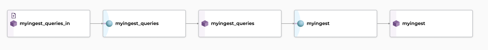
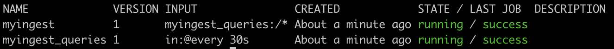
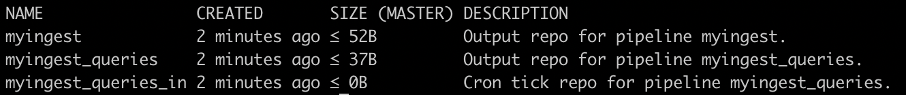

#  Data Warehouse Integration

!!! Warning
    SQL Ingest is an [experimental feature](../../../contributing/supported-releases/#experimental).

Part of your data might live in databases requiring some level of integration with your warehouse to retrieve and inject them into Pachyderm.

Our **SQL ingest** tool provides a seamless connection between databases and Pachyderm,  allowing you to import data from a SQL database into Pachyderm-powered pipelines. By bringing data-driven pipelines, versioning & lineage to structured data, we are allowing Data Science teams to easily combine structured and unstructured data.

Specifically, we help you connect to a remote database of your choice and pull the result of a given query at regular intervals in the form of a CSV or a JSON file.  

## Use SQL Ingest
Pachyderm's SQL Ingest uses [jsonnet pipeline specs](../../pipeline-operations/jsonnet-pipeline-specs) with the following parameters to automatically create the pipelines that access, query, and materialize the results of a SQL query to a data warehouse. The outputted results can take the form of CSV or JSON files.

Pass in the following parameters and get your results committed to an output repo, ready for the following downstream pipeline:
```shell
pachctl update pipeline --jsonnet https://raw.githubusercontent.com/pachyderm/pachyderm/{{ config.pach_branch }}/src/templates/sql_ingest_cron.jsonnet 
  --arg name=myingest
  --arg url="mysql://root@mysql:3306/test_db"
  --arg query="SELECT * FROM test_data"
  --arg cronSpec="@every 30s"
  --arg secretName="mysql-creds"
  --arg format=json
```

Where the parameters passed to the jsonnet pipeline spec are:

| Parameter     | Description | 
| ------------- |-------------| 
| `name`        | The name of output repo in which your query results will materialize.|
| `url`         | The [connection string to the database](#database-connection-url).|  
| `query`       | The SQL query that will be run against your database. |
| `cronSpec`    | How often to run the query. For example `"@every 60s"`.|
| `format`      | The type of your output file containing the results of your query (either `json` or `yaml`).|
| `secretName`  | The kubernetes secret name that contains the [password to the database](#database-secret).|

!!! Note
    `pachctl update pipeline` will create pipelines if none exist or update otherwise.


When the command is run, the database will be queried on a schedule defined in your `cronSpec` parameter and a result file committed to the output repo named after `name`.

### Database Secret
Before you create your SQL Ingest pipelines, make sure to create a [generic secret](../../advanced-data-operations/secrets/#create-a-secret) containing your database password in the field `PACHYDERM_SQL_PASSWORD`.

!!! Example
    ```yaml
    apiVersion: v1
    kind: Secret
    metadata:
      name: mysql-creds
    data:
      "PACHYDERM_SQL_PASSWORD": "cm9vdA==" # base64 encoded
    ```

### Database Connection URL
Pachyderm's SQL Ingest will take an URL as its connection string to the database of your choice.

The URL is structured as follows:
```shell
<protocol>://<username>@<host>:<port>/<database>?<param1>=<value1>&<param2>=<value2>
```

Where:

| Parameter     | Description | 
| ------------- |-------------| 
| **protocol**   | The name of the database protocol. As of today, you have the ability to connect to  `postgres`or `mysql`. Note that `mysql` allows you to connect to mariadb. |
| **username**  | The user used to access the database.|
| **host**      | The hostname of your database instance.|
| **port**      | The port number your instance is listening on.|
| **database**  | The name of the database to connect to. | 

!!! Note 
    - The additional parameters are optional and specific to the driver.
    - The password is not included in the URL.  It is retrieved from a [kubernetes secret](#database-secret) or file on disk at the time of the query.


## How does this work?

SQL Ingest's jsonnet pipeline specs [**`sql_ingest_cron.jsonnet`**](https://github.com/pachyderm/pachyderm/blob/{{ config.pach_branch }}/src/templates/sql_ingest_cron.jsonnet) creates two pipelines:


- A **[Cron Pipeline](../../../concepts/pipeline-concepts/pipeline/cron/#cron-pipeline)** `myingest_queries` triggering at an interval set by `cronSpec` and outputting a file `/0000` in its output repo `myingest_queries`. `/0000` contains a timestamp and the SQL statement set in `query`.
- The following pipeline `myingest` takes the `/0000` file as input and runs the query against the database set in `url`. The query's result is then materialized in a file (JSON or CSV) of the same name `/0000` committed to the output repo `myingest`.

!!! Note
    The name of each pipeline and related input and output repos are derived from the `name` parameter. In the example above, we have set `--arg name=myingest`.

The same base image [pachctf](https://hub.docker.com/repository/docker/pachyderm/pachtf) is used in both pipelines.

Check the visual representation of the SQL Ingest DAG created above in Console: 



In your terminal:

- The list of the DAG's pipelines (`pachctl list pipeline`) looks like this:

     

- 3 repos are created:

     

!!! Note "Inspect the result of a query"
    To inspect the result of the following query:

    ```shell
    pachctl get file myingest_queries@master:/0000
    ```
    ```
    -- 1643235475
    SELECT * FROM test_data
    ```
    Read the file written to the output repo `myingest`:

    ```shell
    pachctl list file myingest@master
    ```
    ```
    NAME  TYPE SIZE
    /0000 file 52B
    ```

    ```shell
    pachctl get file myingest@master:/0000
    ```
    ```yaml
    {"mycolumn":"hello world","id":1}
    {"mycolumn":"hello you","id":2}
    ```


