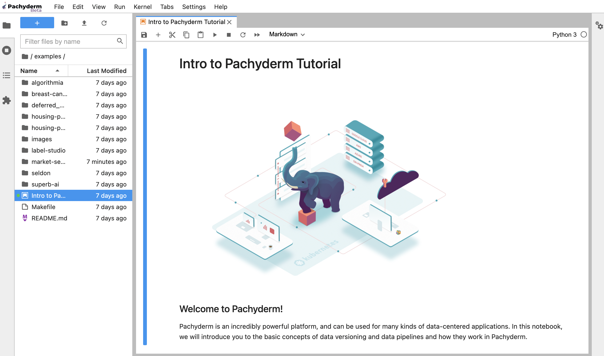

# Notebooks (beta)

!!! Warning 
     - Notebooks [**beta**](../../contributing/supported-releases/#beta) is available on our Saas solution [Hub](https://hub.pachyderm.com){target=_blank}. 
     - [Contact us](mailto:sales@pachyderm.com) to create a workspace and start experimenting with Notebooks right away with our **21-day free trial**\*.

     *\*Offer limited to one single user workspace with 4 vCPUs, 15GB RAM, and unlimited object storage.*
    
## Overview

Pachyderm Notebooks is a **customized JupyterHub deployment running inside and authenticated to your Pachyderm cluster.**.
The Jupyter notebooks spawned from Notebooks provide data scientists with a familiar way to sample (mount repositories) or experiment with data and code written in Python. Because those experiments are running on Pachyderm, Data scientists benefit from the complete reproducibility that data versioning and lineage offer. At the same time, ML engineers can productionize those pipelines faster, efficiently, and securely.

## Base Image

Our Notebooks instances come with a pre-installed suite of packages, including:

 - [Jupyter Data science base image](https://hub.docker.com/layers/jupyter/datascience-notebook/python-3.8.8/images/sha256-bab39ddef7f66e05a0618a23abbf8e71cba000a5fff585b515cc3338698ec165?context=explore){target=_blank} with [libraries for data analysis](https://jupyter-docker-stacks.readthedocs.io/en/latest/using/selecting.html#jupyter-datascience-notebook){target=_blank} from the Python (scipy, scikit-learn, pandas, beautifulsoup, seaborn, matplotlib... ), R, and Julia communities. 
 - Our [Python Client `python-pachyderm`](../../reference/clients/#python-client). 
 - Our Command-Line Tool `pachctl`.

Run `pip install` from a cell to install any additional library.

!!! Note 
     We have included a selection of data science examples running on Pachyderm, from a market sentiment NLP implementation using a FinBERT model to pipelines training a regression model on the Boston Housing Dataset. In the `/examples` directory, you will also find integration examples with open-source products, such as labeling or model serving applications.
     
## Getting Started

!!! Note 
     On [Hub](https://hub.pachyderm.com){target=_blank}, click the `Notebooks` button on your workspace.

From the landing page of Notebooks, in the `/examples` directory, click on the **Intro to Pachyderm Tutorial**. 
Follow along to learn the basics of Pachyderm (repos, pipelines, commits, etc...) from your familiar Jupyter notebook. 

!!! Note 
     This Tutorial uses Pachyderm's CLI `pachctl`. Feel free to use 'python-pachyderm' instead. 
