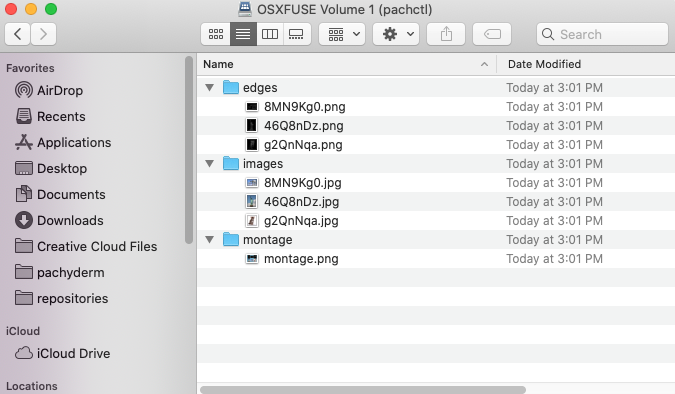

# Mount a Repo to a Local Computer

!!! warning
    Pachyderm uses FUSE to mount repositories as local filesystems.
    Because Apple has announced phasing out support for macOS
    kernel extensions, including FUSE, this functionality is no
    longer stable on macOS Catalina (10.15) or later.

Pachyderm enables you to mount a repository
as a local filesystem on your computer by using the
`pachctl mount` command. This command
uses the Filesystem in Userspace (FUSE) user interface to export a Pachyderm
File System (PFS) to a Unix computer system.
This functionality is useful when you want to pull data locally to experiment,
review the results of a pipeline, or modify the files
in the input repository directly.

You can mount a Pachyderm repo in one of the following modes:

* `Read-only` — you can read the mounted files to further experiment with them
locally, but cannot modify them.
* `Read-write` — you can read mounted files, modify their contents, and
push them back into your centralized Pachyderm input repositories.

## Prerequisites

You must have the following configured for this functionality to work:

* Unix or Unix-like operating system, such as Ubuntu 16.04 or macOS
Yosemite or later.
* FUSE for your operating system installed:

  * On macOS, run:

    ```shell
    brew install osxfuse
    ```

  * On Ubuntu, run:

    ```shell
    sudo apt-get install -y fuse
    ```

    For more information, see:

  * [FUSE for macOS](https://osxfuse.github.io/){target=_blank}

## Mounting Repositories in Read-Only Mode

By default, Pachyderm mounts
all repositories in read-only mode. You can access the
files through your file browser or enable third-party applications
access. Read-only access enables you to explore and experiment with
the data, without modifying it. For example, you can mount your
repo to a local computer and then open that directory in a Jupyter
Notebook for exploration. 

!!! Note
      The `pachctl mount` command allows you to mount not only the default
      branch, typically a `master` branch, but also other Pachyderm
      branches. By default, Pachyderm mounts the `master` branch. However,
      if you add a branch to the name of the repo, the `HEAD` of that branch
      will be mounted.

      **Example:**

      ```shell
      pachctl mount images --repos images@staging
      ```

      You can also mount a specific commit, but because commits
      might be on multiple branches, modifying them might result in data deletion
      in the `HEAD` of the branches. Therefore, you can only mount commits in
      read-only mode. If you want to write to a specific commit that is not
      the `HEAD` of a branch, you can create a new branch with that commit as `HEAD`.

## Mounting Repositories in Read-Write Mode

Running the `pachctl mount` command with the `--write` flag grants you
write access to the mounted repositories, which means that you can
open the files for editing and put them back to the Pachyderm
repository. 

!!! Warning
    Your changes are saved to the Pachyderm repository only **after you interrupt the `pachctl mount` with  `CTRL+C`** or with `pachctl unmount`, `unmount /<path-to-mount>`, or `fusermount -u /<path-to-mount>`.

For example, you have the [OpenCV example pipeline](../../../../getting-started/beginner-tutorial/#image-processing-with-opencv)
up and running. If you want to edit files in the `images`
repository, experiment with brightness and contrast
settings in `liberty.png`, and finally have your `edges`
pipeline process those changes.
If you do not mount the `images` repo, you would have to
first download the files to your computer, edit them,
and then put them back to the repository. The `pachctl mount`
command automates all these steps for you. You can mount just the
`images` repo or all Pachyderm repositories as directories
on you machine, edit as needed, and, when done,
exit the `pachctl mount` command. Upon exiting the `pachctl mount`
command, Pachyderm uploads all the changes to the corresponding
repository.

If someone else modifies the files while you are working on them
locally, their changes will likely be overwritten when you exit
`pachctl mount`. This happens because  Therefore, make sure that you do not work on the
same files while someone else is working on them.

!!! Note
    
    - Use writable mount **ONLY** when you have sole ownership
    over the mounted data. Otherwise, merge conflicts or
    unexpected data overwrites can occur.

    - Because output repositories are created by the Pachyderm
      pipelines, they are immutable. Only a pipeline
      can change and update files in these repositories. If you try to change
      a file in an output repo, you will get an error message.


### How to Mount/Unmount a Pachyderm Repo

To mount a Pachyderm repo on a local computer, complete the following
steps:

1. In a terminal, go to a directory in which you want to mount a
Pachyderm repo. It can be any new empty directory on your local computer.
For example, `mydirectory`.

1. Run `pachctl mount` for a repository and branch that you want to mount:

      ```shell
      pachctl mount <path-on-your-computer> [flags]
      ```

      **Example:**

      * If you want to mount all the repositories in your Pachyderm cluster 
      to a `mydirectory` directory on your computer and give `WRITE` access to them, run:

      ```shell
      pachctl mount mydirectory --write
      ```

      * If you want to mount the master branch of the `images` repo
      and enable file editing in this repository, run:

      ```shell
      pachctl mount mydirectory --repos images@master+w
      ```

      To give read-only access, omit `+w`.

      **System Response:**

      ```
      ro for images: &{Branch:master Write:true}
      ri: repo:<name:"montage" > created:<seconds:1591812554 nanos:348079652 > size_bytes:1345398 description:"Output repo for pipeline montage." branches:<repo:<name:"montage" > name:"master" >
      continue
      ri: repo:<name:"edges" > created:<seconds:1591812554 nanos:201592492 > size_bytes:136795 description:"Output repo for pipeline edges." branches:<repo:<name:"edges" > name:"master" >
      continue
      ri: repo:<name:"images" > created:<seconds:1591812554 nanos:28450609 > size_bytes:244068 branches:<repo:<name:"images" > name:"master" >
      MkdirAll /var/folders/jl/mm3wrxqd75l9r1_d0zktphdw0000gn/T/pfs201409498/images
      ```

      The command runs in your terminal until you terminate it
      by pressing `CTRL+C`.

      * Tip
      Mount multiple repos at once by appending each mount instruction to the same command.
      For example, the following will mount both repos to the `/mydirectory` directory.
      ```shell
      pachctl mount ./mydirectory -r first_repo@master -r second_repo@master
      ```  
1. You can check that the repo was mounted by running the mount command
in your terminal:

      ```shell hl_lines="7"
      mount
      /dev/disk1s1 on / (apfs, local, read-only, journaled)
      devfs on /dev (devfs, local, nobrowse)
      /dev/disk1s2 on /System/Volumes/Data (apfs, local, journaled, nobrowse)
      /dev/disk1s5 on /private/var/vm (apfs, local, journaled, nobrowse)
      map auto_home on /System/Volumes/Data/home (autofs, automounted, nobrowse)
      pachctl@osxfuse0 on /Users/testuser/mydirectory (osxfuse, nodev, nosuid, synchronous, mounted by testuser)
      ```

1. Access your mountpoint.

      For example, in macOS, open Finder, press
      `CMD + SHIFT + G`, and type the mountpoint location. If you have mounted
      the repo to `~/mydirectory`, type `~/mydirectory`.

      

1. Edit the files as needed.
1. When ready, **add your changes to the Pachyderm repo by stopping
the `pachctl mount` command with `CTRL+C` or by running `pachctl unmount
<mountpoint>`** (or `unmount /<path-to-mount>`, or `fusermount -u /<path-to-mount>`).

      If you have mounted a writable Pachyderm share, **interrupting the
      `pachctl mount` command results in the upload of
      your changes to the corresponding repo and branch**, which is equivalent
      to running the `pachctl put file` command. You can check that
      Pachyderm runs a new job for this work by listing current jobs with
      `pachctl list job`.
