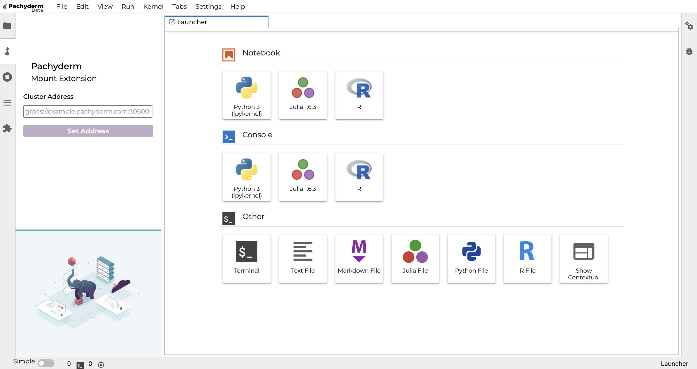

# Pachyderm JupyterLab Mount Extension


 We implemented a [JupyterLab extension](https://pypi.org/project/jupyterlab-pachyderm/){target=_blank} that selectively **maps the contents of data repositories right into your Jupyter environment**. Any named branch in a repo can be “mounted” into your file system via the Jupyter environment, making it feel like the data in Pachyderm is on your computer. 

 For Data Scientists whose data are stored in Pachyderm, the extension provides a seamless way to:

- Connect your Notebook to a Pachyderm cluster.
- Browse, explore, analyze data stored in Pachyderm directly from your Notebook.
- Run and test out your pipeline code before creating a Docker image. The extension provides a quick and reliable data **development environment** that can be shared. 

!!! Important "TL;DR - Quick Start"
    We will provide two sets of instructions, depending on whether you know the cluster address (`pachd_address`) you want to connect your JupyterHub to or don't.

    - **You know the `pachd_address` of your cluster**:

        - Run:
        ```shell
        docker run -it -p 8888:8888 -e GRANT_SUDO=yes --user root --device /dev/fuse --privileged --entrypoint /opt/conda/bin/jupyter pachyderm/notebooks-user:{{ config.jupyterlab_extension_image_tag }}  lab --allow-root
        ```
        - Access your JupyterLab session through a local browser (check the link in the stdout).
        - Then [connect your JupyterLab to your Pachyderm cluster](#connect-the-extension-to-your-pachyderm-cluster). 
        You are ready to start experimenting.


    - **You do not know the `pachd_address` of your cluster**:

        - Install `pachctl` (Pachyderm command line tool) on your machine (see [`pachctl` installation instructions](../../getting-started/local-installation/#install-pachctl){target=_blank} ).
        - Then, [connect that CLI to your cluster](../../getting-started/local-installation/#connect-pachctl-to-your-cluster){target=_blank}.
        - And run:
        ```shell
        docker run -it -v ~/.pachyderm/config.json:/home/jovyan/.pachyderm/config.json -p 8888:8888 -e GRANT_SUDO=yes --user root --device /dev/fuse --privileged --entrypoint /opt/conda/bin/jupyter pachyderm/notebooks-user:{{ config.jupyterlab_extension_image_tag }} lab --allow-root
        ```
        - Access your JupyterLab session through a local browser (check the link in the stdout).
        You are all logged in. Start experimenting.

Note that we are assuming that you **already have a Pachyderm cluster running** to connect your JupyterHub/JupyterLab. Find Pachyderm installation instructions in the [Deploy/Manage](../../deploy-manage/deploy/) section of our documentation.
## Using The Extension

!!! Warning "Troubleshooting - When in doubt, restart your mount server"
        JupyterLab Mount Extension is an [experimental feature](https://docs.pachyderm.com/latest/reference/supported-releases/#experimental){target=_blank}. Many issues can be resolved by restarting the mount server, should you find yourself in an odd situation. To kill/restart your server, run the following command from the terminal window in jupyterlab:
        ```shell
        pkill -f "pachctl mount-server" 
        ```
        The server will restart by itself.
### Connect The Extension To Your Pachyderm Cluster

To connect the extension to your Pachyderm cluster, fill in the full `pachd_address` (i.e., Pachyderm cluster address) in the login form accessible by clicking on the mount extension icon in the far left tab bar. It should look like "grpc://`<external-IP-address-or-domain-name>`:`<port-number>`".

If you are experimenting with data living in different Pachyderm clusters, you can change the connection string and direct your notebooks to another cluster.

You might be prompted to authenticate in a separate tab of your browser if Authentication has been turned on on the cluster you are exploring data from.



!!! Info "Having difficulty finding the full `pachd_address` of your cluster?"
        Refer to the **QuickStart** at the top of this page.
### Mount / Unmount A Branch

After connecting to your cluster via the login interface, you are presented with a list of the repos in your cluster. **Any named branch in a repo can be “mounted” into your file system** by clicking the mount button next to the repo. 

The extension connects to your versioned data stored in Pachyderm and simulates a mounted drive on your file system at `/pfs`, similar to how a pipeline would see data when running a job. Files are lazily loaded, meaning they are only downloaded locally when you access them. This saves you time by only **loading the data as you access it**.

To make interacting with the mounted data easier, the extension also provides you with a file browser to the `/pfs` location. This lets you explore, search and open the data you have mounted in the same way you would the files on your computer. 

You should see the repositories ready to be mounted from your Pachyderm instance.

!!! Info 
    - All mounted repositories are **read-only**. 
    - Under the hood, the extension requires FUSE. 
    - We apply the `/` globbing pattern to all directories/files in mounted repo@branch. 

Make sure to check our [data science notebook examples](https://github.com/pachyderm/examples){target=_blank} running on Pachyderm, from a market sentiment NLP implementation using a FinBERT model to pipelines training a regression model on the Boston Housing Dataset. You will also find integration examples with open-source products, such as labeling or model serving applications. 

## Install The Mount Extension

The deployment instructions for Pachyderm Mount Extension come in two flavors, depending on what your deployment target is (e.g. *JupyterLab or JupyterHub on Kubernetes*).

Pick the option that fits your use case:

- Run with our [JupyterLab container](#running-the-jupyterlab-container).
- Deploy on [JupyterHub with Helm](#adding-the-extension-to-your-jupyterhub-deployment-with-helm).

!!! Info "Versions"

     - Find the latest available version of our Pachyderm Mount Extension in [PyPi](https://pypi.org/project/jupyterlab-pachyderm/){target=_blank}.
     - We recommend JupyterLab >= 3.0.
<!-- Deploy the extension [locally](#on-your-machine) on a JupyterLab installed on your machine.-->
Just before your installation... 
### Pre-built Image vs Make Your Own

Depending on your setup, you might choose to use our pre-built image containing the extension or add the extension to your image.

- Using Pachyderm's pre-built image `pachyderm/notebooks-user:{{ config.jupyterlab_extension_image_tag }}`:

    !!! Note 

         Find the latest available tag of the image [`pachyderm/notebooks-user` in DockerHub](https://hub.docker.com/r/pachyderm/notebooks-user/tags){target=_blank} to get the latest copy of the extension.
 
         Our image comes with a pre-installed suite of packages, including:

         - The extension `jupyterlab-pachyderm`. 
         - A custom version of our Command-Line Tool `pachctl`. 
         - FUSE 
         - Additionally, it pre-creates the `/pfs` directory files that will be mounted to and grants ownership to the JupyterLab USER.
        
         The image is based on a GPU-enabled version of [jupyter/base-notebook¶](https://jupyter-docker-stacks.readthedocs.io/en/latest/using/selecting.html#jupyter-base-notebook).

- Add the extension to your existing Jupyterlab Docker image:

    !!! Note 
        Replace the following `${PACHCTL_VERSION}` with the version of `pachctl` that matches your cluster's, and update `<version>` with the release number of the extension.

    ```shell 
    # This runs the following section as root; if adding to an existing Dockerfile, set the user back to whatever you need. 
    USER root

    # This is the directory files will be mounted to, mirroring how pipelines are run. 
    RUN mkdir -p /pfs 

    # If you are not using "jovyan" as your notebook user, replace the user here. 
    RUN chown $NB_USER /pfs

    # Fuse is a requirement for the mount extension 
    RUN apt-get clean && RUN apt-get update && apt-get -y install curl fuse 

    # Install Pachctl - Set the version of Pachctl that matches your cluster deployment. 
    RUN curl -f -o pachctl.deb -L https://github.com/pachyderm/pachyderm/releases/download/v${PACHCTL_VERSION}/pachctl_${PACHCTL_VERSION}_amd64.deb 
    RUN dpkg -i pachctl.deb

    # This sets the user back to the notebook user account (i.e., Jovyan) 
    USER $NB_UID

    # Replace the version here with the version of the extension you would like to install from https://pypi.org/project/jupyterlab-pachyderm/ 
    RUN pip install jupyterlab-pachyderm==<version> 
    ```

    Then, [build, tag, and push your image](../developer-workflow/working-with-pipelines/#step-2-build-your-docker-image).

### Running the JupyterLab Container

If you are using our pre-built image:

- Run the script below:

    ```shell
    docker run -it -p 8888:8888 -e GRANT_SUDO=yes --user root --device /dev/fuse --privileged --entrypoint /opt/conda/bin/jupyter pachyderm/notebooks-user:{{ config.jupyterlab_extension_image_tag }} lab --allow-root 
    ```

- Click on the link provided in the stdout of your terminal to run JupyterLab in a browser.

- Jump to the [`Connect Your JupyterLab Extension To Your Pachyderm Cluster`](#connect-the-extension-to-your-pachyderm-cluster) section.

Replace the image name with your own image otherwise.

### Adding The Extension To Your JupyterHub Deployment With Helm

!!! Info
    Find the complete installation instructions of JupyterHub on Kubernetes in [Jupyterhub for Kubernetes documentation](https://zero-to-jupyterhub.readthedocs.io/en/latest/#setup-jupyterhub){target=_blank}.

- As a FUSE requirement, add the following to your **Jupyterhub helm chart values.YAML** file to enable root in the `singleuser` containers or use our default [`jupyterhub-ext-values.yaml`](https://github.com/pachyderm/pachyderm/blob/{{ config.pach_branch }}/etc/helm/examples/jupyterhub-ext-values.yaml){target=_blank}:

    !!! Note
        Update the fields `singleuser.image.name` and `singleuser.image.tag` to match your user image or leave Pachyderm's default image `pachyderm/notebooks-user:{{ config.jupyterlab_extension_image_tag }}`.

    ```yaml
    singleuser:
        defaultUrl: "/lab"
        cmd:   "start-singleuser.sh"
        image:
            name: pachyderm/notebooks-user
            tag: {{ config.jupyterlab_extension_image_tag }}
        uid:   0
        fsGid: 0
        extraEnv:
            "GRANT_SUDO": "yes"
            "NOTEBOOK_ARGS": "--allow-root"
            "JUPYTER_ENABLE_LAB": "yes"
            "CHOWN_HOME": "yes"
            "CHOWN_HOME_OPTS": "-R"
    hub:
        extraConfig:
            enableRoot: |
                from kubernetes import client
                def modify_pod_hook(spawner, pod):
                    pod.spec.containers[0].security_context = client.V1SecurityContext(
                        allow_privilege_escalation=True,
                        run_as_user=0,
                        privileged=True,
                        capabilities=client.V1Capabilities(
                            add=['SYS_ADMIN']
                        )
                    )
                    return pod
                c.KubeSpawner.modify_pod_hook = modify_pod_hook
    ```

- Run the following commands to install JupyterHub:

    ```shell
    helm repo add jupyterhub https://jupyterhub.github.io/helm-chart/
    helm repo update

    helm upgrade --cleanup-on-fail \
    --install jupyter jupyterhub/jupyterhub \
    --values <your-jupyterhub-values.yaml>
    ```

    !!! Note 
        This may take a while if you are pulling from a large Docker image.


- Find the IP address you will use to access the JupyterHub as described in these [Helm installation instructions](https://zero-to-jupyterhub.readthedocs.io/en/latest/jupyterhub#setup-jupyterhub) (Step 5 and 6) and open Jupyterlab.

- Click on the link provided in the stdout of your terminal to run JupyterLab in a browser, then jump to the [`Connect Your JupyterLab Extension To Your Pachyderm Cluster`](#connect-the-extension-to-your-pachyderm-cluster) section.

- Run the following command to refresh the mount server:

    ``` shell
    umount /pfs
    ```


<!-- ### 2- On Your Machine

- Prerequisites

    - [Install `pachctl`](../../../getting-started/local-installation/#install-pachctl){target=_blank} :
    Make sure that the version of `pachctl` matches the version of your cluster.
 
    - [Have 'pachctl' and your Cluster Communicate](../../../getting-started/local-installation/#have-pachctl-and-your-cluster-communicate){target=_blank} .

    - [Install FUSE](h../../../how-tos/basic-data-operations/export-data-out-pachyderm/mount-repo-to-local-computer/#prerequisites){target=_blank} . Choose the instructions that fit your environment.
    
    - [Test your mount](../../../how-tos/basic-data-operations/export-data-out-pachyderm/mount-repo-to-local-computer/#mounting-repositories-in-read-only-mode){target=_blank} :
     Create a repo containing a file on its master branch, then mount the HEAD on a local directory of your choice. 
    
        !!! Example
            ```shell
            pachctl create repo images
            pachctl put file images@master:liberty.png -f http://imgur.com/46Q8nDz.png
            pachctl mount images --repos images@master
            ```
            The image should be visible in your directory `images` in this example.    
    
    - Create a `/pfs` directory owned by the Notebook USER:

        !!! Example "Example on Debian-based Linux"
            Run the following commands to create the mount directory and install FUSE:

            ```shell
            # Install FUSE
            sudo apt-get update && apt-get -y install curl fuse
            # Create the directory your data will be mounted into and grant your USER access
            sudo mkdir -p /pfs
            sudo chown $USER /pfs
            ```

 
- Install the extension in the python environment where you have [installed Jupyterlab](https://jupyter.org/install){target=_blank} 

    ```shell
    pip install jupyterlab
    pip install jupyterlab-pachyderm==<version>
    ```
    !!! Note
        Replace `<version>` with your chosen [version of the extension](https://pypi.org/project/jupyterlab-pachyderm/){target=_blank}.

- Start your JupyterLab
    ```shell
    jupyter-lab
    ```

If you are using the same USER to run JupyterLab, the Mount Extension, and have granted that USER access to `/pfs`, you are all set. You should see your existing repos [ready to be mounted](#use-jupyterlab-mount-extension) in your Notebook and can start experimenting. -->


!!! Warning "M1 users with Docker Desktop < `4.6`"

     A [documented issue between qemu and Docker Desktop](https://gitlab.com/qemu-project/qemu/-/issues/340){target=_blank} prevents you from running our pre-built Mount Extension Image in Docker Desktop.

     We recommend to:

     - Use [Podman](https://podman.io){target=_blank} (See installation instructions)
     ```shell
     brew install podman
     podman machine init --disk-size 50
     podman machine start
     podman machine ssh
     sudo rpm-ostree install qemu-user-static && sudo systemctl reboot THEN
     ```
     then replace the keyword `docker` with `podman` in all the commands above. 
     - Or make sure that your qemu version is > `6.2`.


