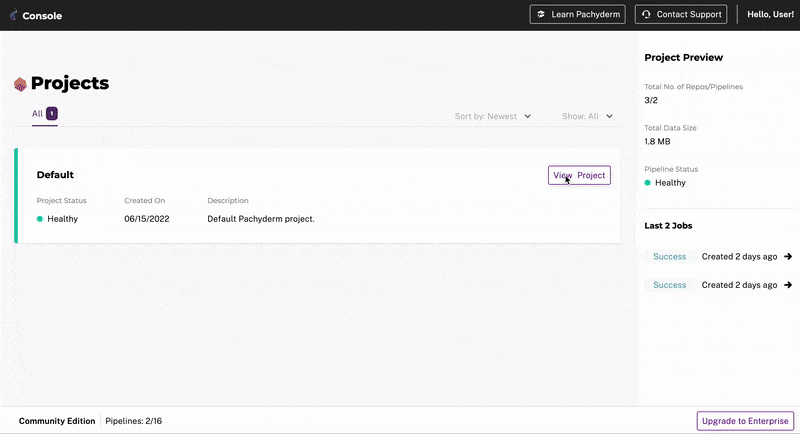
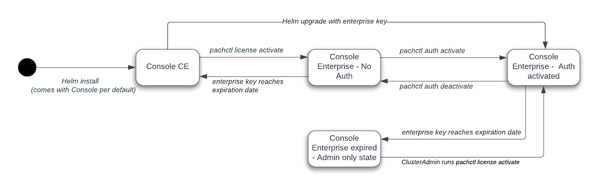

# Console

## What is Console

Pachyderm **Console is a complete web UI for visualizing running pipelines and exploring your data**. By clicking on individual pipeline segments, users can check their jobs' status, visualize their commits' content, access logs, and much more! It is a valuable companion when troubleshooting pipelines.

!!! Warning
     Console has been part of Pachyderm Community Edition since Pachyderm `2.2.3`. Refer to an [earlier version of the deployment instructions](https://docs.pachyderm.com/2.1.x/deploy-manage/deploy/console/){target=_blank} for previous versions of Pachyderm (`2.2.2` and under).

Pachyderm Community Edition comes with Console per default. Upon upgrading to Pachyderm Enterprise, you will be able to:

- Benefit from our Authentication/Authorization features and control which users, groups, or roles have access to specific Pachyderm resources.
- Lift all [CE scaling limits](../../../reference/scaling-limits/){target=_blank}.

!!! Note
     Request an Enterprise trial token directly from Console CE by hitting the **"Upgrade to Enterprise"** button at the bottom right of your Console, fill in [this form](https://www.pachyderm.com/trial/){target=_blank}, or get in touch with us at [sales@pachyderm.io](mailto:sales@pachyderm.io).

Before diving into Console installation steps, please look at Console's various states, from the Community Edition to Enterprise. It should give you a mental model of the various paths to upgrade your Community Edition and what happens when your Enterprise token expires.

## Deploy Console

Note that this section is an add-on to the deployment of Pachyderm, locally or in the cloud. 
It details the additional steps required to install and access your Console.

- If you plan to deploy in the cloud, this section will complement your values.yaml (find Pachyderm's deployment instructions matching your target ([AWS](../aws-deploy-pachyderm/){target=_blank}, [Google](../google-cloud-platform/){target=_blank}, [Azure](../azure/){target=_blank}...) in the [Deploy section](../){target=_blank} of the documentation.
- To deploy locally, follow the instructions below.

### Deploy Locally

!!! Info "Reminder"
      A local installation helps you learn
      some of the Pachyderm basics and experiment with the product. It is not designed to be a production environment.

We provide an easy "one line" deployment command to install Pachyderm with Console on a local environment. All you need is a Kubernetes cluster running locally.

Follow the deployment instructions in our [Local Installation](../../getting-started/local-installation.md#deploy-pachyderm){target=_blank} page.
You are all set!

!!! Note
    - **Pachyderm local deployment comes with Console by default**. To prevent Console from being installed, pass the following parameter to your helm install one line command `--set console.enabled=false`.
    - Console CE does not require any authentication.

### Deploy In The Cloud

The deployment of Console in your favorite Cloud usually requires, at a minimum, the set up an Ingress (see below), the activation of Authentication, and the setup of a DNS.

- You can opt for a **quick installation** that will alleviate those infrastructure constraints (Not recommended in Production but an easy way to get started) and speed up your installation by following the steps in our [Quick Cloud Deployment](../quickstart/){target=_blank} page, then [connect to your Console](#connect-to-console): 

!!! Note 
    - You can "quick install" Pachyderm CE or Enterprise Edition.
    - Use the mock user (username:`admin`, password: `password`) to login to Console when authentication is enabled but no Identity provider was wired (Enterprise).

- For a **production environment**:

    - Set up your [Ingress](../ingress/#ingress) and DNS.
    - Set up your IDP during deployment.
        To configure your Identity Provider as a part of `helm install`, see examples for the `oidc.upstreamIDPs` value in the [helm chart values specification](https://github.com/pachyderm/pachyderm/blob/42462ba37f23452a5ea764543221bf8946cebf4f/etc/helm/pachyderm/values.yaml#L461){target=_blank} and read [our IDP Configuration page](../../enterprise/auth/authentication/idp-dex.md) for a better understanding of each field. 
    - Or manually update your values.yaml with `oidc.mockIDP = false` then [set up an Identity Provider by using `pachctl`](../../../enterprise/auth/authentication/idp-dex).

!!! Warning
    - **When enterprise is enabled through Helm, auth is automatically activated** (i.e., you do not need to run `pachctl auth activate`) and a `pachyderm-auth` k8s secret is created containing a [rootToken](../../enterprise/auth/index.md#activate-user-access-management) key. Use `{{"kubectl get secret pachyderm-auth -o go-template='{{.data.rootToken | base64decode }}'"}}` to retrieve it and save it where you see fit.
    
    However, **this secret is only used when configuring through helm**:

        - If you run `pachctl auth activate`, the secret is not updated. Instead, the rootToken is printed in your STDOUT for you to save.
        - Same behavior if you [activate enterprise manually](../../../enterprise/deployment/) (`pachctl license activate`) then [activate authentication](../../../enterprise/auth/) (`pachctl auth activate`).

    - **Set the helm value `pachd.activateAuth` to false to prevent the automatic bootstrap of auth on the cluster**.

### Connect to Console

=== "No Ingress set up (Local or Quick Install)"

    - Run `pachctl port-forward` (Background this process in a new tab of your terminal).
    
    - Connect to your Console (Pachyderm UI):

         - Point your browser to `http://localhost:4000` 
         - Authenticate as the mock User using `admin` & `password` 

=== "Ingress / DNS set up"

    - Point your browser to:

         - `http://<external-IP-address-or-domain-name>:80` or,
         - `https://<external-IP-address-or-domain-name>:443` if TLS is enabled

    - Authenticate:

         - As the mock User using `admin` & `password` if you used the mockIDP.
         - As a User of your IdP otherwise.

You are all set! 
You should land on the Projects page of Console.

