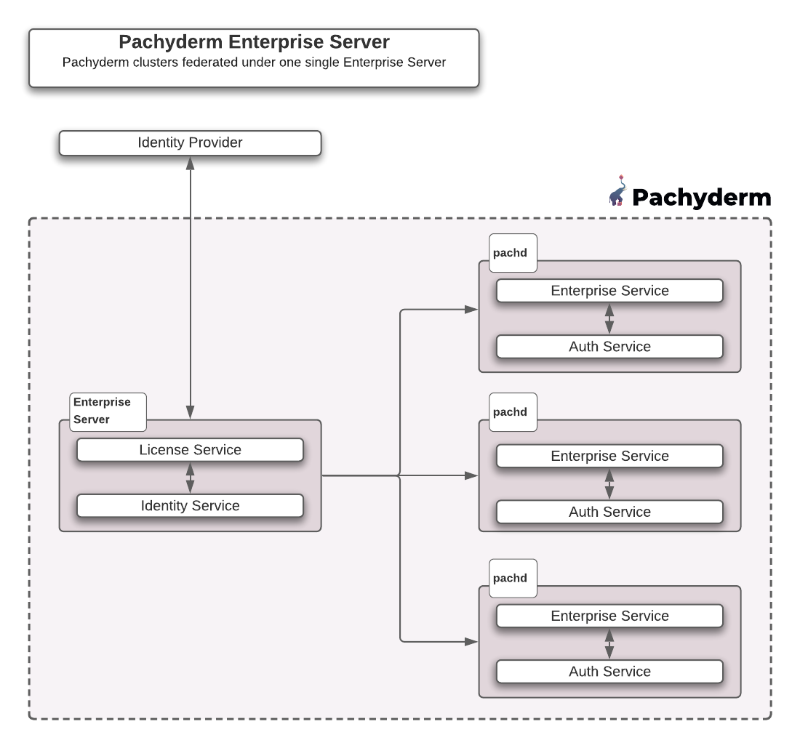

# Enterprise Server Setup
The **Enterprise Server** is a component in Pachyderm which manages Enterprise Licensing
and the integration with a company's Identity Providers (IDPs).

An organization can have **many Pachyderm clusters registered with one single Enterprise Server**. Administrators activate the Enterprise Server with an **Enterprise License Key** from Pachyderm sales, and optionally configure authentication with their IDP via SAML, OIDC, LDAP, etc...

An Enterprise Server uses the same binary/images as a regular Pachyderm cluster, therefore, it is deployed like a typical cluster (See our [Deploy/Manage](../../../deploy-manage/index.md) section) with minor differences:

- **No Object store**: It is **not backed by an object store**. In other words, you won't need to set up an object store, so you don't need any deployment target in your helm chart.
- **The PostgreSQL Instance requires two databases: `dex` and `pachyderm`**. Note that when the enterprise server is deployed as a standalone cluster as part of a multi-cluster deployment, all the clusters than will be registered to this enterprise server will each require one PostgreSQL database only: `pachyderm` (`dex` being at the enterprise server already).

The following diagram gives you a quick overview of an organization with multiple Pachyderm clusters behind a single Enterprise Server.


!!! Note
	For POCs and smaller organizations with one single Pachyderm cluster, the **Enterprise Server services can be run embedded in pachd**. A separate deployment is not necessary. An organization with a single Pachyderm cluster can run the Enterprise Server services embedded within pachd.

The setup of an Enterprise Server requires to:

1. Deploy it.
2. Activate your Enterprise Key and enable Auth.
3. Register your newly created or existing Pachyderm clusters with your enterprise server.
4. Optional: Enable Auth on each cluster.

!!! Attention 
    We are now shipping Pachyderm with an **embedded proxy** 
    allowing your nterprise server to expose one single port externally. This deployment setup is optional.
    
    If you choose to deploy your enterprise server with a Proxy, check out our new recommended architecture and [deployment instructions](../../../../deploy-manage/deploy/deploy-w-proxy/) as they alter the instructions below.

## 1 - Deploy An Enterprise Server
Deploying and configuring an enterprise server can be done in one of two flavors:

1. Provide all licensing and authentication configurations as a part of the Helm deployment.
1. Or, [install a bare-bones version of Pachyderm with Helm](../../../../deploy-manage/deploy/helm-install/), then use `pachctl` commands to set up licensing and authentication.

### As Part Of A Regular Pachyderm Helm Deployment
Update your values.yaml with your enterprise license key and auth configurations ([for an example on localhost, see the example values.yaml here](https://github.com/pachyderm/pachyderm/blob/{{ config.pach_branch }}/etc/helm/examples/local-dev-values.yaml){target=_blank}) or check our minimal example below to your values.yaml.

!!! Warning
		- If a pachyderm cluster will also be installed in the same kubernetes cluster, they should be installed in **different namespaces**:

			```shell
			kubectl create namespace enterprise
			helm install ... --set enterpriseServer.enabled=true  --namespace enterprise
			```

			This command deploys postgres, etcd and a deployment and service called `pach-enterprise`. 
			`pach-enterprise` uses the same docker image and pachd binary, but it **listens on a different set of ports (31650, 31657, 31658)** to avoid conflicts with pachd.

		- Check the state of your deployment by running:
			```shell
			kubectl get all --namespace enterprise
			```
			**System Response**
			```
			NAME                                   READY   STATUS    RESTARTS   AGE
			pod/etcd-5fd7c675b6-46kz7              1/1     Running   0          113m
			pod/pach-enterprise-6dc9cb8f66-rs44t   1/1     Running   0          105m
			pod/postgres-6bfd7bfc47-9mz28          1/1     Running   0          113m

			```


=== "values.yaml for a **stand-alone Enterprise Server as part of a multi-cluster deployment**"
		
	Deploying a stand-alone enterprise server requires setting the helm parameter `enterpriseServer.enabled` to `true` and the `pachd.enabled` to `false`. 

	```yaml
	enterpriseServer:
		enabled: true
	pachd:
		enabled: false
		enterpriseLicenseKey: "<ENTERPRISE-LICENSE-KEY>"
		# Alternatively, you can pass your license in a secret
		enterpriseLicenseKeySecretName: "<enterprise License key secret name>"
		oauthClientID: "pachd"
		oauthRedirectURI: "http://<PACHD-IP>:30657/authorization-code/callback"
		## if a secret name is not provided in `oauthClientSecretSecretName`, a secret containing `oauthClientSecret` (or a randomly generated value if empty) will be created on install and stored in the k8s secret 'pachyderm-auth` under the key `auth-config'
		oauthClientSecret: ""
		oauthClientSecretSecretName: ""
		## if a secret name is not provided in `enterpriseSecretSecretName`, a secret containing `enterpriseSecret` (or a randomly generated value if empty) will be created on install and stored in the k8s secret 'pachyderm-enterprise` under the key `enterprise-secret'
		enterpriseSecretSecretName: ""
		enterpriseSecret: ""
		activateAuth: true
		## if a secret name is not provided in `rootTokenSecretName`, a secret containing `rootToken` (or a randomly generated value if empty) will be created on install and stored in the k8s secret 'pachyderm-auth` under the key `rootToken'
		rootTokenSecretName: ""
		rootToken: ""
    externalService:
      enabled: true
	oidc:
		issuerURI: "http://<PACHD-IP>:30658/"
		## userAccessibleOauthIssuerHost is necessary in localhost settings or anytime the registered Issuer address isn't accessible outside the cluster
		# userAccessibleOauthIssuerHost: "localhost:30658"
		## if `mockIDP` is set to true, `pachd.upstreamIDPs` will be ignored in favor of a testing placeholder IDP with username/password: admin/password
		mockIDP: false
		## to set up upstream IDPs, set pachd.mockIDP to false,
		## and populate the pachd.upstreamIDPs with an array of Dex Connector configurations.
		## See the example below or https://dexidp.io/docs/connectors/
		upstreamIDPs:
		  - id: idpConnector
		    jsonConfig: >-
		      {
		          "issuer": "<ISSUER>",
		          "clientID": "<CLIENT-ID>",
		          "clientSecret": "<CLIENT-SECRET>",
		          "redirectURI": "http://<PACHD-IP>:30658/callback",
		          "insecureEnableGroups": true,
		          "insecureSkipEmailVerified": true,
		          "insecureSkipIssuerCallbackDomainCheck": true,
		          "forwardedLoginParams": ["login_hint"]
		      }
		    name: idpConnector
		    type: oidc
	```

=== "values.yaml for an **embedded single-cluster deployment**"

	```yaml
	pachd:
		enterpriseLicenseKey: "<ENTERPRISE-LICENSE-KEY>"
		# Alternatively, you can pass your license in a secret
		enterpriseLicenseKeySecretName: "<enterprise License key secret name>"
		oauthClientID: "pachd"
		oauthRedirectURI: "http://<PACHD-IP>:30657/authorization-code/callback"
		## if a secret name is not provided in `oauthClientSecretSecretName`, a secret containing `oauthClientSecret` (or a randomly generated value if empty) will be created on install and stored in the k8s secret 'pachyderm-auth` under the key `auth-config'
		oauthClientSecret: ""
		oauthClientSecretSecretName: ""
		## if a secret name is not provided in `enterpriseSecretSecretName`, a secret containing `enterpriseSecret` (or a randomly generated value if empty) will be created on install and stored in the k8s secret 'pachyderm-enterprise` under the key `enterprise-secret'
		enterpriseSecretSecretName: ""
		enterpriseSecret: ""
		activateAuth: true
		## if a secret name is not provided in `rootTokenSecretName`, a secret containing `rootToken` (or a randomly generated value if empty) will be created on install and stored in the k8s secret 'pachyderm-auth` under the key `rootToken'
		rootTokenSecretName: ""
		rootToken: ""
    externalService:
      enabled: true
	oidc:
		issuerURI: "http://<PACHD-IP>:30658/"
		## userAccessibleOauthIssuerHost is necessary in localhost settings or anytime the registered Issuer address isn't accessible outside the cluster
		# userAccessibleOauthIssuerHost: "localhost:30658"
		## if `mockIDP` is set to true, `pachd.upstreamIDPs` will be ignored in favor of a testing placeholder IDP with username/password: admin/password
		mockIDP: false
		## to set up upstream IDPs, set pachd.mockIDP to false,
		## and populate the pachd.upstreamIDPs with an array of Dex Connector configurations.
		## See the example below or https://dexidp.io/docs/connectors/
		upstreamIDPs:
		  - id: idpConnector
		    jsonConfig: >-
		      {
		          "issuer": "<ISSUER>",
		          "clientID": "<CLIENT-ID>",
		          "clientSecret": "<CLIENT-SECRET>",
		          "redirectURI": "http://<PACHD-IP>:30658/callback",
		          "insecureEnableGroups": true,
		          "insecureSkipEmailVerified": true,
		          "insecureSkipIssuerCallbackDomainCheck": true,
		          "forwardedLoginParams": ["login_hint"]
		      }
		    name: idpConnector
		    type: oidc
	```
	This results in a single pachd pod, with authentication enabled, and an IDP integration configured.


!!! Note
     Update the following values as follow:

	 - `PACHD-IP`: The address of Pachyderm's IP. Retrieve Pachyderm external IP address if necessary.
 `ISSUER`, `CLIENT-ID`, `CLIENT-SECRET`: Refer to our [Identity Provider Configuration page](../authentication/idp-dex.md#create-a-connector-configuration-file).


Check the [list of all available helm values](../../../../reference/helm-values/) at your disposal in our reference documentation or on [Github](https://github.com/pachyderm/pachyderm/blob/{{ config.pach_branch }}/etc/helm/pachyderm/values.yaml){target=_blank}.

!!! Warning
    - **When enterprise is enabled through Helm, auth is automatically activated** (i.e., you do not need to run `pachctl auth activate`) and a `pachyderm-auth` k8s secret is created containing a rootToken key. Use `{{"kubectl get secret pachyderm-auth -o go-template='{{.data.rootToken | base64decode }}'"}}` to retrieve it and save it where you see fit.
			
		However, **this secret is only used when configuring through helm**:

		- If you run `pachctl auth activate`, the secret is not updated. Instead, the rootToken is printed in your STDOUT for you to save.
       - Same behavior if you [activate enterprise manually](../../deployment.md) (`pachctl license activate`) then [activate authentication](../../auth/index.md) (`pachctl auth activate`).

    - **Set the helm value `pachd.activateAuth` to false to prevent the automatic bootstrap of auth on the cluster**.

### On An Existing Pachyderm Cluster

To enable the Enterprise Server on an existing cluster:

- [activate your enterprise key and authentication](#2-activate-enterprise-licensing-and-enable-authentication) as described in the following chapter.
- then proceed to [configuring IDP integrations](../authentication/idp-dex.md).

## 2- Activate Enterprise Licensing And Enable Authentication

- Use your enterprise key to activate your enterprise server: 
	```shell
	echo <your-activation-token> | pachctl license activate
	```
- Then enable Authentication at the Enterprise Server level:
	```shell
	pachctl auth activate --enterprise
	```

	!!! Warning
		Enabling Auth will return a `root token` for the enterprise server. 
		**This is separate from the root tokens for each pachd (cluster)**. 
		They should all be stored securely.

Once the enterprise server is deployed, 
deploy your cluster(s) [`helm install...`](../../../deploy-manage/deploy/helm-install.md#install-pachyderms-helm-chart) and [register it(them) with the enterprise server](#3-register-your-cluster-with-the-enterprise-server). Note that you have the option to register your clusters directly in your values.yaml when deploying or after its deployment, using `pachctl`.

You might want to expose your cluster(s) to the internet. Check the setup of a Load Balancer in our [deployment section](../../../deploy-manage/deploy/ingress/index.md#loadbalancer).

## 3- Register Your Cluster With The Enterprise Server
Similarly to the enterprise server, we can configure our pachyderm clusters to leverage Helm for licensing and authentication in one of two flavors:

1. Provide enterprise registration information as a part of the Helm deployment of a cluster.
1. Register a cluster with the Enterprise Server using pachctl commands.

### Register Clusters With Helm
Add the enterprise server's root token, and network addresses to the values.yaml of each cluster you plan to deploy and register, for the cluster and enterprise server to communicate ([for an example on localhost, see the example values.yaml here](https://github.com/pachyderm/pachyderm/blob/{{ config.pach_branch }}/etc/helm/examples/enterprise-member-values.yaml){target=_blank}), or insert our minimal example below to your values.yaml.

=== "values.yaml with activation of an enterprise license and authentication"

	```yaml
	pachd:
	    activateEnterpriseMember: true
  		enterpriseServerAddress: "grpc://<ENTERPRISE_SERVER_ADDRESS>"
  		enterpriseCallbackAddress: "grpc://<PACHD_ADDRESS>"
  		enterpriseServerToken: "<ENTERPRISE-SERVER-TOKEN>" # the same root token of the enterprise cluster
		# Alternatively, use a secret
		enterpriseServerTokenSecretName: "<Name of you secret containing enterpriseServerToken>" 

	```

!!! Warning
		**When setting your enterprise server info as part of the Helm deployment of a cluster, auth is automatically activated unless the helm value `pachd.activateAuth` was intentionally set to false.** (i.e., you can skip step 4).

In this case, a `pachyderm-auth` k8s secret is automatically created containing an entry for your rootToken in the key `rootToken`. Use `{{"kubectl get secret pachyderm-auth -o go-template='{{.data.rootToken | base64decode }}'"}}` to retrieve it and save it where you see fit.


### Register Clusters With pachctl

- Run this command for each of the clusters you wish to register using `pachctl`:

	```shell
	pachctl enterprise register --id <my-pachd-config-name> --enterprise-server-address <pach-enterprise-IP>:650 --pachd-address <pachd-IP>:650
	```

	* `--id` is the name of the context pointing to your cluster in `~/.pachyderm/config.json`.

	* `--enterprise-server-address` is the host and port where pachd can reach the enterprise server. 
	In production, the enterprise server may be exposed on the internet.

	* `--pachd-address` is the host and port where the enterprise server can reach pachd. 
	This may be internal to the kubernetes cluster, or over the internet.

- Display the list of all registered clusters with your enterprise server: 
	```shell
	pachctl license list-clusters
	```

	```shell
	Using enterprise context: my-enterprise-context-name
	id: john
	address: ae1ba915f8b5b477c98cd26c67d7563b-66539067.us-west-2.elb.amazonaws.com:650
	version: 2.0.0
	auth_enabled: true
	last_heartbeat: 2021-05-21 18:37:36.072156 +0000 UTC

	---
	id: doe
	address: 34.71.247.191:650
	version: 2.0.0
	auth_enabled: true
	last_heartbeat: 2021-05-21 18:43:42.157027 +0000 UTC
	---
	```

## 4- Enable Auth On Each Cluster

Finally, if your clusters were registered with the Enterprise Server using `pachctl`, you might choose to activate auth on each (or some) of them. 
This is an **optional step**. Clusters can be registered with the enterprise server without authentication being enabled.

- Before enabling authentication, set up the issuer in the idp config between the enterprise server and your cluster:
	```shell
	echo "issuer: http://<enterprise-server-IP>:658" | pachctl idp set-config --config -
	```
	Check that your config has been updated properly: `pachctl idp get-config`

- For each registered cluster you want to enable auth on:
	```shell
	pachctl auth activate --client-id <my-pachd-config-name> --redirect http://<pachd-IP>:657/authorization-code/callback 
	```
!!! Note
	- Note the **`/authorization-code/callback`** appended after `<pachd-IP>:657` in `--redirect`.
	- `--client-id` is to `pachctl auth activate` what `--id` is to `pachctl enterprise register`: In both cases, enter `<my-pachd-config-name>`. 

-	Make sure than your enterprise context is set up properly: 
	```shell
	pachctl config get active-enterprise-context
	```
	If not: 
	```shell
	pachctl config set active-enterprise-context <my-enterprise-context-name>
	```

 
To manage you server, its context, or connect your IdP, visit the [**Manage your Enterprise Server**](../manage/) page.


