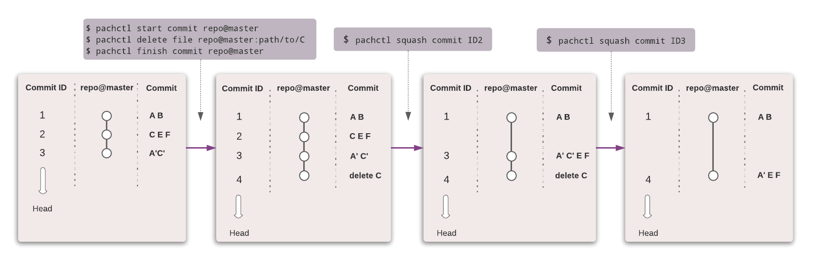
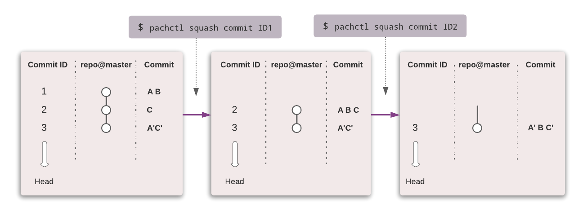

#  Delete Commits, Squash Commits, and Delete Data

If *bad* data was committed into a Pachyderm input repository, you might need to
delete a commit or surgically delete files from your history. 
Depending on whether or not the bad data is in the HEAD commit of
the branch, you can perform one of the following actions:

- [Delete the HEAD of a Branch](#delete-the-head-of-a-branch).
If the incorrect data was added in the latest commit and provided that the commit does not have children: Follow the steps in this section to fix the HEAD of the corrupted branch.
- If your changes are relatively recent (see conditions below), you can [delete a particular file](#delete-files-from-history), then erase it from your history.

Additionally, although this is a separate use-case, you have the option to [squash non-HEAD commits](#squash-non-head-commits) to rewrite your commit history.
## Delete the HEAD of a Branch

To fix a broken HEAD, run the following command:

```shell
pachctl delete commit <commit-ID>
```

When you delete a HEAD commit, Pachyderm performs the following actions:

- Changes HEADs of all the branches that had the bad commit as their
  HEAD to their bad commit's parent and deletes the commit. 
  **The data in the deleted commit is lost**.
  If the bad commit does not have
  a parent, Pachyderm sets the branch's HEAD to a new empty commit. 
- Interrupts all running jobs, including not only the
  jobs that use the bad commit as a direct input but also the ones farther
  downstream in your DAG.
- Deletes the output commits from the deleted jobs. All the actions listed above are applied to those commits as well.

!!! Warning
     This command will **only succeed if the HEAD commit has no children on any branch**. `pachctl delete commit` will error when attempting to delete a HEAD commit with children. 

!!! Note "Are you wondering how a HEAD commit can have children?"
     A commit can be the head of a branch and still have children. 
     For instance, given a `master` branch in a repository named `repo`, if you branch `master` by running `pachctl create branch repo@staging --head repo@master`, the `master`'s HEAD will have an alias child on `staging`. 

## Squash non-HEAD Commits

If your commit has children, you have the option to use the `squash commit` command.
Squashing is a way to rewrite your commit history; this helps clean up and simplify your commit history before sharing your work with team members.
Squashing a commit in Pachyderm means that you are **combining all the file changes in the commits of a global commit
into their children** and then removing the global commit.
This behavior is inspired by the squash option in git rebase.
**No data stored in PFS is removed** since they remain in the child commits.

```shell
pachctl squash commit <commit-ID>
```

!!! Warning "Important"
    - Squashing a global commit on the head of a branch (no children) will fail. Use `pachctl delete commit` instead.
    - Squash commit only applies to [user repositories](../../../concepts/data-concepts/repo/). For example, you cannot squash a commit that updated a pipeline (Commit that lives in a spec repository).
    - Similarly to `pachctl delete commit`, `pachctl squash commit` stops (but does not delete) associated jobs.

!!! Example

      In the simple example below, we create three successive commits on the master branch of a repo `repo`:
      
      - In commit ID1, we added files A and B.
      - In commit ID2, we added file C.
      - In commit ID3, the latest commit, we altered the content of files A and C.

      We then run `pachctl squash commit ID1`, then `pachctl squash commit ID2`, and look at our branch and remaining commit(s).

      
      * A’ and C' are altered versions of files A and C.

      At any moment, `pachctl list file repo@master` invariably returns the same files A’, B, C’. `pachctl list commit` however, differs in each case, since, by squashing commits, we have deleted them from the branch. 

## Delete Files from History

!!! Important
    It is important to note that this use case is limited to simple cases where the "bad" changes were made relatively recently, as any pipeline update since then will make it impossible.

In rare cases, you might need to delete a particular file from a given commit and further choose to delete its complete history. 
In such a case, you will need to:

- Create a new commit in which you surgically remove the problematic file.
    1. Start a new commit:

        ```shell
        pachctl start commit <repo>@<branch>
        ```

    1. Delete all corrupted files from the newly opened commit:

        ```shell
        pachctl delete file <repo>@<branch or commitID>:/path/to/files
        ```

    1. Finish the commit:

        ```shell
        pachctl finish commit <repo>@<branch>
        ```

- Optionally, wipe this file from your history by squashing the initial bad commit and all its children up to
   the newly finished commit.

      Unless the subsequent commits overwrote or deleted the
      bad data, the data might still be present in the
      children commits. Squashing those commits cleans up your
      commit history and ensures that the errant data is not
      available when non-HEAD versions of the data are read.


!!! Example

      In the simple example below, we want to delete file C in commit 2. 
      How would we do that?

      For now, `pachctl list file repo@master` returns the files A’, B, C’, E, F.

      
      * A’ and C' are altered versions of files A and C.

      - We create a new commit in which we surgically remove file C:

        ``` shell
          pachctl start commit repo@master
          pachctl delete file repo@master:path/to/C
          pachctl finish commit repo@master   
        ```
        At this point, `pachctl list file repo@master` returns the files A’, B, E, F. We removed file C. However, it still exists in the commit history.

      - To remove C from the commit history, we squash the commits in which C appears, all the way down to the last commit.  
        ```
          pachctl squash commitID2
          pachctl squash commitID3
        ```
        It is as if C never existed.


      

      