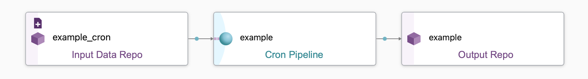

# Ingest Data Via SQL Ingest

!!! Warning
    SQL Ingest is an [experimental feature](../../../reference/supported-releases/#experimental){target=_blank}.

You can inject database content, collected by your data warehouse, by pulling the result of a given query into Pachyderm and saving it as a CSV or JSON file.

## Before You Start 

- You should be familiar with [Jsonnet](https://jsonnet.org/learning/tutorial.html).
- You should be familiar with creating [Jsonnet pipeline specs](https://docs.pachyderm.com/latest/how-tos/pipeline-operations/jsonnet-pipeline-specs/#jsonnet-pipeline-specifications) in Pachyderm.
- You should be familiar with [managing Kubernetes secrets](https://kubernetes.io/docs/tasks/configmap-secret/managing-secret-using-kubectl/). 

---

## How to Set Up SQL Ingest

### 1. Create & Upload a Secret

You must generate a secret that contains the password granting user access to the database; you will pass the username details through the database connection string in [step 2](#2-create-a-database-connection-string).

1. Copy the following:
    ```shell
    kubectl create secret generic yourSecretName --from-literal=PACHYDERM_SQL_PASSWORD=yourDatabaseUserPassword --dry-run=client --output=json > yourSecretFile.json
    ```
2. Swap out `yourSecretName`, `yourDatabaseUserPassword`, and `yourSecretFile` with relevant inputs.
3. Open a terminal and run the command.
4. Copy the following: 
    ```shell
    pachctl create secret -f yourSecretFile.json
    ```
5. Swap out `yourSecretfile` with relevant filename. 
6. Run the command. 
7. Confirm secret by running `pachctl list secret`. 
   
!!! Note
     Not all secret formats are the same. For a full walkthrough on how to create, edit, and view different types of secrets, see [Create and Manage Secrets in Pachyderm](../../advanced-data-operations/secrets/#create-a-secret).

### 2. Create a Database Connection String

Pachyderm's SQL Ingest requires a connection string defined as a [Jsonnet URL parameter](#url-parameter-details) to connect to your database; the URL is structured as follows:

```
<protocol>://<username>@<host>:<port>/<database>?<param1>=<value1>&<param2>=<value2>
```

### 3. Create a Pipeline Spec 

Pachyderm provides a [default Jsonnet template](https://raw.githubusercontent.com/pachyderm/pachyderm/{{ config.pach_branch }}/src/templates/sql_ingest_cron.jsonnet) that has key parameters built in. To use it, you must pass an argument for each [parameter](#parameters). 

1. Copy the following:
   ```shell
   pachctl update pipeline --jsonnet https://raw.githubusercontent.com/pachyderm/pachyderm/{{ config.pach_branch }}/src/templates/sql_ingest_cron.jsonnet \
     --arg name=<pipelineName> \
     --arg url="<connectionStringToDdatabase>" \
     --arg query="<query>" \
     --arg hasHeader=<boolean> \
     --arg cronSpec="<pullInterval>" \
     --arg secretName="<youSecretName>" \
     --arg format=<CsvOrJson> 
     --arg outputFile='<fileName>'
   ```
2. Swap out all of the parameter values with relevant inputs. 
3. Open terminal.
4. Run the command.

### 4. View Query & Results 

- **To View Query String**: `pachctl inspect pipeline <pipelineName>`
- **To View Output File Name**: `pachctl list file <pipelineName>@master`
- **To View Output File Contents**: `pachctl get file <pipelineName>@master:/0000` 

### Example: Snowflake

In this example, we are leveraging Snowflake's support for queries traversing [semi-structured data](https://docs.snowflake.com/en/user-guide/semistructured-concepts.html#:~:text=Snowflake%20provides%20native%20support%20for,fast%20and%20efficient%20SQL%20querying.) (here, JSON). 


1. Create a secret with your password named `snowflakeSecret`.
2. Create a [Snowflake specific](#snowflake) database connection URL using the following details:
      - **Protocol**: `snowflake`
      - **Username**: `username`
      - **Host**: `VCNYTW-MH64356` (account name or locator)
      - **Database**: `SNOWFLAKE_SAMPLE_DATA` 
      - **Schema**: `WEATHER`
      - **Warehouse**: `COMPUTE_WH`
      ```
      snowflake://username@VCNYTW-MH64356/SNOWFLAKE_SAMPLE_DATA/WEATHER?warehouse=COMPUTE_WH
      ```
3. Build query for the table `DAILY_14_TOTAL` using information from column `V`.  
    ```sql
    select T, V:city.name, V:data[0].weather[0].description as morning, V:data[12].weather[0].description as pm FROM DAILY_14_TOTAL LIMIT 1
    ```
4.  Define the pipeline spec by populating all of the parameter values:
   
   ```shell
      pachctl update pipeline --jsonnet https://raw.githubusercontent.com/pachyderm/pachyderm/{{ config.pach_branch }}/src/templates/sql_ingest_cron.jsonnet \
      --arg name=mysnowflakeingest \
      --arg url="snowflake://username@VCNYTW-MH64356/SNOWFLAKE_SAMPLE_DATA/WEATHER?warehouse=COMPUTE_WH" \
      --arg query="select T, V:city.name, V:data[0].weather[0].description as morning, V:data[12].weather[0].description as pm FROM DAILY_14_TOTAL LIMIT 1" \
      --arg hasHeader=true \
      --arg cronSpec="@every 30s" \
      --arg secretName="snowflakeSecret" \
      --arg format=json
   ```
5. Run the command.

---

## How Does This Work?

SQL Ingest's Jsonnet pipeline spec, [**`sql_ingest_cron.jsonnet`**](https://github.com/pachyderm/pachyderm/blob/{{ config.pach_branch }}/src/templates/sql_ingest_cron.jsonnet), creates all of the following:

- **1 Input Data Repo**: Used to store timestamp files at the cronSpec's set interval rate (`--arg cronSpec="pullInterval" \`) to trigger the pipeline.
- [**1 Cron Pipeline**](../../../concepts/pipeline-concepts/pipeline/cron/#cron-pipeline): Houses the spec details that define the input type and settings and  data transformation.
-  **1 Output Repo**: Used to store the data transformed by the cron pipeline; set by the pipeline spec's `pipeline.name` attribute, which you can define through the Jsonnet parameter `--arg name=outputRepoName \`.
- **1 Output File**: Used to save the query results (JSON or CSV) and potentially be used as input for a following pipeline.



In the default Jsonnet template, the file generated is obtainable from the output repo, `outputRepoName@master:/0000`. The filename is hardcoded, however you could paramaterize this as well using a custom Jsonnet pipeline spec and passing `--arg outputFile='0000'`. The file's contents are the result of the query(`--arg query="query"`) being ran against the database`--arg url="connectionStringToDdatabase"` ; both are defined in the `transform.cmd` attribute.


### About SQL Ingest Pipeline Specs

To create an SQL Ingest Jsonnet Pipeline spec, you must have a `.jsonnet` file and several parameters:

```shell
pachctl update pipeline --jsonnet https://raw.githubusercontent.com/pachyderm/pachyderm/{{ config.pach_branch }}/src/templates/sql_ingest_cron.jsonnet \
  --arg name=<pipelineName> \
  --arg url="<connectionStringToDdatabase>" \
  --arg query="<query>" \
  --arg hasHeader=<boolean> \
  --arg cronSpec="<pullInterval>" \
  --arg secretName="<secretName>" \
  --arg format=<CsvOrJson> 
```

- The name of each pipeline (and their related input/output repos) are derived from the `name` parameter (`--arg name=<pipelineName>`).


### Parameters

| Parameter  | Description | 
| ------------- |-------------| 
| `name`        | The name of output repo where query results will materialize.|
| `url`         | The connection string to the database.|  
| `query`       | The SQL query to be run against the connected database. |
| `hasHeader`   | Adds a header to your CSV file if set to `true`. Ignored if `format="json"` (JSON files always display (header,value) pairs for each returned row). Defaults to `false`. <br><br>Pachyderm creates the header after each element of the comma separated list of your SELECT clause or their aliases (if any). <br>For example `country.country_name_eng` will have `country.country_name_eng` as header while `country.country_name_eng as country_name` will have `country_name`. |
| `cronSpec`    | How often to run the query. For example `"@every 60s"`.|
| `format`      | The type of your output file containing the results of your query (either `json` or `csv`).|
| `secretName`  | The Kubernetes secret name that contains the password to the database.|
|`outputFile` | The name of the file created by your pipeline and stored in your output repo; default `0000`|

#### URL Parameter Details

```
<protocol>://<username>@<host>:<port>/<database>?<param1>=<value1>&<param2>=<value2>
```

- Passwords are not included in the URL; they are retrieved from the secret created in [step 1](#1-create-upload-a-secret).
- The additional parameters after `?` are optional and needed on a case-by-case bases (for example, Snowflake).

| Parameter     | Description | 
| ------------- |-------------| 
|`protocol`  | The name of the database protocol. <br> As of today, we support: <br>- `postgres` and `postgresql` : connect to Postgresql or compatible (for example Redshift).<br>- `mysql` : connect to MySQL or compatible (for example MariaDB). <br>- `snowflake` : connect to Snowflake. |
| `username` | The user used to access the database.|
| `host`     | The hostname of your database instance.|
| `port`     | The port number your instance is listening on.|
| `database` | The name of the database to connect to. | 

##### Snowflake 

 Pachyderm supports two connection URL patterns to query Snowflake:

  ```shell
  snowflake://username@<account_identifier>/<db_name>/<schema_name>?warehouse=<warehouse_name>
  snowflake://username@hostname:port/<db_name>/<schema_name>?account=<account_identifier>&warehouse=<warehouse_name>
  ```
  The *[`account_identifier`](https://docs.snowflake.com/en/user-guide/admin-account-identifier.html){target=_blank}* takes one of the following forms for most URLs:

  - Option 1 - [Account Name](https://docs.snowflake.com/en/user-guide/admin-account-identifier.html#option-1-account-name-in-your-organization){target=_blank}:`organization_name`-`account_name`.
  - Option 2 - [Account Locator](https://docs.snowflake.com/en/user-guide/admin-account-identifier.html#option-2-account-locator-in-a-region){target=_blank}: `account_locator`.`region`.`cloud`.


### Formats & SQL Data Types 

The following comments on formatting reflect the state of this release and are subject to change.

#### Formats 

##### Numeric 

All numeric values are converted into strings in your CSV and JSON. 

|Database|CSV|JSON|
|--------|---|----|
| 12345 | 12345 | "12345" |
| 123.45 | 123.45 | "123.45" |

!!! Warning
        - Note that infinite (Inf) and not a number (NaN) values will also be stored as strings in JSON files. 
        - Use this format `#.#` for all decimals that you plan to egress back to a database.

##### Date/Timestamps

|Type|Database|CSV|JSON|
|----|--------|---|----|
|Date|2022-05-09|2022-05-09T00:00:00|"2022-05-09T00:00:00"|
|Timestamp ntz|2022-05-09 16:43:00|2022-05-09T16:43:00|"2022-05-09T16:43:00"|
|Timestamp tz|2022-05-09 16:43:00-05:00|2022-05-09T16:43:00-05:00|"2022-05-09T16:43:00-05:00"|

##### Strings

|Database|CSV|
|--------|---|
|"null"|null|
|\`""\`|""""""|
|""|""|
|nil||
|`"my string"`|"""my string"""|
|"this will be enclosed in quotes because it has a ,"|"this will be enclosed in quotes because it has a ,"|

!!! Tip 
     When parsing your CSVs in your user code, remember to escape `"` with `""`.


#### Supported Data Types

Some of the Data Types listed in this section are specific to a particular database.

| Dates/Timestamps | Varchars | Numerics | Booleans |
|------------------|---------|----------|----------|
|`DATE` <br> `TIME`<br> `TIMESTAMP`<br> `TIMESTAMP_LTZ`<br> `TIMESTAMP_NTZ`<br> `TIMESTAMP_TZ`<br> `TIMESTAMPTZ`<br> `TIMESTAMP WITH TIME ZONE`<br> `TIMESTAMP WITHOUT TIME ZONE` |`VARCHAR`<br> `TEXT`<br> `CHARACTER VARYING`|`SMALLINT`<br> `INT2`<br> `INTEGER`<br> `INT`<br> `INT4`<br> `BIGINT`<br> `INT8`<br>`FLOAT`<br> `FLOAT4`<br> `FLOAT8`<br> `REAL`<br> `DOUBLE PRECISION`<br>`NUMERIC`<br> `DECIMAL`<br> `NUMBER`|`BOOL`<br>`BOOLEAN`|