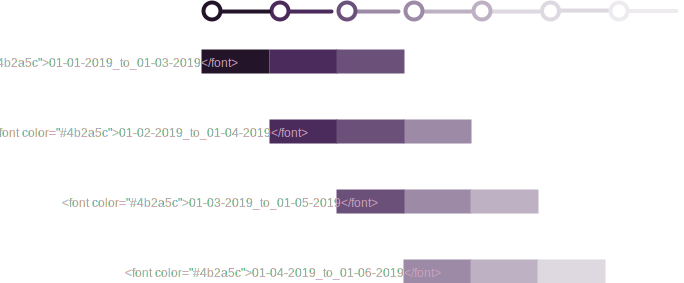

# Processing Time-Windowed Data

!!! info
    Before you read this section, make sure that you understand the concepts
    described in the following sections:

    - [Datum](../concepts/pipeline-concepts/datum/index.md)
    - [Distributed Computing](../concepts/advanced-concepts/distributed_computing.md)
    - [Individual Developer Worflow](individual-developer-workflow.md)

If you are analyzing data that is changing over time, you might
need to analyze historical data. For example, you might need to
examine *the last two weeks of data*, *January's data*, or some
other moving or static time window of data.

Pachyderm provides the following approaches to this task:

1. [Fixed time windows](#fixed-time-windows) - for rigid, fixed
time windows, such as months (Jan, Feb, and so on) or days—01-01-17,
01-02-17, and so on).

2. [Moving time windows](#moving-time-windows)
- for rolling time windows of data, such as three-day windows or
two-week windows.

## Fixed Time Windows

[Datum](../concepts/pipeline-concepts/datum/index.md) is the basic
unit of data partitioning in Pachyderm. The glob pattern property
in the pipeline specification defines a datum. When you analyze data
within fixed time windows, such as the data that corresponds to
fixed calendar dates, Pachyderm recommends that you organize your
data repositories so that each of the time windows that you plan
to analyze corresponds to a separate file or directory in your
repository, and therefore, Pachyderm processes it as a separate
datum.

Organizing your repository as described above, enables you to do the
following:

- Analyze each time window in parallel.
- Only re-process data within a time window when that data, or a
  corresponding data pipeline, changes.

For example, if you have monthly time windows of sales data stored
in JSON format that needs to be analyzed, you can create a `sales`
data repository with the following data:

```
sales
├── January
|   ├── 01-01-17.json
|   ├── 01-02-17.json
|   └── ...
├── February
|   ├── 01-01-17.json
|   ├── 01-02-17.json
|   └── ...
└── March
    ├── 01-01-17.json
    ├── 01-02-17.json
    └── ...
```

When you run a pipeline with `sales` as an input repository and a glob
pattern of `/*`, Pachyderm processes each month's worth of sales data
in parallel if workers are available. When you add new data into a
subset of the months or add data into a new month, for example, May,
Pachyderm processes only these updated datums.

More generally, this structure enables you to create the following
types of pipelines:

- Pipelines that aggregate or otherwise process daily data on a
  monthly basis by using the `/*` glob pattern.
- Pipelines that only analyze a particular month's data by using a `/subdir/*`
  or `/subdir/` glob pattern. For example, `/January/*` or `/January/`.
- Pipelines that process data on daily by using the `/*/*` glob
  pattern.
- Any combination of the above.

## Moving Time Windows

In some cases, you need to run analyses for moving or rolling time
windows that do not correspond to certain calendar months or days.
For example, you might need to analyze the last three days of data,
the three days of data before that, or similar.
In other words, you need to run an analysis for every rolling length
of time.

For rolling or moving time windows, there are a couple of recommended
patterns:

1. Bin your data in repository folders for each of the moving time windows.

2. Maintain a time-windowed set of data that corresponds to the latest of the
   moving time windows.

### Bin Data into Moving Time Windows

In this method of processing rolling time windows, you create the following
two-pipeline DAGs to analyze time windows efficiently:

| Pipeline | Description |
| -------- | ----------- |
| Pipeline 1 | Reads in data, determines to which bins the data <br>corresponds, and writes the data into those bins. |
| Pipeline 2 | Read in and analyze the binned data. |

By splitting this analysis into two pipelines, you can benefit from using
parallelism at the file level. In other words, *Pipeline 1* can be easily
parallelized for each file, and *Pipeline 2* can be parallelized per bin.
This structure enables easy pipeline scaling as the number of
files increases.

For example, you have three-day moving time windows, and you
want to analyze three-day moving windows of sales data. In the first repo,
called `sales`, you commit data for the first day of sales:

```shell
sales
└── 01-01-17.json
```

In the first pipeline, you specify to bin this data into a directory that
corresponds to the first rolling time window from 01-01-17 to 01-03-17:

```shell
binned_sales
└── 01-01-17_to_01-03-17
    └── 01-01-17.json
```

When the next day's worth of sales is committed, that data lands
in the `sales` repository:

```shell
sales
├── 01-01-17.json
└── 01-02-17.json
```

Then, the first pipeline executes again to bin the `01-02-17` data into
relevant bins. In this case, the data is placed in the previously
created bin named `01-01-17 to 01-03-17`. However, the data also
goes to the bin that stores the data that is received starting
on `01-02-17`:

```shell
binned_sales
├── 01-01-17_to_01-03-17
|   ├── 01-01-17.json
|   └── 01-02-17.json
└── 01-02-17_to_01-04-17
    └── 01-02-17.json
```

As more and more daily data is added, your repository structure
starting to looks as follows:

```shell
binned_sales
├── 01-01-17_to_01-03-17
|   ├── 01-01-17.json
|   ├── 01-02-17.json
|   └── 01-03-17.json
├── 01-02-17_to_01-04-17
|   ├── 01-02-17.json
|   ├── 01-03-17.json
|   └── 01-04-17.json
├── 01-03-17_to_01-05-17
|   ├── 01-03-17.json
|   ├── 01-04-17.json
|   └── 01-05-17.json
└── ...
```

The following diagram describes how data accumulates in the repository
over time:



Your second pipeline can then process these bins in parallel according to the
glob pattern of `/*` or as described further. Both pipelines can be easily
parallelized.

In the above directory structure, it might seem that data is
duplicated. However, under the hood, Pachyderm deduplicates all of these
files and maintains a space-efficient representation of your data.
The binning of the data is merely a structural re-arrangement to enable
you process these types of moving time windows.

It might also seem as if Pachyderm performs unnecessary data transfers
over the network to bin files. However, Pachyderm ensures that these data
operations do not require transferring data over the network.

### Maintaining a Single Time-Windowed Data Set

The advantage of the binning pattern above is that any of the moving
time windows are available for processing. They can be compared,
aggregated, and combined in any way, and any results or
aggregations are kept in sync with updates to the bins. However, you
do need to create a process to maintain the binning directory structure.

There is another pattern for moving time windows that avoids the
binning of the above approach and maintains an up-to-date version of a
moving time-windowed data set. This approach
involves the creation of the following pipelines:

| Pipeline     | Description |
| ------------ | ----------- |
| Pipeline 1 | Reads in data, determines which files belong in your moving <br> time window, and writes the relevant files into an updated<br> version of the moving time-windowed data set. |
| Pipeline 2 | Reads in and analyzes the moving time-windowed data set. |

For example, you have three-day moving time windows, and you
want to analyze three-day moving windows of sales data. The input data
is stored in the `sales` repository:

```shell
sales
├── 01-01-17.json
├── 01-02-17.json
├── 01-03-17.json
└── 01-04-17.json
```

When the January 4th file, `01-04-17.json`, is committed, the first
pipeline pulls out the last three days of data and arranges it in the
following order:

```shell
last_three_days
├── 01-02-17.json
├── 01-03-17.json
└── 01-04-17.json
```

When the January 5th file, `01-05-17.json`, is committed into the
`sales` repository:

```shell
sales
├── 01-01-17.json
├── 01-02-17.json
├── 01-03-17.json
├── 01-04-17.json
└── 01-05-17.json
```

the first pipeline updates the moving window:

```shell
last_three_days
├── 01-03-17.json
├── 01-04-17.json
└── 01-05-17.json
```

The analysis that you need to run on the moving windowed dataset
in `moving_sales_window` can use the `/` or `/*` glob pattern, depending
on whether you need to process all of the time-windowed files together
or if they can be processed in parallel.

!!! warning
    When you create this type of moving time-windowed data set,
    the concept of *now* or *today* is relative. You must define the time
    based on your use case. For example, by configuring to use `UTC`. Do not use
    functions such as `time.now()` to determine the current time. The actual
    time when this pipeline runs might vary.
