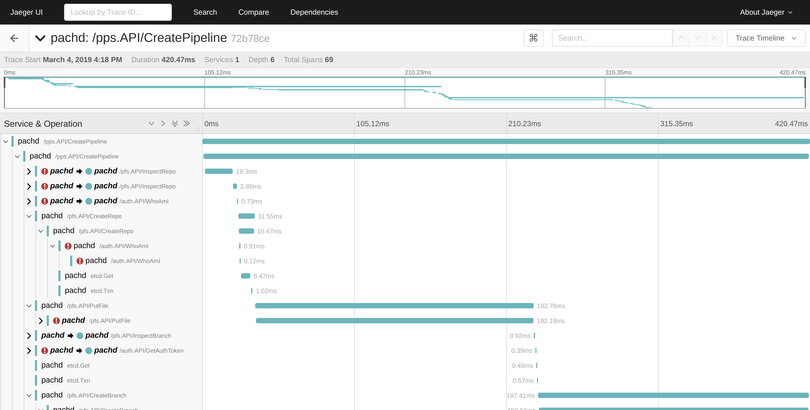
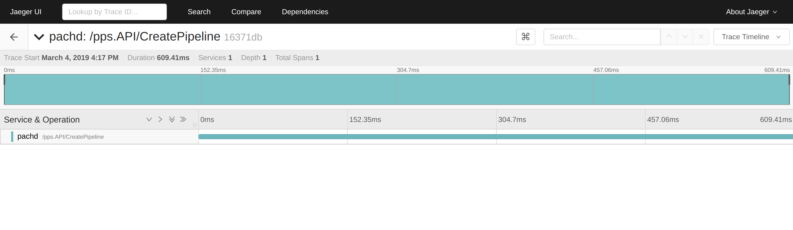

# Configure Tracing with Jaeger

Pachyderm has the ability to trace requests using Jaeger. This
can be useful when diagnosing slow clusters.



# Collecting Traces

To use tracing in Pachyderm, complete the following steps:

1. Run Jaeger in Kubernetes

    ```shell
    kubectl apply -f https://raw.githubusercontent.com/pachyderm/pachyderm/master/etc/deploy/tracing/jaeger-all-in-one.yaml
    ```

2. Point Pachyderm at Jaeger

   * For `pachctl`, run:

     ```shell
     export JAEGER_ENDPOINT=localhost:14268
     kubectl port-forward svc/jaeger-collector 14268 & # Collector service
     ```

   * For `pachd`, run:

     ```
     kubectl delete po -l suite=pachyderm,app=pachd
     ```

     The port-forward command is necessary because `pachctl` sends traces to
     Jaeger (it actually initiates every trace), and reads the `JAEGER_ENDPOINT`
     environment variable for the address to which it will send the trace info.

     Restarting the `pachd` pod is necessary because `pachd` also sends trace
     information to Jaeger, but it reads the environment variables corresponding
     to the Jaeger service[1] on startup to find Jaeger (the Jaeger service is
     created by the `jaeger-all-in-one.yaml` manifest). Killing the pods
     restarts them, which causes them to connect to Jaeger.

3. Send Pachyderm a traced request by setting the `PACH_TRACE`
   environment variable to "true" before running any `pachctl`
   command (note that `JAEGER_ENDPOINT` must also be
   set/exported):

   ```
   PACH_TRACE=true pachctl list job # for example
   ```

   Pachyderm does not recommend exporting `PACH_TRACE` because
   tracing calls can slow them down and make interesting traces hard
   to find in Jaeger. Therefore, you might want to set this variable for
   the specific calls you want to trace.

   However, Pachyderm's client library reads this variable and implements the
   relevant tracing, so any binary that uses Pachyderm's go client library can
   trace calls if these variables are set.

## View Traces

To view traces, run:

```
kubectl port-forward svc/jaeger-query 16686:80 & # UI service
```

Then, connect to `localhost:16686` in your browser, and you should see all
collected traces.

!!! note "See Also:"
    [Kubernetes Service Environment Variables](https://kubernetes.io/docs/concepts/services-networking/service/#environment-variables)

## Troubleshooting

1. If you see `<trace-without-root-span>`, this likely means that `pachd` has
    connected to Jaeger, but `pachctl` has not. Make sure that the
    `JAEGER_ENDPOINT` environment variable is set on your local machine, and
    that `kubectl port-forward "po/${jaeger_pod}" 14268` is running.

2. If you see a trace appear in Jaeger with no subtraces, like so:

    

    This might mean that `pachd` has not connected to Jaeger, but
    `pachctl` has. Restart the `pachd` pods *after* creating the
    Jaeger service in Kubernetes.
