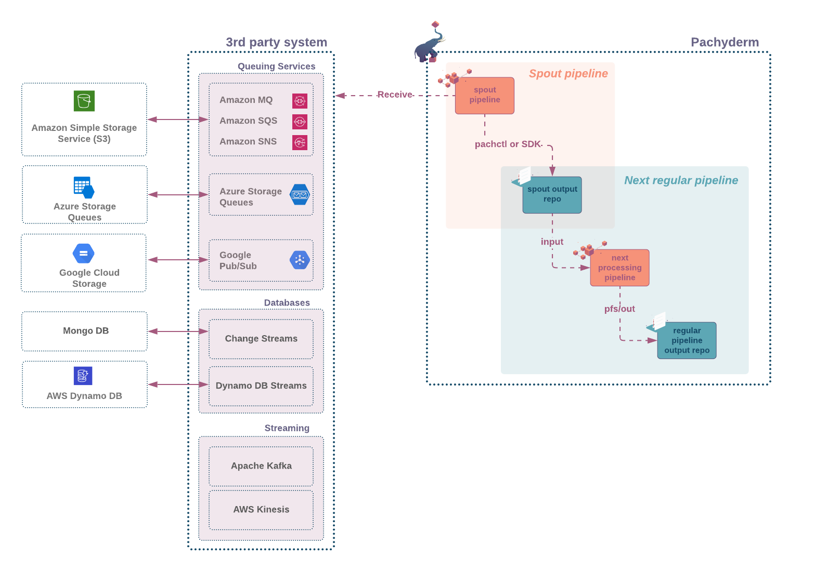

# Spout
!!! note
    This page documents
    the new *spout 2.0* implementation
    in **Pachyderm 1.12 and newer releases**.
    The implementation of spouts 
    in previous releases
    is now [deprecated](../../../../reference/supported-releases/#deprecated).
    We recommend upgrading 
    to the latest version
    of Pachyderm
    and using **spouts 2.0**.
    You can access the [documentation page
    of spouts 1.0 here](./spout_1_0.md).

A spout is a type of pipeline
that **ingests streaming data
from an outside source**
(message queue, database transactions logs, event notifications... )
as schematized in the diagram below.



Generally, 
spout pipelines are ideal for situations
when the frequency of new incoming data
is sporadic, and the latency requirement
to start the processing is short. 

In these workloads,
a regular pipeline with a [cron input](./cron.md)
that polls for new data
at a consistent time interval
might not be an optimal solution.

A spout pipeline differs
from regular pipelines in many ways:

- its code runs continuously, waiting for new events.
- it does not take an input repo. 
Instead, it consumes data from an outside source.
- the pipeline's output repo,
`pfs/out` is not directly accessible. 
To write into the output repo,
you will need to use the `put file` API call
via any of the following:
    - the CLI (`pachctl put file`)
    - one of the Pachyderm's SDKs (for [golang](../../../../reference/clients/#go-client) or [Python](../../../../reference/clients/#python-client) )
    - or [your own API client](../../../../reference/clients/#other-languages).
- Pachyderm CLI (`pachctl`) is packaged
in the base image of your spout
as well as your authentication information.
As a result, the authentication is seamless when using `pachctl`. 

!!! Note 
    Support for a transparent
    authentication in our SDKs is coming soon.
    In the meantime, check our Spout 101 example
    at the end of this page
    to learn how to retrieve
    and inject your authentication token
    into your API client. 


To create a spout pipeline, you will need:

* A source of streaming data.
* A Docker container with your spout code that connects to, reads, transforms, and pushes data from the data source to your output repo.
* A spout pipeline specification file that uses your container.

!!! Note
    It is important
    to remember that you will
    need to use a `put file` API call
    from a client of your choice
    to push your data
    into the pipeline output repository.
    Having the entire Pachyderm API
    available to you
    allows you to package data
    into commits and transactions
    at the granularity your problem requires.


A minimum spout specification must include the following
parameters in the [pipeline specification](../../../reference/pipeline_spec.md):

| Parameter   | Description |
| ----------- | ----------- |
| `name`      | The name of your data pipeline and the output repository. You can set an arbitrary name that is meaningful to the code you want to run. |
| `spout`     | This attribute can be left empty. Optional: Add a `service` field to expose your spout as a service. |
| `transform` | Specifies the command that you want to call to ingest your data and the Docker image it is packaged in. |


Here is an example of a minimum spout pipeline specification:

!!! note
    The `env` property is an optional argument.
    You can define your data stream source
    from within the container
    in which you run
    your script.
    For simplicity, in this example,
    `env` specifies the
    source of the Kafka host.

```
{
  "pipeline": {
    "name": "my-spout"
  },
    "spout": {
  },
  "transform": {
    "cmd": [ "go", "run", "./main.go" ],
    "image": "myaccount/myimage:0.1",
    "env": {
        "HOST": "kafkahost",
        "TOPIC": "mytopic",
        "PORT": "9092"
    }
  }
}
```


For a first overview of how spouts work, see
our [spout101 example](https://github.com/pachyderm/pachyderm/tree/1.13.x/examples/spouts/spout101).


