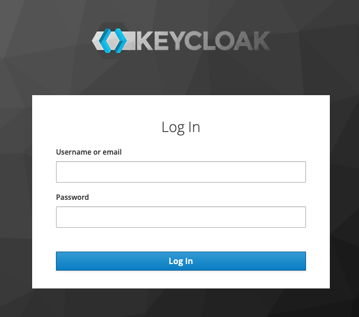
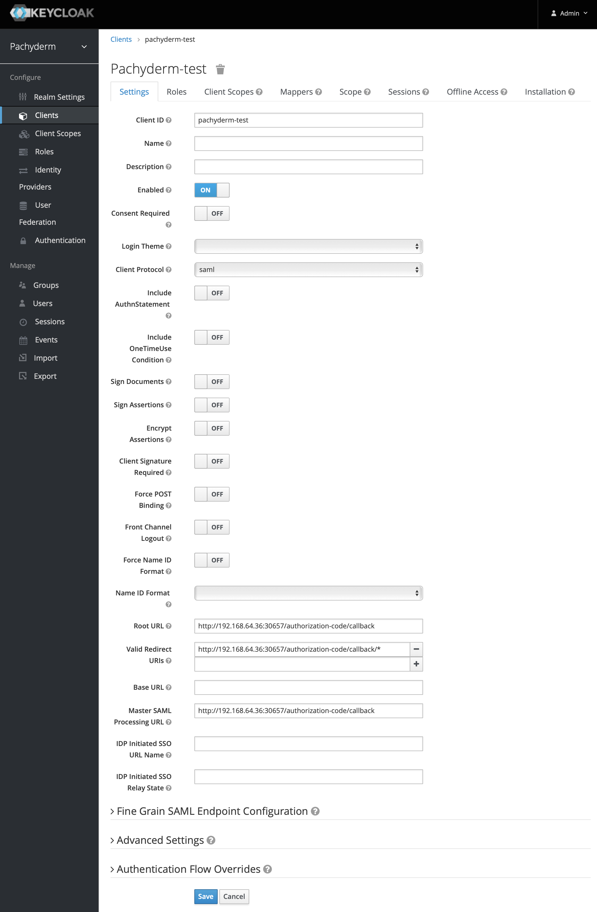

# Configure Pachyderm with Keycloak

Keycloak is an open-source identity management solution that supports
OIDC and provides authentication and authorization. When using Keycloak
with Pachyderm, Keycloak is responsible for authorizing user access to
your data that is stored in Pachyderm through identity and access tokens.
For more information about Keycloak support for OIDC, see the
[Keycloak Documentation](https://www.keycloak.org/docs/latest/securing_apps/#openid-connect-2).

!!! note
    Although this section describes how to configure Keycloak with
    OIDC, you can configure SAML as well with the corresponding
    [SAML auth config](../../saml/#write-pachyderm-config).

## Prerequisites

Before you can configure Pachyderm to work with Keycloak, you need to
have the following components up and running:

* Pachyderm Enterprise 1.11.x or later. The enterprise token must be
  activated by running `echo <your-activation-token> | pachctl enterprise activate`.
  Check the status of your license by running:

  ```shell
  pachctl enterprise get-state
  ```

  For more information, see [Activate Pachyderm Enterprise Edition](../../../deployment/#activate-pachyderm-enterprise-edition).

* Keycloak must be running in your environment:

  If you are just testing Keycloak with Pachyderm, you can run
  Keycloak in Minikube on your machine. Follow the instructions
  on how to set up Keycloak locally as described in
  [Keycloak on Kubernetes](https://www.keycloak.org/getting-started/getting-started-kube).

  If you are deploying in production, see [Keycloak Documentation](https://www.keycloak.org/getting-started).

## Configure Keycloak

After you have installed Pachyderm and Keycloak, follow the steps
below to configure the two components to work together.

To configure Pachyderm with Keycloak, complete the following steps:

1. Go to the **Keycloak Administration Console**. If you have deployed
Keycloak on Minikube as described above, get the address of the console
by running the following script:

   ```shell
   KEYCLOAK_URL=https://keycloak.$(minikube ip).nip.io/auth &&
   echo "Keycloak Admin Console: $KEYCLOAK_URL/admin"
   ```

   **Example of System Response:**

   ```shell
   Keycloak Admin Console: https://keycloak.192.168.64.36.nip.io/auth/admin
   ```

1. Paste the link above to a browser and log in as admin. If you have
used the instructions above to deploy Keycloak on Minikube, use the following
credentials:

   * `username:` `admin`
   * `password:` `admin`

   

1. If you do not have one already, add a new realm. Otherwise, proceed to
the next step.

   A realm is a logically isolated group, similar to a tenant. By default,
   Keycloak predefines a `Master` realm for administrative purposes. You need
   to create a new realm for Pachyderm. For example, you can call it
   `pachyderm`.

1. If you have created a new realm you need to add users to whom you want to
grant access to Pachyderm. Create a user by clicking **Users > Add user** and
filling out the required fields. Otherwise, proceed to the next step.

   1. Set up a password for this user by clicking **Credentials** and typing
   your password information.

      You might want to set the temporary password toggle to off so that your
      password does not expire.

1. Create a client for Pachyderm:

   1. Click **Clients > Create**.
   1. Specify a client ID. For example, *pachyderm-test*.
   1. Set the **Client Protocol** to **openid-connect**.
   1. Set the **Root URL** to `http://<ip>:30657/authorization-code/callback`.
      For example:

      ```shell
      http://192.168.64.36:30657/authorization-code/callback
      ```

      You can configure additional settings, such as require consent and so on,
      as needed, but this minimal configuration is everything you need to make
      Keycloak work with Pachyderm.

      

1. Proceed to [Configure Pachyderm](#configure-pachyderm).

## Configure Pachyderm

Now that you have Keycloak configured, you need to log in to Pachyderm
with the user you have created in Keycloak.

To configure Pachyderm, complete the following steps:

1. Go to the terminal and forward the `pachd` pod to the OIDC port:

   1. Get the `pachd` pod ID:

      ```shell
      kubectl get pod
      ```

      **Example system response:**

      ```shell
      dash-5768cb7d98-j6cgt       2/2     Running   0          4h2m
      etcd-56d897697-xzsqr        1/1     Running   0          4h2m
      keycloak-857c59449b-htg99   1/1     Running   0          4h6m
      pachd-79f7f68c65-9qs8g      1/1     Running   0          4h2m
      ```

   1. Forward the `pachd` pod to the OIDC port:

      **Example:**

      ```shell
      kubectl port-forward pachd-79f7f68c65-9qs8g 30657
      ```

1. Enable Pachyderm authentication:

   ```shell
   pachctl auth activate --initial-admin=robot:admin
   ```

   Pachyderm returns a token.

   **WARNING!** You must save the token to a secure location
   to avoid being locked out of your cluster.

1. Log in as the admin user with the token you received in the previous
step:

   ```shell
   pachctl auth use-auth-token
   ```

1. Set up the authentication config:

    ```shell
    pachctl auth set-config <<EOF
    {
            "live_config_version": 1,
            "id_providers": [{
            "name": "keycloak",
            "description": "oidc-based authentication with locally hosted keycloak",
            "oidc":{
                    "issuer": "http://keycloak.<ip>.nip.io/auth/realms/<realm-name>",
                    "client_id": "<client-id>",
                    "redirect_uri": "http://<ip>:30657/authorization-code/callback"
            }
        }]
    }
    EOF
    ```

    You need to replace the following placeholders with relevant values:

    - `issuer` — the URL to the location of your Keycloak realm.
    - `ip` — the IP of the Kubernetes host. If you are using Minikube, you can get the
    IP address by running `minikube ip`.
 
    - `realm-name` — the name of the Keycloak realm that you have created for Pachyderm.
    In the example, above it is called `pachyderm`.

    - `client-id` — the name of the Pachyderm's Keycloak client. In the example above,
    `pachyderm-test`.

    - `redirect_uri` — the URL that redirects back to Pachyderm. If you are running Pachyderm
    in Minikube, it is the Minikube IP address.

1. Log in as the user you have created in the Pachyderm realm:

   1. Run:

      ```shell
      pachctl auth login
      ```

      **Example of System Response:**

      ```shell
      You will momentarily be directed to your IdP and asked to authorize
      Pachyderm\'s login app on your IdP.

      Paste the following URL into a browser if not automatically redirected:

      http://keycloak.192.168.64.36.nip.io/auth/realms/pachyderm/protocol/openid-connect/auth?client_id=pachyderm-test&nonce=O-5zWG2v0KKbijzIJMi289V8qUrY8sg&redirect_uri=http%3A%2F%2F192.168.64.36%3A30657%2Fauthorization-code%2Fcallback&response_type=code&scope=openid+profile+email&state=d4lTSkAImVpvEqiQgHIkf6Fp3Y5E9E8

      Retrieving Pachyderm token...
      ```

1. Go to the browser and log in to the Pachyderm realm
with the user you have previously created and no the admin
user.

   * If you have enabled **Request consent**, grant access to
   the realm by clicking **Yes**.

   You should see the following message printed out in your browser:

   ```
   You are now logged in. Go back to the terminal to use Pachyderm!
   ```

1. In the terminal, check that you are logged in as the Keycloak user:

   ```shell
   pachctl auth whoami
   ```

   **Example of System Response:**

   ```shell
   You are "keycloak:test@pachyderm.com"
   session expires: 06 Aug 20 09:23 PDT
   ```

## Modifying Realm Settings

If you make any changes, such as changing the protocol from
OIDC to SAML in the Keycloak UI, you will have
to update the Pachyderm authentication config as well. Just
changing the protocol in the Keycloak UI will result in
error the next time users log in.

## Limitations

Pachyderm authentication has the following limitations:

- Only one identity provider can authenticate with Pachyderm at a time.
- Group support is not available with OIDC.
- Only one Keycloak realm can be configured with Pachyderm.
