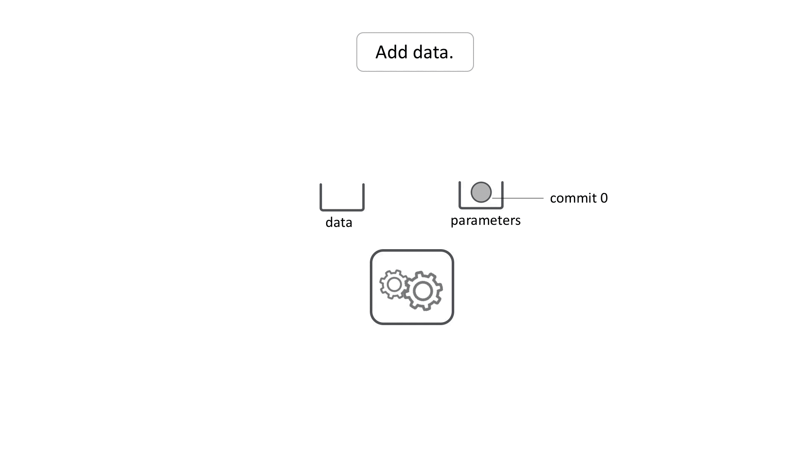
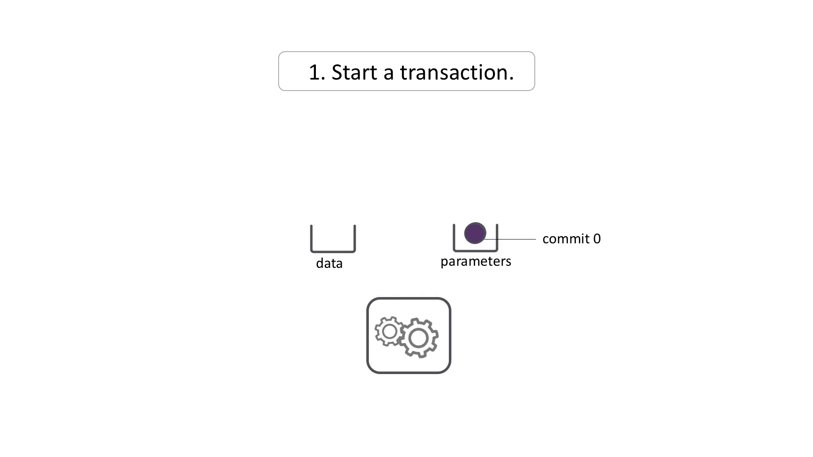

# Use Transactions

!!! note "TL;DR"
    Use transactions to run multiple Pachyderm commands
    simultaneously in one job run.

A transaction is a Pachyderm operation that enables you to create
a collection of Pachyderm commands and execute them concurrently.
Regular Pachyderm operations, that are not in a transaction, are
executed one after another. However, when you need
to run multiple commands at the same time, you can use transactions.
This functionality is useful in particular for pipelines with multiple
inputs. If you need to update two or more input repos, you might not want
pipeline jobs for each state change. You can issue a transaction
to start commits in each of the input repos, which creates a single
downstream commit in the pipeline repo. After the transaction, you
can put files and finish the commits at will, and the pipeline job
will run once all the input commits have been finished.

## Use Cases

Pachyderm users implement transactions to their own workflows finding
unique ways to benefit from this feature, whether it is a small
research team or an enterprise-grade machine learning workflow.

Below are examples of the most commonly employed ways of using transactions.

### Commit to Separate Repositories Simultaneously

For example, you have a Pachyderm pipeline with two input
repositories. One repository includes training data and the
other `parameters` for your machine learning pipeline. If you need
to run specific data against specific parameters, you need to
run your pipeline against specific commits in both repositories.
To achieve this, you need to commit to these repositories
simultaneously.

If you use a regular Pachyderm workflow, the data is uploaded sequentially,
each time triggering a separate job instead of one job with both commits
of new data. One `put file` operation commits changes to
the data repository and the other updates the parameters repository.
The following animation shows the standard Pachyderm workflow without
a transaction:



In Pachyderm, a pipeline starts as soon as a new commit lands in
a repository. In the diagram above, as soon as `commit 1` is added
to the `data` repository, Pachyderm runs a job for `commit 1` and
`commit 0` in the `parameters` repository. You can also see
that Pachyderm runs the second job and processes `commit 1`
from the `data` repository with the `commit 1` in the `parameters`
repository. In some cases, this is perfectly acceptable solution.
But if your job takes many hours and you are only interested in the
result of the pipeline run with `commit 1` from both repositories,
this approach does not work.

With transactions, you can ensure that only one job triggers with
both the new `data` and `parameters`. The following animation
demonstrates how transactions work:



The transaction ensures that a single job runs for the two commits
that were started within the transaction.
While Pachyderm supports some workflows where you can get the
same effect by having both data and parameters in the same repo,
often separating them and using transactions is much more efficient for
organizational and performance reasons.

### Switching from Staging to Master Simultaneously

If you are using [deferred processing](../../../concepts/advanced-concepts/deferred_processing/)
in your repositories because you want to commit your changes frequently
without triggering jobs every time, then transactions can help you
manage deferred processing with multiple inputs. You commit your
changes to the staging branch and
when needed, switch the `HEAD` of your master branch to a commit in the
staging branch. To do this simultaneously, you can use transactions.

For example, you have two repositories `data` and `parameters`, both
of which have a `master` and `staging` branch. You commit your
changes to the staging branch while your pipeline is subscribed to the
master branch. To switch to these branches simultaneously, you can
use transactions like this:

```shell
pachctl start transaction
```

**System Response:**

```shell
Started new transaction: 0d6f0bc3-37a0-4936-96e3-82034a2a2055
pachctl pachctl create branch data@master --head staging
Added to transaction: 0d6f0bc3-37a0-4936-96e3-82034a2a2055
pachctl create branch parameters@master --head staging
Added to transaction: 0d6f0bc3-37a0-4936-96e3-82034a2a2055
pachctl finish transaction
Completed transaction with 2 requests: 0d6f0bc3-37a0-4936-96e3-82034a2a2055
```

When you finish the transaction, both repositories switch to
to the master branch at the same time which triggers one job to process
those commits together.

### Updating Multiple Pipelines Simultaneously

If you want to change logic or intermediate data formats in your DAG, you 
may need to change multiple pipelines. Performing these changes together
in a transaction can avoid creating jobs with mismatched pipeline versions
and potentially wasting work.

## Start and Finish Transactions

To start a transaction, run the following command:

```shell
pachctl start transaction
```

**System Response:**

```shell
Started new transaction: 7a81eab5-e6c6-430a-a5c0-1deb06852ca5
```

This command generates a transaction object in the cluster and saves
its ID in the local Pachyderm configuration file. By default, this file
is stored at `~/.pachyderm/config.json`.

!!! example
    ```json hl_lines="9"
    {
       "user_id": "b4fe4317-be21-4836-824f-6661c68b8fba",
       "v2": {
         "active_context": "local-2",
         "contexts": {
           "default": {},
           "local-2": {
             "source": 3,
             "active_transaction": "7a81eab5-e6c6-430a-a5c0-1deb06852ca5",
             "cluster_name": "minikube",
             "auth_info": "minikube",
             "namespace": "default"
           },
    ```

After you start a transaction, you can add supported commands, such
as `pachctl create repo`, `pachctl create branch`, and so on, to the
transaction. All commands that are performed in a transaction are
queued up and not executed against the actual cluster until you finish
the transaction. When you finish the transaction, all queued command
are executed atomically.

To finish a transaction, run:

```shell
pachctl finish transaction
```

**System Response:**

```shell
Completed transaction with 1 requests: 7a81eab5-e6c6-430a-a5c0-1deb06852ca5
```

## Other Transaction Commands
Other supporting commands for transactions include the following commands:

| Command      | Description |
| ------------ | ----------- |
| pachctl list transaction| List all unfinished transactions available in the Pachyderm cluster. |
| pachctl stop transaction | Remove the currently active transaction from the local Pachyderm config file. The transaction remains in the Pachyderm cluster and can be resumed later. |
| pachctl resume transaction | Set an already-existing transaction as the active transaction in the local Pachyderm config file. |
| pachctl delete transaction | Deletes a transaction from the Pachyderm cluster. |
| pachctl inspect transaction | Provides detailed information about an existing transaction, including which operations it will perform. By default, displays information about the current transaction. If you specify a transaction ID, displays information about the corresponding transaction. |

## Supported Operations

While there is a transaction object in the Pachyderm configuration
file, all supported API requests append the request to the
transaction instead of running directly. These supported commands include:

```shell
create repo
delete repo
start commit
finish commit
delete commit
create branch
delete branch
create pipeline
update pipeline
```

Each time you add a command to a transaction, Pachyderm validates the
transaction against the current state of the cluster metadata and obtains
any return values, which is important for such commands as
`start commit`. If validation fails for any reason, Pachyderm does
not add the operation to the transaction. If the transaction has been
invalidated by changing the cluster state, you must delete the transaction
and start over, taking into account the new state of the cluster.
From a command-line perspective, these commands work identically within
a transaction as without. The only difference is that you do not apply
your changes until you run `finish transaction`, and a message that
Pachyderm logs to `stderr` to indicate that the command was placed
in a transaction rather than run directly.

## Multiple Opened Transactions

Some systems have a notion of *nested* transactions. That is when you
open transactions within an already opened transaction. In such systems, the
operations added to the subsequent transactions are not executed
until all the nested transactions and the main transaction are closed.

Pachyderm does not support such behavior. Instead, when you open a
transaction, the transaction ID is written to the Pachyderm configuration
file. If you begin another transaction while the first one is open, Pachyderm
returns an error.

Every time you add a command to a transaction,
Pachyderm creates a blueprint of the commit and verifies that the
command is valid. However, one transaction can invalidate another.
In this case, a transaction that is closed first takes precedence
over the other. For example, if two transactions create a repository
with the same name, the one that is executed first results in the
creation of the repository, and the other results in error.

!!! tip
     While you cannot use `pachctl put file` in a transaction, you can
     start a commit within a transaction, finish the transation,
     then put as many files as you need, and then finish your commit.
     Your changes will only be applied in one batch when you close
     the commit.

To get a better understanding of how transactions work in practice, try
[Use Transactions with Hyperparameter Tuning](https://github.com/pachyderm/pachyderm/tree/1.13.x/examples/transactions/).

