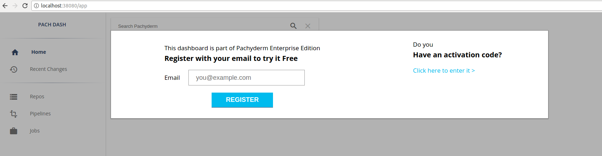

# Deploy Enterprise Edition

To deploy and use Pachyderm's Enterprise Edition, follow
[the deployment instructions](../deploy-manage/deploy/google_cloud_platform.md) for your platform
and then [activate the Enterprise Edition](#activate-pachyderm-enterprise-edition).
Pachyderm provides a FREE evaluation token for the Enterprise Edition on the landing
page of the Enterprise dashboard.

!!! note
    Pachyderm automatically deploys the Enterprise dashboard. If you want
    to deploy without the dashboard, run
    `pachctl deploy [command] --no-dashboard`.

## Activate Pachyderm Enterprise Edition

There are two ways to activate Pachyderm's enterprise features::

- [Activate Pachyderm Enterprise by Using the `pachctl` CLI](#activate-by-using-the-pachctl-cli)
- [Activate Pachyderm Enterprise by Using the Dashboard](#activate-by-using-the-dashboard)

For either method, you need to have your Pachyderm Enterprise activation code
available. You should have received this from the Pachyderm sales team when
registering for the Enterprise Edition. If you are a new user evaluating Pachyderm,
you can request a FREE evaluation code on the landing page of the dashboard.
If you are having trouble locating your activation code, contact [support@pachyderm.io](mailto:support@pachyderm.io).

### Activate by Using the `pachctl` CLI

When you have Pachyderm up and running, the `kubectl get pods` must return a similar
output:

```
$ kubectl get pods
NAME                     READY     STATUS    RESTARTS   AGE
dash-6c9dc97d9c-vb972    2/2       Running   0          6m
etcd-7dbb489f44-9v5jj    1/1       Running   0          6m
pachd-6c878bbc4c-f2h2c   1/1       Running   0          6m
```

You should also be able to connect to the Pachyderm cluster via the `pachctl` CLI:

```
$ pachctl version
COMPONENT           VERSION
pachctl             1.9.5
pachd               1.9.5
```

To activate the Pachyderm Enterprise Edition, complete the following steps::

1. Activate the Enterprise Edition by running:

   ```shell
   $ echo <your-activation-token> | pachctl enterprise activate
   ```

   If this command does not return any error, then the activation was
   successful.

1. Verify the status of the enterprise activation:

   ```shell
   $ pachctl enterprise get-state
   ACTIVE
   ```

### Activate by Using the Dashboard

You can activate Enterprise Edition directly in the dashboard.

To active Enterprise Edition in the Dashboard, complete the following steps:

1. Connect to the dashboard by using one of the following methods:

   * If you can connect directly, point your browser to port
   `30080` on your Kubernetes cluster's IP address.

   * Enable port forwarding by running `pachctl port-forward` in a separate terminal
   window and then, point your browser to `localhost:30080`.

   When you first access the dashboard, you are prompted to enter your activation code.

1. Enter the promo code:

   

   After you enter your activation code, you have full access to the Enterprise
   dashboard, and your cluster has an active Enterprise Edition license.

1. Confirm that your cluster has an active Enterprise Edition license:

   ```shell
   $ pachctl enterprise get-state
   ACTIVE
   ```
