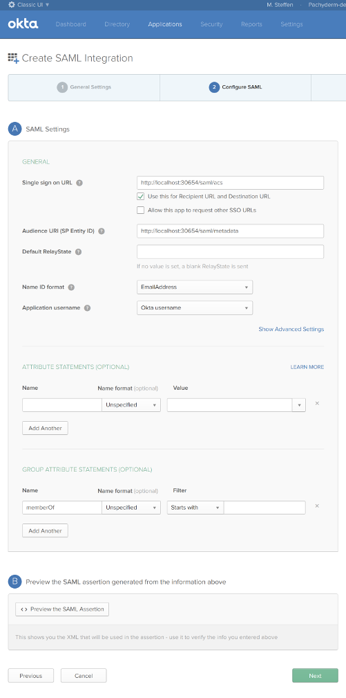
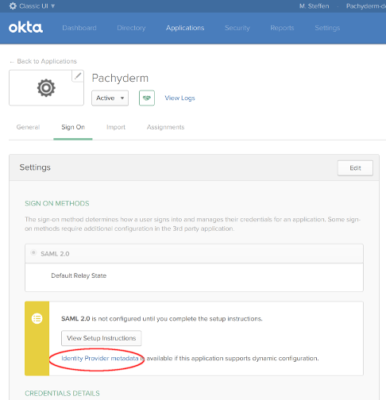

# Configure SAML

This guide will walk through testing Pachyderm's experimental SAML support.
This will describe the process of:

1. Activating Pachyderm enterprise and Pachyderm auth
1. Configuring Pachyderm's auth system and enabling its SAML ACS (Assertion
   Consumer Service—the HTTP endpoint to which users will forward SAML
   assertions).
1. Logging in to both the dash and CLI
1. Enabling debug logging in case anything goes wrong

## Activation

For testing, we **highly** recommend that you run Pachyderm in Minikube. If you
accidentally misconfigure your cluster, you might lock yourself out of your
cluster, and you will not be able to log in again to fix the configuration
error. With Minikube, experimenting with authentication options is easier and
safer and will not risk data loss.

To activate Pachyderm enterprise and Pachyderm auth:

```
echo <your-activation-token> | pachctl enterprise activate
pachctl auth activate --initial-admin=robot:admin
```

These commands cause Pachyderm's auth system to start verifying attempts to
read and write Pachyderm data and blocking unauthorized users. Whichever user
ran this command automatically authenticates as `robot:admin` and has admin
privileges in the cluster (run `pachctl auth whoami`, as shown below, to
confirm)

Users will either need to set the `--initial-admin` admin flag or have one
GitHub-based user in the system. The reason:
1. Pachyderm requires there to be at least one cluster admin if auth is
   activated
1. Pachyderm uses GitHub for authentication by default. Without this flag,
   Pachyderm asks the caller to go through an OAuth flow with GitHub, and then
   at the conclusion, makes the caller the cluster admin. Then whoever
   activated Pachyderm's auth system can assume admin status by
   re-authenticating via GitHub and performing any necessary actions
1. To avoid the OAuth flow, though, it's also possible to make the initial
   cluster admin a "robot user". Setting `--initial-admin=robot:<something>`
   does this.
1. Pachyderm will print out a Pachyderm token that authenticates the holder as
   this robot user. At any point, you can authenticate as this robot user by
   running

   ```
   pachctl auth use-auth-token
   ```

   **System response:**

   ```shell
   Please paste your Pachyderm auth token:
   <paste robot token emitted by "pachctl auth activate --initial-admin=robot:admin">
   ```

   ```shell
   pachctl auth whoami
    ```

   **System response:**

   ```shell
   You are "robot:admin"
   You are an administrator of this Pachyderm cluster
   ```

## Create IdP test app
This image shows an example configuration for an Okta test app that
authenticates Okta users with Pachyderm:



Pachyderm also needs a URL where it can scrape SAML metadata from the ID
provider. All SAML ID providers should provide such a URL; the Okta metadata
URL, for example, can be retrieved here:



## Write Pachyderm config
This enables the Pachyderm ACS. See inline comments:

```shell
# Lookup current config version--pachyderm config has a barrier to prevent
# read-modify-write conflicts between admins
live_config_version="$(pachctl auth get-config | jq .live_config_version)"
live_config_version="${live_config_version:-0}"
```

Set the Pachyderm config:

```shell
pachctl auth set-config <<EOF
{
  "live_config_version": ${live_config_version},

  "id_providers": [
    {
      "name": "saml",
      "description": "Okta test app metadata",
      "saml": {
        "metadata_url": <okta app metadata URL>,
        "group_attribute": "memberOf"
      }
    }
  ],

  "saml_svc_options": {
    "acs_url": "http://localhost:30654/saml/acs",
    "metadata_url": "http://localhost:30654/saml/metadata",
    "dash_url": "http://localhost:30080/auth/autologin?lol=wut",
    "session_duration": "8h",
  }
}
EOF
```

## Logging In
Currently Pachyderm only supports IdP-initiated authentication. Configure
an Okta app to point to the Pachyderm ACS
(`http://localhost:30654/saml/acs` if using `pachctl`'s port forwarding, then
sign in via the new Okta app

This should allow you to log in at the Pachyderm dash. To log in with the
Pachyderm CLI, get a One-Time Password from the Pachyderm dash, and then
run `pachctl auth login --code=<one-time password>` in your terminal.

## Other features
### Debug Logging
If we run into issues while deploying this, it may be useful to enable
a collection of debug logs that we added during development. To do so,
add the option `"debug_logging": true` to `"saml_svc_options"`:

```
pachctl auth set-config <<EOF
{
  ...
  "saml_svc_options": {
    ...
    "debug_logging": true
  }
}
EOF
```

### Groups
Pachyderm has very preliminary, experimental support for groups. While they won't
appear in ACLs in the dash (and may have other issues), you can experiment using
the CLI by setting `"group_attribute"` in the IDProvider field of the auth config:

```shell
pachctl auth set-config <<EOF
{
  ...
  "id_providers": [
    {
      ...
      "saml": {
        "group_attribute": "memberOf"
      }
    }
  ],
}
EOF
```

Then, try:

```shell
pachctl create repo group-test
pachctl put file group-test@master -f some-data.txt
pachctl auth set group/saml:"Test Group" reader group-test
```

Elsewhere:

```shell
pachctl auth login --code=<auth code>
pachctl get file group-test@master:some-data.txt # should work for members of "Test Group"
```
