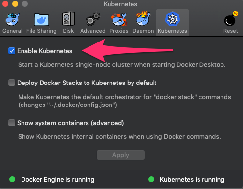
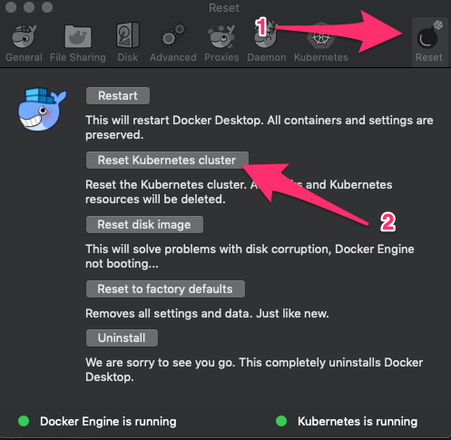

# Local Installation

This guide walks you through the steps to install Pachyderm
on macOS®, Linux®, or Microsoft® Windows®. Local installation helps you to learn
some of the Pachyderm basics and is not designed to be a production
environment.

!!! note
    Pachyderm supports the Docker runtime only. If you want to
    deploy Pachyderm on a system that uses another container runtime,
    ask for advice in our [Slack channel](http://slack.pachyderm.io/).

## Prerequisites

Before you can deploy Pachyderm, make sure you have the following
programs installed on your computer:

- [Minikube](#using-minikube)
- Oracle® VirtualBox™ or [Docker Desktop (v18.06+)](#docker-desktop)
- [Pachyderm Command Line Interface](#install-pachctl)

If you want to install Pachyderm on Windows, follow the instructions in
[Deploy Pachyderm on Windows](wsl-deploy.md).


### Using Minikube

On your local machine, you can run Pachyderm in a minikube virtual machine.
Minikube is a tool that creates a single-node Kubernetes cluster. This limited
installation is sufficient to try basic Pachyderm functionality and complete
the Beginner Tutorial.

To configure Minikube, follow these steps:

1. Install minikube and VirtualBox in your operating system as described in
the
[Kubernetes documentation](http://kubernetes.io/docs/getting-started-guides/minikube).
1. [Install `kubectl`](https://kubernetes.io/docs/tasks/tools/install-kubectl/).
1. Start `minikube`:

   ```shell
   minikube start
   ```

!!! note
    Any time you want to stop and restart Pachyderm, run `minikube delete`
    and `minikube start`. Minikube is not meant to be a production environment
    and does not handle being restarted well without a full wipe.

### Docker Desktop

If you are using Minikube, skip this section and proceed to [Install pachctl](#install-pachctl)

You can use Docker Desktop instead of Minikube on macOS or Linux
by following these steps:

1. In the Docker Desktop settings, verify that Kubernetes is enabled:

   

1. From the command prompt, confirm that Kubernetes is running:

   ```shell
   $ kubectl get all
   NAME                 TYPE        CLUSTER-IP   EXTERNAL-IP   PORT(S)   AGE
   service/kubernetes   ClusterIP   10.96.0.1    <none>        443/TCP   56d
   ```

   * To reset your Kubernetes cluster that runs on Docker Desktop, click
   the **Reset** button in the **Preferences** sub-menu.

   

### Install `pachctl`

`pachctl` is a command-line utility that you can use to interact
with a Pachyderm cluster.

To deploy Pachyderm locally, you need
to have pachctl installed on your machine by following these steps:

1. Run the corresponding steps for your operating system:

   * For macOS, run:

     ```shell
     $ brew tap pachyderm/tap && brew install pachyderm/tap/pachctl@{{ config.pach_major_minor_version }}
     ```

   * For a Debian-based Linux 64-bit or Windows 10 or later running on
   WSL:

     ```shell
     $ curl -o /tmp/pachctl.deb -L https://github.com/pachyderm/pachyderm/releases/download/v{{ config.pach_latest_version }}/pachctl_{{ config.pach_latest_version }}_amd64.deb && sudo dpkg -i /tmp/pachctl.deb
     ```

   * For all other Linux flavors:

     ```shell
     $ curl -o /tmp/pachctl.tar.gz -L https://github.com/pachyderm/pachyderm/releases/download/v{{ config.pach_latest_version }}/pachctl_{{ config.pach_latest_version }}_linux_amd64.tar.gz && tar -xvf /tmp/pachctl.tar.gz -C /tmp && sudo cp /tmp/pachctl_{{ config.pach_latest_version }}_linux_amd64/pachctl /usr/local/bin
     ```

1. Verify that installation was successful by running `pachctl version --client-only`:

   ```shell
   $ pachctl version --client-only
   COMPONENT           VERSION
   pachctl             {{ config.pach_latest_version }}
   ```

   If you run `pachctl version` without `--client-only`, the command times
   out. This is expected behavior because `pachd` is not yet running.

## Deploy Pachyderm

After you configure all the [Prerequisites](#prerequisites),
deploy Pachyderm by following these steps:

* For macOS or Linux, run:

   ```shell
   $ pachctl deploy local
   ```

   This command generates a Pachyderm manifest and deploys Pachyderm on
   Kubernetes.

* For Windows:

  1. Start WSL.
  1. In WSL, run:

     ```shell
     $ pachctl deploy local --dry-run > pachyderm.json
     ```

  1. Copy the `pachyderm.json` file into your Pachyderm directory.
  1. From the same directory, run:

     ```shell
     kubectl create -f .\pachyderm.json
     ```

  Because Pachyderm needs to pull the Pachyderm Docker image
  from DockerHub, it might take a few minutes for the Pachyderm pods status
  to change to `Running`.

1. Check the status of the Pachyderm pods by periodically
running `kubectl get pods`. When Pachyderm is ready for use,
all Pachyderm pods must be in the **Running** status.


   ```shell
   $ kubectl get pods
   NAME                     READY     STATUS    RESTARTS   AGE
   dash-6c9dc97d9c-vb972    2/2       Running   0          6m
   etcd-7dbb489f44-9v5jj    1/1       Running   0          6m
   pachd-6c878bbc4c-f2h2c   1/1       Running   0          6m
   ```

   If you see a few restarts on the `pachd` nodes, that means that
   Kubernetes tried to bring up those pods before `etcd` was ready. Therefore,
   Kubernetes restarted those pods. You can safely ignore that message.

1. Run `pachctl version` to verify that `pachd` has been deployed.

   ```shell
   $ pachctl version
   COMPONENT           VERSION
   pachctl             {{ config.pach_latest_version }}
   pachd               {{ config.pach_latest_version }}
   ```

1. Open a new terminal window.

1. Use port forwarding to access the Pachyderm dashboard.

   ```shell
   $ pachctl port-forward
   ```

   This command runs continuosly and does not exit unless you interrupt it.

1. Alternatively, you can set up Pachyderm to directly connect to
the Minikube instance:

   1. Get your Minikube IP address:

      ```shell
      $ minikube ip
      ```

   1. Configure Pachyderm to connect directly to the Minikube instance:

      ```shell
     $ pachctl config update context `pachctl config get active-context` --pachd-address=`minikube ip`:30650
      ```

## Next Steps

After you install and configure Pachyderm,
continue exploring Pachyderm:

* Complete the [Beginner Tutorial](./beginner_tutorial.md)
to learn the basics of Pachyderm, such as adding data and building
analysis pipelines.

* Explore the Pachyderm Dashboard.
By default, Pachyderm deploys the Pachyderm Enterprise dashboard. You can
use a FREE trial token to experiment with the dashboard. Point your
browser to port `30080` on your minikube IP.
Alternatively, if you cannot connect directly, enable port forwarding
by running `pachctl port-forward`, and then point your browser to
`localhost:30080`.

!!! note "See Also:"
    [General Troubleshooting](../troubleshooting/general_troubleshooting.md)
