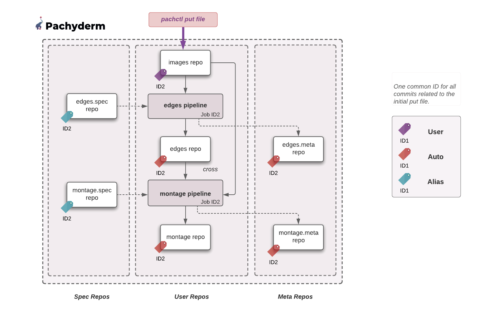

# Global Identifier

## Definition
Pachyderm provides users with a simple way to follow a change throughout their DAG (i.e., Traverse Provenance and Subvenance).

When you commit data to Pachyderm, your new commit has an ID associated with it that you can easily check by running `pachctl list commit repo@branch`. 
All resulting downstream commits and job will then share that ID (Global Identifier).

!!! Info "In other terms"
    Commit and job IDs **represent a logically-related set of objects**. 
    The ID of a commit is also the ID of any commits created along with it due to provenance relationships, 
    as well as the ID of any jobs that were started because of the creation of those commits. 

This ability to track down related commits and jobs with one global identifier brought the need for new terms:

- **Commitset**: A commitset is the set of all provenance-dependent commits sharing the same ID.
- **Jobset**: A jobset is the set of jobs created due to commits in a CommitSet.

Using this identifier you can:

## List All Commitset And Jobset
You can list all commitset by running the following command:
```shell
pachctl list commitset
```
Each commitset displays how many commits their set is made of.
```
ID                               COMMITS PROGRESS CREATED        MODIFIED
1035715e796f45caae7a1d3ffd1f93ca 7       ▇▇▇▇▇▇▇▇ 7 seconds ago  7 seconds ago
28363be08a8f4786b6dd0d3b142edd56 6       ▇▇▇▇▇▇▇▇ 24 seconds ago 24 seconds ago
e050771b5c6f4082aed48a059e1ac203 4       ▇▇▇▇▇▇▇▇ 24 seconds ago 24 seconds ago
```
Similarly, if you run the equivalent command for jobset:
```shell
pachctl list jobset
```
you will notice that the job IDs are shared with the commitsets.

```
ID                               JOBS PROGRESS CREATED            MODIFIED
1035715e796f45caae7a1d3ffd1f93ca 2    ▇▇▇▇▇▇▇▇ 55 seconds ago     55 seconds ago
28363be08a8f4786b6dd0d3b142edd56 1    ▇▇▇▇▇▇▇▇ About a minute ago About a minute ago
e050771b5c6f4082aed48a059e1ac203 1    ▇▇▇▇▇▇▇▇ About a minute ago About a minute ago
```
Note, for example, that 7 commits and 2 jobs are involved in the changes occured
in the commitset ID 1035715e796f45caae7a1d3ffd1f93ca.

## Inspect A Commitset And Jobset

To list all commits involved in a given commitset:
```shell
pachctl inspect commitset 1035715e796f45caae7a1d3ffd1f93ca
```
```
REPO         BRANCH COMMIT                           FINISHED      SIZE ORIGIN DESCRIPTION
images       master 1035715e796f45caae7a1d3ffd1f93ca 5 minutes ago -    USER
edges.spec   master 1035715e796f45caae7a1d3ffd1f93ca 5 minutes ago -    ALIAS
montage.spec master 1035715e796f45caae7a1d3ffd1f93ca 5 minutes ago -    ALIAS
montage.meta master 1035715e796f45caae7a1d3ffd1f93ca 4 minutes ago -    AUTO
edges        master 1035715e796f45caae7a1d3ffd1f93ca 5 minutes ago -    AUTO
edges.meta   master 1035715e796f45caae7a1d3ffd1f93ca 5 minutes ago -    AUTO
montage      master 1035715e796f45caae7a1d3ffd1f93ca 4 minutes ago -    AUTO
```

Similarly, change `commitset` in `jobset` to list all jobs linked to your jobset.
```shell
pachctl inspect jobset 1035715e796f45caae7a1d3ffd1f93ca
```
```
ID                               PIPELINE STARTED       DURATION  RESTART PROGRESS  DL       UL       STATE
1035715e796f45caae7a1d3ffd1f93ca montage  5 minutes ago 4 seconds 0       1 + 0 / 1 79.49KiB 381.1KiB success
1035715e796f45caae7a1d3ffd1f93ca edges    5 minutes ago 2 seconds 0       1 + 0 / 1 57.27KiB 22.22KiB success
```

The commitset and jobset above have been created after
a `pachctl put file images@master -i images.txt` in the images repo of the open cv example.


The following diagram illustrate the commitset and its various components:
    


Let's explain the origin of each commit.

1. Inspect the commit ID 1035715e796f45caae7a1d3ffd1f93ca in the `images` repo,  the repo in which our change (`put file`) has originated:

    ```shell
    pachctl inspect commit images@1035715e796f45caae7a1d3ffd1f93ca --raw
    ```
    Note that this original commit is of `USER` origin (i.e., the result of a user change).

    !!! Note
        The list of all commit types is detailed in the [`Commit` page](../data-concepts/commit.md) of this section.

    ```json
    "origin": {
    "kind": "USER"
        },
    ```

1. Inspect the following commit 1035715e796f45caae7a1d3ffd1f93ca produced in the output repos of the edges pipeline:
    ```shell
    pachctl inspect commit edges@1035715e796f45caae7a1d3ffd1f93ca --raw
    ```
    ```json
    {
        "commit": {
            "branch": {
            "repo": {
                "name": "edges",
                "type": "user"
            },
            "name": "master"
            },
            "id": "1035715e796f45caae7a1d3ffd1f93ca"
        },
        "origin": {
            "kind": "AUTO"
        },
        "parent_commit": {
            "branch": {
            "repo": {
                "name": "edges",
                "type": "user"
            },
            "name": "master"
            },
            "id": "28363be08a8f4786b6dd0d3b142edd56"
        },
        "started": "2021-07-07T13:52:34.140584032Z",
        "finished": "2021-07-07T13:52:36.507625440Z",
        "direct_provenance": [
            {
            "repo": {
                "name": "edges",
                "type": "spec"
            },
            "name": "master"
            },
            {
            "repo": {
                "name": "images",
                "type": "user"
            },
            "name": "master"
            }
        ],
        "details": {
            "size_bytes": "22754"
        }
    }

    ```
    Note that the origin of the commit is of kind **`AUTO`** as it has been trigerred by the arrival of a commit in the upstream repo `images`.
    ```json
        "origin": {
            "kind": "AUTO"
        },
    ```

    The same origin (`AUTO` ) applies to the commits sharing that same ID in the `montage` output repo as well as `edges.meta` and `montage.meta` system repos. 
    !!! Note
        The list of all types of repos is detailed in the [`Repo` page](../data-concepts/repo.md) of this section.

- Besides  the `USER` and `AUTO` commits, notice a set of `ALIAS` commits in `edges.spec` and `montage.spec`:
```shell
    pachctl inspect commit edges.spec@336f02bdbbbb446e91ba27d2d2b516c6 --raw
```
The version of each pipeline within their respective `.spec` repos are neither the result of a user change, nor of an automatic change.
They have, however, contributed to the creation of the previous `AUTO` commits. 
To make sure that we have a complete view of all the data and pipeline versions involved in all commits resulting from the initial 
`put file`, their version is kept as `ALIAS` commits under the same global ID.

For a fuller view of GlobalID in action, take a look at our [GlobalID illustration](https://github.com/pachyderm/pachyderm/tree/master/examples/globalID).

## Track Provenance Downstream

Pachyderm provides the `wait commitset` command that enables you
to track your commits downstream as they are produced. 

Unlike the `inspect commitset`, each line is printed as soon as a new commit of your set finishes.

Change `commitset` in `jobset` to list the jobs related to your jobset as they finish processing a commit.

## Squash Commitset

`pachctl squash commitset 1035715e796f45caae7a1d3ffd1f93ca`
combines all the file changes in the commits of a commitset 
into their children and then removes the commitset.
This behavior is inspired by the squash option in git rebase.
No data stored in PFS is removed.

!!! Warning
    Squashing a commitset with no children results in the head of the branch disagreement with the state of the world. 
    So a new identical commitset will be created.
