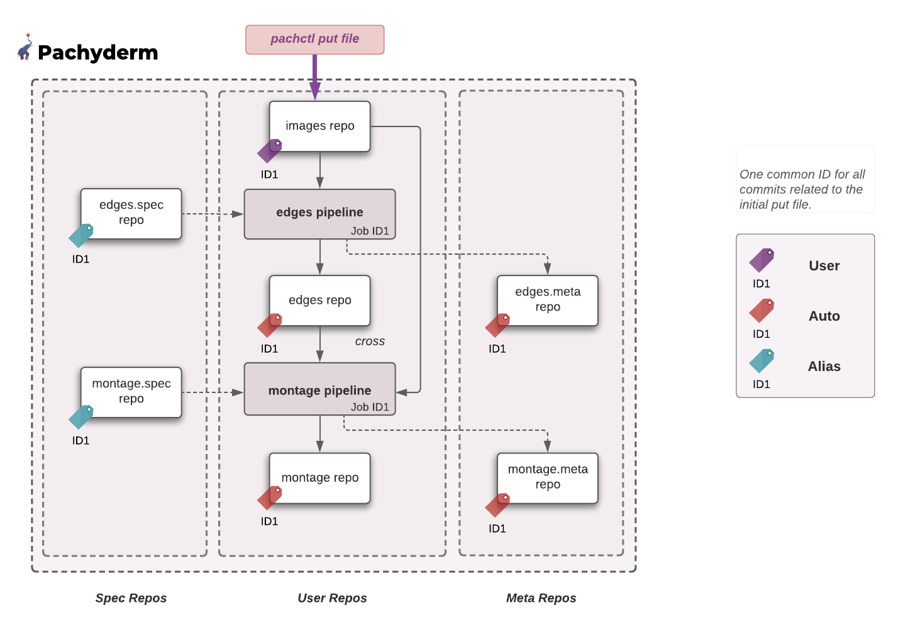

# Global Identifier

## Definition
Pachyderm provides users with a simple way to follow a change throughout their DAG (i.e., traverse `Provenance` and `Subvenance`).

Pachyderm associates a commit ID to each new commit. You can quickly check this new commit by running `pachctl list commit repo@branch`. **All resulting downstream commits and jobs in your DAG will then share that same ID (Global Identifier).**

!!! Info "TLDR"
    The commits and jobs sharing the same ID **represent a logically-related set of objects**. 
    The ID of a commit is also:

    - the ID of any commits created along due to provenance relationships, 
    - and the ID of any jobs triggered by the creation of those commits. 

This ability to track down related commits and jobs with one global identifier brought the need to introduce a new scope to our original concepts of [job](../../pipeline-concepts/job/) and [commit](../../data-concepts/commit/). The nuance in the scope of a commit or a job ( "Global" or "Local") gives the term two possible meanings.


| CONCEPT | SCOPE | DEFINITION |
| ---------| --------- | -------------------- |
| Commit | Global | A commit with `global` scope (global commit) represents **the set of all provenance-dependent commits sharing the same ID**. <br> You can retrieve a global commit by running `pachctl list commit <commitID>`.| 
| Commit| Local Repo| The same term of `commit`, applied to the more focused scope of a repo (`pachctl list commit <repo>@<commitID>` or `pachctl list commit <repo>@<branch>=<commitID>`), represents **"the Git-like" record of one commit in a single branch of a repository's file system**. |
| Job | Global | A job with `global` scope (global job) is **the set of jobs triggered due to commits in a global commit**.<br> You can retrieve a global job by running `pachctl list job <commitID>`.|
|Job | Local Pipeline |  Narrowing down the scope to a single pipeline (`pachctl list job <pipeline>@<commitID>`) shifts the meaning to **the execution of a given job in a pipeline of your DAG**. |


## List All Global Commits And Global Jobs
You can list all global commits by running the following command: 
```shell
pachctl list commit
```
Each global commit displays how many (sub) commits it is made of.
```
ID                               SUBCOMMITS PROGRESS CREATED        MODIFIED
1035715e796f45caae7a1d3ffd1f93ca 7          ▇▇▇▇▇▇▇▇ 7 seconds ago  7 seconds ago
28363be08a8f4786b6dd0d3b142edd56 6          ▇▇▇▇▇▇▇▇ 24 seconds ago 24 seconds ago
e050771b5c6f4082aed48a059e1ac203 4          ▇▇▇▇▇▇▇▇ 24 seconds ago 24 seconds ago
```
Similarly, if you run the equivalent command for global jobs:
```shell
pachctl list job
```
you will notice that the job IDs are shared with the global commit IDs.

```
ID                               SUBJOBS PROGRESS CREATED            MODIFIED
1035715e796f45caae7a1d3ffd1f93ca 2       ▇▇▇▇▇▇▇▇ 55 seconds ago     55 seconds ago
28363be08a8f4786b6dd0d3b142edd56 1       ▇▇▇▇▇▇▇▇ About a minute ago About a minute ago
e050771b5c6f4082aed48a059e1ac203 1       ▇▇▇▇▇▇▇▇ About a minute ago About a minute ago
```
For example, in this example, 7 commits and 2 jobs are involved in the changes occured
in the global commit ID 1035715e796f45caae7a1d3ffd1f93ca.

!!! Note
        The progress bar is equally divided to the number of steps, or pipelines,
        you have in your DAG. In the example above, `1035715e796f45caae7a1d3ffd1f93ca` is two steps.
        If one of the sub-jobs fails, you will see the progress bar turn red
        for that pipeline step. To troubleshoot, look into that particular
        pipeline execution.

## List All Commits And Jobs With A Global ID

To list all (sub) commits involved in a global commit:
```shell
pachctl list commit 1035715e796f45caae7a1d3ffd1f93ca
```
```
REPO         BRANCH COMMIT                           FINISHED      SIZE        ORIGIN DESCRIPTION
images       master 1035715e796f45caae7a1d3ffd1f93ca 5 minutes ago 238.3KiB    USER
edges.spec   master 1035715e796f45caae7a1d3ffd1f93ca 5 minutes ago 244B        ALIAS
montage.spec master 1035715e796f45caae7a1d3ffd1f93ca 5 minutes ago 405B        ALIAS
montage.meta master 1035715e796f45caae7a1d3ffd1f93ca 4 minutes ago 1.656MiB    AUTO
edges        master 1035715e796f45caae7a1d3ffd1f93ca 5 minutes ago 133.6KiB    AUTO
edges.meta   master 1035715e796f45caae7a1d3ffd1f93ca 5 minutes ago 373.9KiB    AUTO
montage      master 1035715e796f45caae7a1d3ffd1f93ca 4 minutes ago 1.292MiB    AUTO
```

Similarly, change `commit` in `job` to list all (sub) jobs linked to your global job ID.
```shell
pachctl list job 1035715e796f45caae7a1d3ffd1f93ca
```
```
ID                               PIPELINE STARTED       DURATION  RESTART PROGRESS  DL       UL       STATE
1035715e796f45caae7a1d3ffd1f93ca montage  5 minutes ago 4 seconds 0       1 + 0 / 1 79.49KiB 381.1KiB success
1035715e796f45caae7a1d3ffd1f93ca edges    5 minutes ago 2 seconds 0       1 + 0 / 1 57.27KiB 22.22KiB success
```
For each pipeline execution (sub job) within this global job, Pachyderm shows the time since each sub job started and its duration, the number of datums in the PROGRESS section,  and other information.
The format of the progress column is `DATUMS PROCESSED + DATUMS SKIPPED / TOTAL DATUMS`.

For more information, see [Datum Processing States](../../../concepts/pipeline-concepts/datum/datum-processing-states/).

!!! Note
     The global commit and global job above are the result of
     a `pachctl put file images@master -i images.txt` in the images repo of [the open cv example](../../../getting-started/beginner-tutorial/).

The following diagram illustrates the global commit and its various components:
    

Let's take a look at the origin of each commit.

!!! Note
        Check the list of [all commit origins](../data-concepts/commit.md) in the `Commit` page.


1. Inspect the commit ID 1035715e796f45caae7a1d3ffd1f93ca in the `images` repo,  the repo in which our change (`put file`) has originated:

    ```shell
    pachctl inspect commit images@1035715e796f45caae7a1d3ffd1f93ca --raw
    ```
    Note that this original commit is of `USER` origin (i.e., the result of a user change).

    ```json
    "origin": {
    "kind": "USER"
        },
    ```

1. Inspect the following commit 1035715e796f45caae7a1d3ffd1f93ca produced in the output repos of the edges pipeline:
    ```shell
    pachctl inspect commit edges@1035715e796f45caae7a1d3ffd1f93ca --raw
    ```
    ```json
    {
        "commit": {
            "branch": {
            "repo": {
                "name": "edges",
                "type": "user"
            },
            "name": "master"
            },
            "id": "1035715e796f45caae7a1d3ffd1f93ca"
        },
        "origin": {
            "kind": "AUTO"
        },
        "parent_commit": {
            "branch": {
            "repo": {
                "name": "edges",
                "type": "user"
            },
            "name": "master"
            },
            "id": "28363be08a8f4786b6dd0d3b142edd56"
        },
        "started": "2021-07-07T13:52:34.140584032Z",
        "finished": "2021-07-07T13:52:36.507625440Z",
        "direct_provenance": [
            {
            "repo": {
                "name": "edges",
                "type": "spec"
            },
            "name": "master"
            },
            {
            "repo": {
                "name": "images",
                "type": "user"
            },
            "name": "master"
            }
        ],
        "details": {
            "size_bytes": "22754"
        }
    }

    ```
    Note that the origin of the commit is of kind **`AUTO`** as it has been trigerred by the arrival of a commit in the upstream repo `images`.
    ```json
        "origin": {
            "kind": "AUTO"
        },
    ```

    The same origin (`AUTO` ) applies to the commits sharing that same ID in the `montage` output repo as well as `edges.meta` and `montage.meta` system repos. 
    !!! Note
        Check the list of [all types of repos](../data-concepts/repo.md) in the `Repo` page.

- Besides  the `USER` and `AUTO` commits, notice a set of `ALIAS` commits in `edges.spec` and `montage.spec`:
```shell
pachctl inspect commit edges.spec@336f02bdbbbb446e91ba27d2d2b516c6 --raw
```
The version of each pipeline within their respective `.spec` repos are neither the result of a user change, nor of an automatic change.
They have, however, contributed to the creation of the previous `AUTO` commits. 
To make sure that we have a complete view of all the data and pipeline versions involved in all the commits resulting from the initial 
`put file`, their version is kept as `ALIAS` commits under the same global ID.

For a full view of GlobalID in action, take a look at our [GlobalID illustration](https://github.com/pachyderm/pachyderm/tree/{{ config.pach_branch }}/examples/globalID){target=_blank}.

## Track Provenance Downstream

Pachyderm provides the `wait commit <commitID>` command that enables you
to **track your commits downstream as they are produced**. 

Unlike the `list commit <commitID>`, each line is printed as soon as a new (sub) commit of your global commit finishes.

Change `commit` in `job` to list the jobs related to your global job as they finish processing a commit.

## Squash And Delete Commit

See [`squash commit`](../../../how-tos/basic-data-operations/removing-data-from-pachyderm/#squash-non-head-commits) and  [`delete commit`](../../../how-tos/basic-data-operations/removing-data-from-pachyderm/#delete-the-head-of-a-branch) in the `Delete a Commit / Delete Data` page of the How-Tos section of this Documentation.


