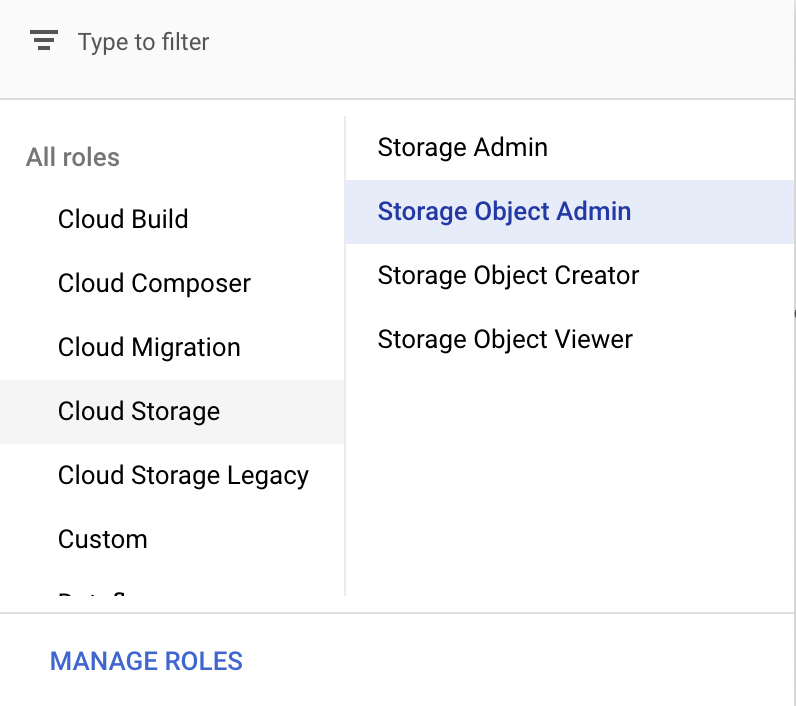

# Google Cloud Platform

Google Cloud Platform provides seamless support for Kubernetes.
Therefore, Pachyderm is fully supported on [Google Kubernetes Engine](https://cloud.google.com/kubernetes-engine/) (GKE).
The following section walks you through deploying a Pachyderm cluster on GKE.

## 1- Prerequisites

- [Google Cloud SDK](https://cloud.google.com/sdk/) >= 124.0.0
- [kubectl](https://kubernetes.io/docs/user-guide/prereqs/)
- [pachctl](#install-pachctl)

If this is the first time you use the SDK, follow
the [Google SDK QuickStart Guide](https://cloud.google.com/sdk/docs/quickstarts).

!!! note
    When you follow the QuickStart Guide, you might update your `~/.bash_profile`
    and point your `$PATH` at the location where you extracted
    `google-cloud-sdk`. However, Pachyderm recommends that you extract
    the SDK to `~/bin`.

!!! tip
    You can install `kubectl` by using the Google Cloud SDK and
    running the following command:

    ```shell
    gcloud components install kubectl
    ```

## 2- Deploy Kubernetes

To create a new Kubernetes cluster by using GKE, run:

```shell
CLUSTER_NAME=<any unique name, e.g. "pach-cluster">

GCP_ZONE=<a GCP availability zone. e.g. "us-west1-a">

gcloud config set compute/zone ${GCP_ZONE}

gcloud config set container/cluster ${CLUSTER_NAME}

MACHINE_TYPE=<machine type for the k8s nodes, we recommend "n1-standard-4" or larger>

# By default the following command spins up a 3-node cluster. You can change the default with `--num-nodes VAL`.
gcloud container clusters create ${CLUSTER_NAME} --machine-type ${MACHINE_TYPE}

# By default, GKE clusters have RBAC enabled. To allow the 'helm install' to give the 'pachyderm' service account
# the requisite privileges via clusterrolebindings, you will need to grant *your user account* the privileges
# needed to create those clusterrolebindings.
#
# Note that this command is simple and concise, but gives your user account more privileges than necessary. See
# https://docs.pachyderm.io/en/latest/deployment/rbac.html for the complete list of privileges that the
# pachyderm serviceaccount needs.
kubectl create clusterrolebinding cluster-admin-binding --clusterrole=cluster-admin --user=$(gcloud config get-value account)
```

!!! Note
    Adding `--scopes storage-rw` to `gcloud container clusters create ${CLUSTER_NAME} --machine-type ${MACHINE_TYPE}` will grant Pachyderm read/write access to all of your GCP resources. While this is **not recommended in any production settings**, this option can be useful for a quick test setup. In that scenario, you do not need any service account or additional GCP Bucket permission.

This might take a few minutes to start up. You can check the status on
the [GCP Console](https://console.cloud.google.com/compute/instances).
A `kubeconfig` entry is automatically generated and set as the current
context. As a sanity check, make sure your cluster is up and running
by running the following `kubectl` command:

```shell
# List all pods in the kube-system namespace.
kubectl get pods -n kube-system
```

**System Response:**

```shell
NAME                                                        READY   STATUS    RESTARTS   AGE
event-exporter-gke-67986489c8-j4jr8                         2/2     Running   0          3m21s
fluentbit-gke-499hn                                         2/2     Running   0          3m6s
fluentbit-gke-7xp2f                                         2/2     Running   0          3m6s
fluentbit-gke-jx7wt                                         2/2     Running   0          3m6s
gke-metrics-agent-jmqsl                                     1/1     Running   0          3m6s
gke-metrics-agent-rd5pr                                     1/1     Running   0          3m6s
gke-metrics-agent-xxl52                                     1/1     Running   0          3m6s
kube-dns-6c7b8dc9f9-ff4bz                                   4/4     Running   0          3m16s
kube-dns-6c7b8dc9f9-mfjrt                                   4/4     Running   0          2m27s
kube-dns-autoscaler-58cbd4f75c-rl2br                        1/1     Running   0          3m16s
kube-proxy-gke-nad-cluster-default-pool-2e5710dd-38wz       1/1     Running   0          105s
kube-proxy-gke-nad-cluster-default-pool-2e5710dd-4b7j       1/1     Running   0          3m6s
kube-proxy-gke-nad-cluster-default-pool-2e5710dd-zmzh       1/1     Running   0          3m5s
l7-default-backend-66579f5d7-2q64d                          1/1     Running   0          3m21s
metrics-server-v0.3.6-6c47ffd7d7-k2hmc                      2/2     Running   0          2m38s
pdcsi-node-7dtbc                                            2/2     Running   0          3m6s
pdcsi-node-bcbcl                                            2/2     Running   0          3m6s
pdcsi-node-jl8hl                                            2/2     Running   0          3m6s
stackdriver-metadata-agent-cluster-level-85d6d797b4-4l457   2/2     Running   0          2m14s
```

If you *don't* see something similar to the above output,
you can point `kubectl` to the new cluster manually by running
the following command:

```shell
# Update your kubeconfig to point at your newly created cluster.
gcloud container clusters get-credentials ${CLUSTER_NAME}
```
## 3- Set up your Storage Resources

### Create a GCS Bucket
Pachyderm needs a [GCS bucket](https://cloud.google.com/storage/docs/) (Object store) to function correctly. You can create the bucket by running the following commands:


```shell
# The Pachyderm bucket name needs to be globally unique across the entire GCP region.
BUCKET_NAME=<The name of the GCS bucket where your data will be stored>

# Create the bucket.
gsutil mb gs://${BUCKET_NAME}
```

To check that everything has been set up correctly, run:

```shell
gsutil ls
# You should see the bucket you created.
```
!!! Info
    Additionally, the metadata service (that stores PFS metadata) requires a [persistent disk](https://cloud.google.com/compute/docs/disks/).
    
    When deploying Pachyderm on GCP, a pv is automatically created and assigned the **default disk size of 50 GBs**. Note that StatefulSets is a default as well .

!!! Warning
    The persistent disk generally requires a small persistent volume size but **high IOPS (1500)**. If you choose to overwrite the default disk size, depending on your disk choice, you may need to oversize the volume significantly to ensure enough IOPS. For reference, 1GB should work fine for 1000 commits on 1000 files. 10GB is often a sufficient starting
    size, though we recommend provisioning at least 1500 write IOPS, which requires at least 50GB of space on SSD-based PDs and 1TB of space on Standard PDs. 


### Set Up Your GCP Service Account
To access your GCP resources, Pachyderm uses a GCP Service Account with permissioned access to your desired GCS buckets. You can either use an existing service account or create a new one then use the JSON key associated with the service account and pass it on to Pachyderm. 

* **Create a Service Account**

    In the "IAM & Admin" section of your Google Cloud Console sidebar, select "Service Accounts". To create a new service, select the "Create Service Account" button at the top. 

    Fill in the Service Account Name, ID and Description then click Create. Keep the full email of your servoce account handy, you will need it soon.
    
    More infornation about the creation and management of a Service account on [GCP documentation](https://cloud.google.com/iam/docs/creating-managing-service-accounts).

* **Create a Key**
    On the service accounts home page in your Google Cloud Console, select your service account. In the "Keys" tab, select "Add Key", and then "Create New Key", select "JSON" then click "Create".

### Configure Your GCS Bucket Permissions
For Pachyderm to access your Google Cloud Storage bucket, you must add your service account as a new member on your bucket.

In the "Cloud Storage" section of your Google Cloud Console sidebar,  select the "Browser" tab and find your GCS bucket. Click the three dots on the right-hand side to select "Edit Bucket Permissions".

!!! Warning
    Be sure to input the full email (e.g. pachyderm@my-project.iam.gserviceaccount.com) of the account. 

 Add the service account as a new member with the `Cloud Storage/Storage Object Admin` Role.



For a set of standard roles, read the [GCP IAM permissions documentation](https://cloud.google.com/storage/docs/access-control/iam-permissions#bucket_permissions).

## 4- Deploy Pachyderm

### Create your values.yaml
Update your values.yaml with your bucket name.

Additionally, you can copy/paste the json key to your service account in `pachd.storage.google.cred` ([see example of values.yaml here](https://github.com/pachyderm/helmchart/blob/v2.0.x/examples/gcp-values.yaml)) or use `--set-file storage.google.cred=<my-key>.json` when running the following helm install. 

### Deploy Pachyderm on the Kubernetes cluster

Refer to our generic ["Helm Install"](./helm_install.md) page for more information on the required installations and modus operandi of an installation using `Helm`.

Now you can deploy a Pachyderm cluster by running this command:

```shell
$ helm repo add pachyderm https://pachyderm.github.io/helmchart
$ helm repo update
$ helm install pachyderm -f my_values.yaml pachyderm/pachyderm --set-file storage.google.cred=<my-key>.json.
```

**System Response:**

```shell
serviceaccount/pachyderm created
serviceaccount/pachyderm-worker created
clusterrole.rbac.authorization.k8s.io/pachyderm created
clusterrolebinding.rbac.authorization.k8s.io/pachyderm created
role.rbac.authorization.k8s.io/pachyderm-worker created
rolebinding.rbac.authorization.k8s.io/pachyderm-worker created
storageclass.storage.k8s.io/etcd-storage-class created
service/etcd-headless created
statefulset.apps/etcd created
service/etcd created
configmap/postgres-init-cm created
storageclass.storage.k8s.io/postgres-storage-class created
service/postgres-headless created
statefulset.apps/postgres created
service/postgres created
service/pachd created
service/pachd-peer created
deployment.apps/pachd created
secret/pachyderm-storage-secret created

Pachyderm is launching. Check its status with "kubectl get all"
```

!!! note "Important"
    If RBAC authorization is a requirement or you run into any RBAC
    errors see [Configure RBAC](rbac.md).

It may take a few minutes for the pachd nodes to be running because Pachyderm
pulls containers from DockerHub. You can see the cluster status with
`kubectl`, which should output the following when Pachyderm is up and running:

```shell
kubectl get pods
```

**System Response:**

```shell
NAME                     READY   STATUS    RESTARTS   AGE
etcd-0                   1/1     Running   0          4m50s
pachd-5db79fb9dd-b2gdq   1/1     Running   2          4m49s
postgres-0               1/1     Running   0          4m50s
```

If you see a few restarts on the `pachd` pod, you can safely ignore them.
That simply means that Kubernetes tried to bring up those containers
before other components were ready, so it restarted them.

### Install `pachctl`

`pachctl` is a command-line utility for interacting with a Pachyderm cluster. You install it locally by [following those steps](../../getting_started/local_installation/#install-pachctl).

### Have 'pachctl' and your Cluster Communicate

Finally, assuming your `pachd` is running as shown above, 
make sure that `pachctl` can talk to the cluster by:

- Running a port-forward:

```shell
# Background this process because it blocks.
pachctl port-forward   
```

- Exposing your cluster to the internet by setting up a LoadBalancer as follow:

!!! Warning 
    The following setup of a LoadBalancer only applies to pachd.

1. To get an external IP address for a Cluster, edit its k8s service, 
```shell
kubectl edit service pachd
```
and change its `spec.type` value from `NodePort` to `LoadBalancer`. 

1. Retrieve the external IP address of the edited service.
When listing your services again, you should see an external IP address allocated to the service you just edited. 
```shell
kubectl get service
```
1. Update the context of your cluster with their direct url, using the external IP address above:
```shell
echo '{"pachd_address": "grpc://<external-IP-address>:650"}' | pachctl config set context "your-cluster-context-name" --overwrite
```
1. Check that your are using the right context: 
```shell
pachctl config get active-context`
```
Your cluster context name set above should show up. 
    

You are done! You can make sure that your cluster is working
by running `pachctl version` or creating a new repo.

```shell
pachctl version
```

**System Response:**

```shell
COMPONENT           VERSION
pachctl             {{ config.pach_latest_version }}
pachd               {{ config.pach_latest_version }}
```

## 5- Advanced Setups
### Increase Ingress Throughput

One way to improve Ingress performance is to restrict Pachd to
a specific, more powerful node in the cluster. This is
accomplished by the use of [node-taints](https://cloud.google.com/kubernetes-engine/docs/how-to/node-taints)
in GKE. By creating a node-taint for `pachd`, you configure the
Kubernetes scheduler to run only the `pachd` pod on that node. After
that’s completed, you can deploy Pachyderm with the `--pachd-cpu-request`
and `--pachd-memory-request` set to match the resources limits of the
machine type. And finally, you need to modify the `pachd` deployment
so that it has an appropriate toleration:

```shell
tolerations:
- key: "dedicated"
  operator: "Equal"
  value: "pachd"
  effect: "NoSchedule"
```

### Increase upload performance

The most straightfoward approach to increasing upload performance is
to [leverage SSD’s as the boot disk](https://cloud.google.com/kubernetes-engine/docs/how-to/custom-boot-disks) in
your cluster because SSDs provide higher throughput and lower latency than
HDD disks. Additionally, you can increase the size of the SSD for
further performance gains because the number of IOPS increases with
disk size.

### Increase merge performance

Performance tweaks when it comes to merges can be done directly in
the [Pachyderm pipeline spec](../../../reference/pipeline_spec/).
More specifically, you can increase the number of hashtrees (hashtree spec)
in the pipeline spec. This number determines the number of shards for the
filesystem metadata. In general this number should be lower than the number
of workers (parallelism spec) and should not be increased unless merge time
(the time before the job is done and after the number of processed datums +
skipped datums is equal to the total datums) is too slow.
