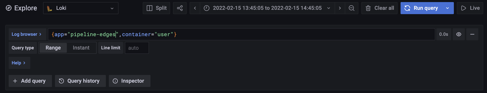

# Enable Logs Aggregation With Loki

## Shipping logs to Loki

Loki retrieves logs from pods in Kubernetes through
an agent service called **Promtail**. 
**Promtail** runs on each node and
sends logs from Kubernetes pods to the Loki API Server,
tagging each log entry with information
about the pod that produced it. 

You need to [configure Promtail](https://grafana.com/docs/loki/latest/clients/promtail/configuration/){target=_blank} for your environment
to ship logs to your Loki instance. 
If you are running **multiple nodes**, 
then you will need to install and configure Promtail
**for each node** shipping logs to Loki.


## Fetching logs

While installing Loki will enable the collection of logs, commands such as `pachctl logs` will not fetch logs directly
from Loki until the `LOKI_LOGGING` environment variable on the `pachd` container is **true**.

This is controlled by the helm value `pachd.lokiLogging`, which can be set by adding the following to your [values.yaml](../../../reference/helm-values/) file:

```yaml
    pachd:
        lokiLogging: true
```

Pachyderm reads logs from the Loki API Server with a particular set of tags. 
The URI at which Pachyderm reads from the Loki API Server is determined by the `LOKI_SERVICE_HOST` and `LOKI_SERVICE_PORT` environment values **automatically added by Loki Kubernetes service**. 

If Loki is deployed after the `pachd` container,
the `pachd` container will need to be redeployed to receive these connection parameters.

!!! note 
    If you are not running Promtail on the node 
    where your Pachyderm pods are located, you
    will be unable to get logs for pipelines running
    on that node via `pachctl logs -p pipelineName`.

## Default Loki Bundle 

Per default, Pachyderm ships with an embedded version of Loki that can be deployed by adding the `lokiDeploy: true` next to the existing [`lokiLogging: true`](#fetching-logs).

```yaml
pachd:
  lokiDeploy: true
  lokiLogging: true
```

In such case, add the following section to your [value.yaml](https://github.com/pachyderm/pachyderm/blob/{{ config.pach_branch }}/etc/helm/pachyderm/values.yaml#L214):

```yaml  
loki-stack:
  loki:
    persistence:
      enabled: true
      accessModes:
      - ReadWriteOnce
      size: 5Gi
      storageClassName: standard
      annotations: {}
  grafana:
    enabled: true
```

!!! Note "Grafana Users"
       - To use Grafana, deploy with `loki-stack.grafana.enabled: true`.
       - To access Grafana, run port-forward with `kubectl port-forward svc/pachyderm-grafana 4001:80`. Change the port 4001 to what suits you best.
       - Login to `localhost:4001` with the username `admin`, and the password found with running `kubectl get secret pachyderm-grafana -o jsonpath="{.data.admin-password}" | base64 -d`.
         If enterprise is activated, you will be able to inspect containers logs in your console.
       
         

## Using Loki in Another Namespace
Instead of deploying a local loki instance in your pachyderm namespace, you can configure pachyderm to use a loki running in another namespace. To do so, you must
set `lokiHost` and `lokiPort`. You should also set `lokiDeploy: false` to prevent the chart from deploying a local loki instance.:
```yaml
pachd:
  lokiDeploy: false
  lokiHost: "<loki-namespace>.<loki-service-name>.svc.cluster.local."
  lokiPort: 3100
```
    
## References

* Loki Documentation - https://grafana.com/docs/loki/latest/
* Promtail Documentation - https://grafana.com/docs/loki/latest/clients/promtail/
* Operating Loki - https://grafana.com/docs/loki/latest/operations/
