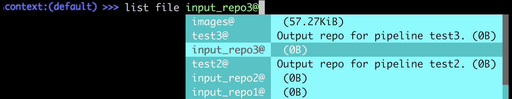

# Using Pachyderm Shell

Pachctl Shell is a special purpose shell for Pachyderm that provides
auto-suggesting as you type. New Pachyderm users will find this user-friendly
shell especially appealing as it helps to learn `pachctl`, type commands
faster and displays useful information about the objects you are interacting
with. This new shell does not supersede the classic `pachctl` shell, but
complements it. If you prefer to use just `pachctl`, you can continue to
do so.

To enter `pachctl shell`, type:

```bash
pachctl shell
```

When you enter `pachctl` shell, your prompt changes to display your current
Pachyderm context, as well as displays a list of available commands in a
drop-down list.


To scroll through the list, press `TAB` and then use arrows to move up or
down. Press `SPACE` to select a command.

After entering Pachctl Shell, omit `pachctl` from the standard `pachctl`
commands. For example, instead of running `pachctl list repo`, run `list
repo`:


With nested commands, `pachctl shell` can do even more. For example, if you
type `list file <repo>@<branch>/`, you can preview and select files from that
branch:



To exit pachctl shell, press `CTRL-D`.

## Limitations

Pachctl shell does not support standard UNIX commands or `kubectl` commands.
To run them, exit the shell.
