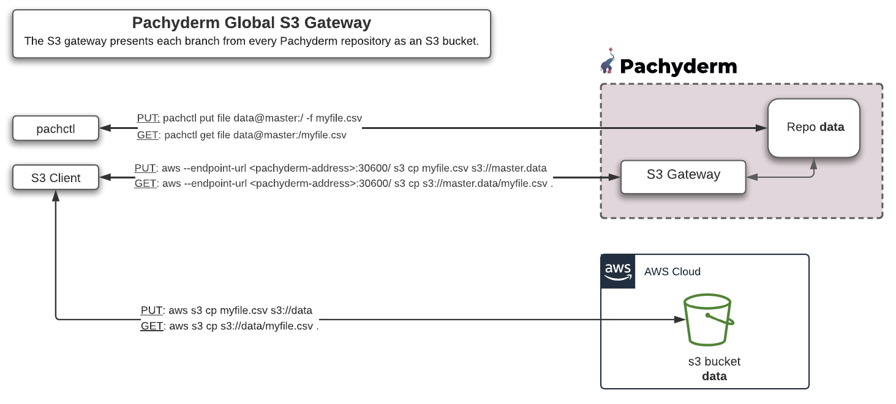

# Global S3 Gateway 

Pachyderm comes with an embedded **S3 gateway**, deployed in the `pachd` pod, that allows you to
**access Pachyderm's repo through the S3 protocol**.  

The S3 Gateway is designed to work with any S3 Client, among which: 

- MinIO
- AWS S3 cli
- boto3

The operations on the HTTP API exposed by the S3 Gateway largely mirror those documented in [S3’s official docs](https://docs.aws.amazon.com/cli/latest/reference/s3/). It is typically used when you wish to retrieve data from or expose data to object storage tooling (such as MinIO, boto3, and aws s3 cli). 

!!! Info
    `pachd` service exposes the S3 gateway (`s3gateway-port`) on port **30600**.

!!! Note "Before using the S3 Gateway"
    Make sure to install and configure the S3 client of your choice as documented [here](configure-s3client.md).

## Quick Start
The S3 gateway presents **each branch from every Pachyderm repository as an S3 bucket**.
Buckets are represented via `branch.repo` or (since 1.13.3) `commit.branch.repo`.  

!!! Example
    - The `master.data` bucket corresponds
    to the `master` branch of the repo `data`.
    - The `be97b64f110643389f171eb64697d4e1.master.data` bucket corresponds to the `be97b64f110643389f171eb64697d4e1` commit in the `data` repo.

The following diagram gives a quick overview of the two main aws commands
that will let you put data into a repo or retrieve data from it via the S3 gateway. 
For reference, we have also mentioned the corresponding `pachctl` commands
and the equivalent call to a real s3 Bucket.



Find the exhaustive list of:

- [all of Pachyderm's supported `aws s3` commands](supported-operations.md).
- and the [unsupported ones](unsupported-operations.md).

## If Authentication Is Enabled
If [auth is enabled](../../../enterprise/auth/) on the Pachyderm cluster, credentials must be passed with
each S3 gateway endpoint as mentioned in the [**Configure Your S3 Client**](./configure-s3client/#set-your-credentials) page.

!!! Warning "Important"
    In any case, whether those values are empty (no authentication) or set, the Access Key must equal the 
    Secret Key (both set to the same value). 

## Port Forwarding
If you do not have direct access to the Kubernetes cluster, you can use port
forwarding instead. Run `pachctl port-forward`, which will allow you
to access the s3 gateway through the `localhost:30600` endpoint.

However, the Kubernetes port forwarder incurs substantial overhead and
does not recover well from broken connections. Connecting to the
cluster directly is faster and more reliable.

## Versioning
Most operations act on the `HEAD` of the given branch. However, if your object
store library or tool supports versioning, you can get objects in non-`HEAD`
commits by using the commit ID as the S3 object version ID or use the new syntax (as of 1.13.3) `--bucket <commit>.<branch>.<repo>`


!!! Example
    To retrieve the file `file.txt` in the commit `a5984442ce6b4b998879513ff3da17da` on the master branch of the repo `arandomrepo`:

    ```shell
    aws s3api get-object --bucket master.arandomrepo --profile gcp-pf --endpoint http://localhost:30600 --key file.txt --version-id a5984442ce6b4b998879513ff3da17da export.txt
    ```
    ```shell
    {
        "AcceptRanges": "bytes",
        "LastModified": "2021-06-03T01:31:36+00:00",
        "ContentLength": 5,
        "ETag": "\"b5fdc0b3557bd4de47045f9c69fa8e54102bcecc36f8743ab88df90f727ff899\"",
        "VersionId": "a5984442ce6b4b998879513ff3da17da",
        "ContentType": "text/plain; charset=utf-8",
        "Metadata": {}
    }
    ```
    OR...

    ```shell
    aws s3api get-object --bucket a5984442ce6b4b998879513ff3da17da.master.arandomrepo --profile gcp-pf --endpoint http://localhost:30600 --key file.txt export.txt
    ```
    
