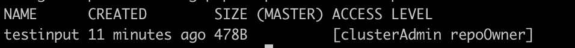
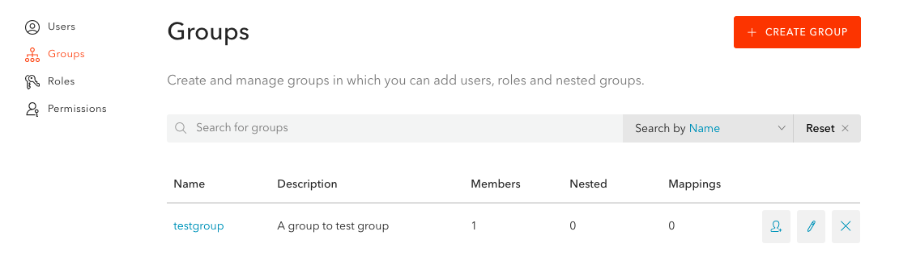
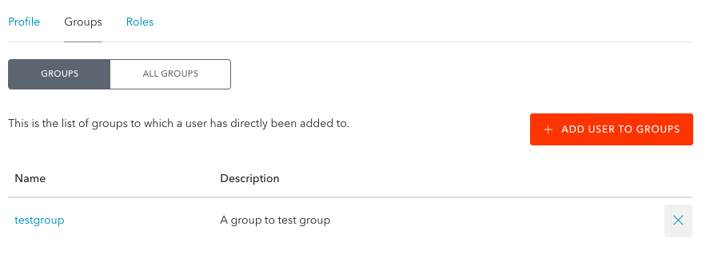

# Role Binding

This chapter will detail how to:

- Grant/modify permissions (Roles) on given Resources to a User (Idp or Robot User).
- Remove all permissions on a Ressource from a User (Idp or Robot User).

!!! Note "Default Privileges"
    - Root User: The activation of the Authentication and Authorization feature generates a **Root User** with **unalterable and unrevokable `clusterAdmin` privileges**. 
    - Robot User: **Robot users do not have any permission by default**. They will need to be set by a `clusterAdmin`.
    - The case of the Pipeline User: In Pachyderm, **you do not explicitly grant users access to pipelines**, they get set for you when you create or update a pipeline. 

!!! Warning "Rules to keep in mind"
    - A user or group can have one or more roles on a specific Resource.
    - Roles are inherited: if a user has a role on a cluster, they have that role for all projects and repos in that cluster.
    - The creator of a repo becomes its `repoOwner`.
    - To update a pipeline, you must have at least `repoReader`-level access to all pipeline inputs
        and `repoWriter`-level access to the pipeline output. 
        This is because pipelines read from their input repos and write
        to their output repos.
    - When a user subscribes a pipeline to a repo, Pachyderm sets
        that user as an `repoOwner` of that pipeline's output repo.
        If additional users need access to the output repository,
        the initial `repoOwner` of a pipeline's output repo, or a `clusterAdmin`,
        needs to grant that user access to the repo.
    
## Set Roles to Users

- A **clusterAdmin** can grant admin privileges on a cluster or any lower level ressources to other users.     
  
- A **repoOwner** of a given repository (or a **clusterAdmin** as mentioned above) can set any level of access to "their" repo to users by running the command:

    ```shell
    pachctl auth set <ressource> <ressource name> [role1,role2 | none ] <prefix:subject>
    ```
!!! Note

    Alternatively, [you have the **option to set your cluster roles directly through Helm using the helm value: pachd.pachAuthClusterRoleBindings**](https://github.com/pachyderm/pachyderm/blob/{{ config.pach_branch }}/etc/helm/pachyderm/values.yaml#L469){target=_blank}. 

    For example, grant reader access to all repos to a specific group:
    ```yaml
     pachd:
        pachAuthClusterRoleBindings:
            group:data-scientists:
            - repoReader
    ```
    Or, give the user `paul@company.com` the clusterAdmin role, and the robot user `wallie` logReader rights on the cluster. 
    ```yaml
     pachd:
        pachAuthClusterRoleBindings:
            user:paul@company.com:
            - clusterAdmin
            robot:wallie:
            - logReader
    ```

To keep using our Auth0 example and illustrate the attribution of a given Role to a User,
let's have our `Root User` (with default clusterAdmin privileges) give `repoReader` access to a repo to our `one-pachyderm-user@gmail.com` user. 

In particular, we will:

1. Connect as our Root User again.
1. Create a repo named `testinput` containing one text file.
1. Grant `repoReader` access on this repo to our user `one-pachyderm-user@gmail.com` registered with our IdP (Auth0).
1. See what happens when `one-pachyderm-user@gmail.com` tries to write in the repo without the proper writing access.

<br>

- **First, let's connect as our Root User:**
    ```shell
    pachctl auth use-auth-token
    ```
    You will be asked to re-enter your Root token.

- **Second, create a Repo as follow:**
    ```shell
    mkdir -p ./testinput 
    printf "this is a test" >./testinput/test.txt
    pachctl create repo testinput
    cd testinput && pachctl put file testinput@master -f test.txt

    ```
    A quick `pachctl list repo` will list your new repo and display your access level on that repo as a **clusterAdmin**.
    

- **Third, grant `repoReader` access to our user `one-pachyderm-user@gmail.com`:**
    ```shell
    pachctl auth set repo testinput repoReader user:one-pachyderm-user@gmail.com
    ```
    ... and take a quick look at his access level:
    ```shell
    pachctl auth get repo testinput
    ```
    The command returns the list of users granted access to this repo and their associated access level. 
    ```
    user:one-pachyderm-user@gmail.com: [repoReader]
    pach:root: [repoOwner]
    ```

    !!! Note
        Note that the user `one-pachyderm-user@gmail.com` has a prefix `user`.
        Pachyderm defines 4 prefixes depending on the type of user:

        - robot
        - user
        - group
        - pipeline (as mentioned above, this prefix will not be used in the context of granting privileges to users. However, it does exist. We are listing it here to give an exhauxtive list of all prefixes.)

        Aditionnally, the "everyone" user `allClusterUsers` has no specific prefix. See the example below to learn how to assign repoReader access to `allClusterUsers` on a repo.

- **Finally, have `one-pachyderm-user@gmail.com` try to add a file to `testinput` without proper writing privileges:**
    ```shell
    # Login as `one-pachyderm-user@gmail.com`
    pachctl auth login
    # Try to write into testinput repo
    printf "this is another test" >./testinput/anothertest.txt
    cd testinput && pachctl put file testinput@master -f anothertest.txt
    ```
    The command returns an error message: 
    ```
    user:one-pachyderm-user@pachyderm.io is not authorized to perform this operation - needs permissions [REPO_WRITE] on REPO testinput
    ```

!!! Info
    Use `--help` to display the list of all available commands, arguments, and flags of the command `pachctl auth set`.

!!! Note
    - To alter a user's privileges, simply re-run the `pachctl auth set` command above with a different set of Roles. 
    For example, 
    ```shell
    pachctl auth set repo testinput repoWriter user:one-pachyderm-user@gmail.com
    ```
    will give one-pachyderm-user@gmail.com `repoWriter` privileges when they were inially granted `repoReader` access.

    - You can remove all access level on a repo to a user by using the `none` keyword.
    For example,
    ```shell
    pachctl auth set repo testinput none user:one-pachyderm-user@gmail.com
    ```
    will remove any previous granted rights on the repo `testinput` to the user one-pachyderm-user@gmail.com.

    - To assign `repoReader` access to `allClusterUsers` on a repo:
    ```shell
    pachctl auth set repo testinput repoReader allClusterUsers
    ```   

## Set Roles to Groups

If your IdP enables group support,
you can grant access on Pachyderm ressources to a group of users.

Let's keep using our Auth0 example as an illustration, and:

1. As a `clusterAdmin`, create a Group in Auth0.
1. Assign our user to the newly created group.
1. Update our connector accordingly.
1. Grant the group an owner access to a specific repo in Pachyderm.

!!! Info
    To enable the Group creation in Auth0, you will need to install an [`Authorization Extension`](https://auth0.com/docs/extensions/authorization-extension){target=_blank} to Auth0:

    - Go to **Auth0 Dashboard > Extensions**.
    - Select **Auth0 Authorization** and answer the prompt to install.
    - Choose where you would like to store your data: **Webtask Storage** for this example and click **Install**
    - Additionally, because Auth0 does not include the groups in the ID token when you use the Authorization Extension above, you will have to manually edit the following rule: 
        - In the **Auth Pipeline** menu on the left, in **Rules**, click on `auth0-authorization-extension`. This will take you to the **Edit Rule** page of the extension. 
        - Copy the following `context.idToken['http://pachyderm.com/groups'] = user.groups;` line 35 and Save your changes.
        


- 1- Group creation

    An Authorization link should now show on your Auth0 webpage.
    In **Authorization/Groups**, create a group. Here `testgroup`:
    

- 2- Add your user to your group

    In **Authorization/Users**, select your user one-pachyderm-user@gmail.com and add them to your `testgroup` as follow.
    

    In **User Mangement/Users**, you user should now show the following addition to their app_metadata:
    ```json
    {
        "authorization": {
            "groups": [
            "testgroup"
            ]
        }
    }
    ```
- 3- Update your connector

    === "oidc-dex-connector.json"

        ```json
        {
            "type": "oidc",
            "id": "auth0",
            "name": "Auth0",
            "version": 1,
            "config":{
            "issuer": "https://dev-k34x5yjn.us.auth0.com/",
            "clientID": "hegmOc5rTotLPu5ByRDXOvBAzgs3wuw5",
            "clientSecret": "7xk8O71Uhp5T-bJp_aP2Squwlh4zZTJs65URPma-2UT7n1iigDaMUD9ArhUR-2aL",
            "redirectURI": "http://<ip>:30658/callback",
            "scopes": ["groups", "email", "profile"],
            "claimMapping":{
                "groups": "http://pachyderm.com/groups"
            },
            "insecureEnableGroups": true
            }
        }
        ```

    === "oidc-dex-connector.yaml"

        ``` yaml
        type: oidc
        id: auth0
        name: Auth0
        version: 1
        config:
            issuer: https://dev-k34x5yjn.us.auth0.com/
            clientID: hegmOc5rTotLPu5ByRDXOvBAzgs3wuw5
            clientSecret: 7xk8O71Uhp5T-bJp_aP2Squwlh4zZTJs65URPma-2UT7n1iigDaMUD9ArhUR-2aL
            redirectURI: http://<ip>:30658/callback
            scopes: 
            - groups
            - email
            - profile
            claimMapping:
                groups: http://pachyderm.com/groups
            insecureEnableGroups: true
        ```

    Note the addition of the `scopes` and `claimMapping` fields to your original connector configuration file.
    Update your connector:
    ```shell
    pachctl idp update-connector auth0 --version 2
    ```
    Your group is all set to receive permissions to Pachyderm's ressources.

- 4- Grant the group an admin access to a specific repo in Pachyderm.

    ```shell
    pachctl auth set repo testinput repoOwner group:testgroup
    ```
    A quick check at this repo should give you its updated list of users an their access level:
    ```shell
    pachctl auth get repo testinput
    ```
    **System Response**
    ```
    pach:root: [repoOwner]
    user:another-pachyderm-user@gmail.com: [repoReader]
    group:testgroup: [repoOwner]
    ```
    !!! Info "Useful note"
        The following command `pachctl auth get-groups` lists the groups that have been defined on your cluster.
