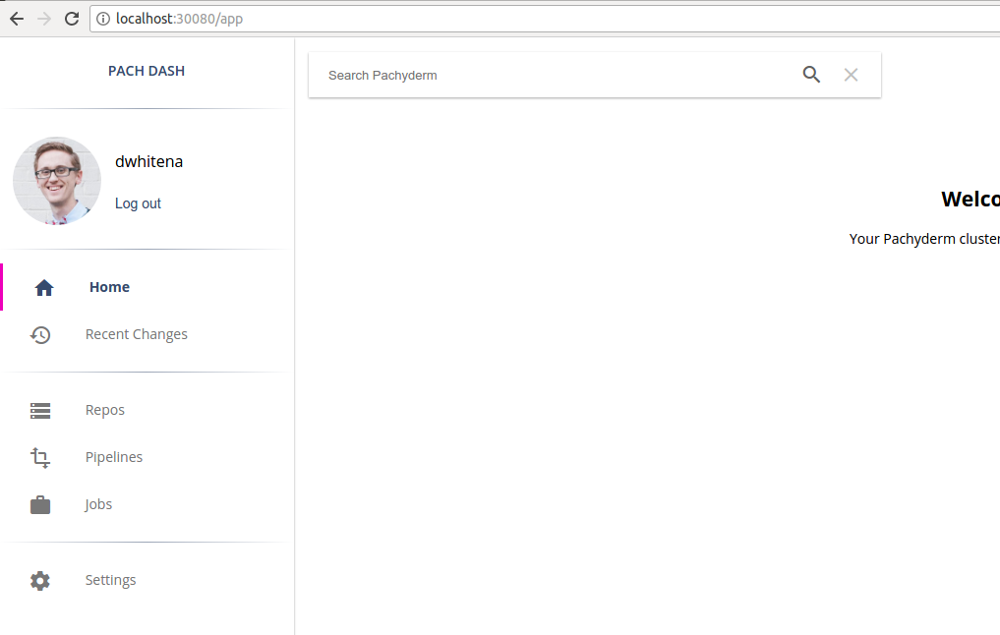
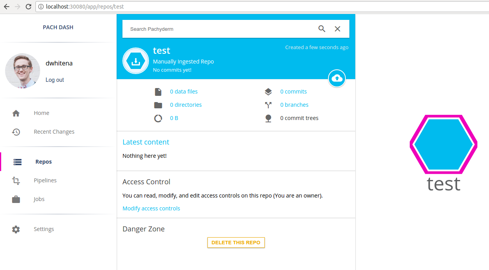

# Enable Access Controls

Before you can enable access controls, make sure that
you have activated Pachyderm Enterprise Edition
as described in [Deploy Enterprise Edition](../deployment.md).

When you initially enable access controls, data access
is restricted to an *initial admin*, most often yourself.
This *initial admin* will have `admin` privileges in the
Pachyderm cluster.
Then, the `admin` user can configure Pachyderm to work with
a identity management provider (IdP) of your choice.

If you want to configure a SAML IdP, such as Auth0, you need
to create an initial robot admin account by using the
`--initial-admin=robot:<user>` flag.

To enable access controls, complete the following steps:

1. Verify the status of the Enterprise
   features by opening the Pachyderm dashboard in your browser or
   by running the following `pachctl` command:

   ```shell
   pachctl enterprise get-state
   ```

   **System response:**

   ```shell
   ACTIVE
   ```

1. Activate the Enterprise access control features by completing
   the steps in one of these sections:

   * To activate through the CLI, follow the steps in
   [Activate Access Control with pachctl](#activate-access-controls-with-pachctl).
   * To activate through the Pachyderm Dashboard, follow the steps in
   [Activate Access Control by Using the Dashboard](#activate-access-controls-by-using-the-dashboard).

## Activate Access Controls with `pachctl`

You can configure any type of supported users through `pachctl`. For
more information about the types of supported users, see [Account Types](../).

To activate access controls with `pachctl`, complete the following steps:

* If you are authenticating as a `robot`, OIDC, or SAML user, activate
access controls by specifying a robot user as an initial admin:

  ```shell
  pachctl auth activate --initial-admin=robot:<user>
  ```


  When you authenticate as a `robot` user,
  Pachyderm generates and returns a Pachyderm auth token
  that issued to authenticate as the initial robot admin by using
  `pachctl auth use-auth-token`. Then, follow the steps in the
  corresponding section to configure a selected type of user:

  * To configure a SAML user, follow the steps in [Configure a SAML Auth Provider]().
  * To configure a OIDC user, follow the steps in [Configure an OIDC Auth Provider]().

* Activate access controls with a GitHub account:

  ```shell
  pachctl auth activate
  ```

  Pachyderm prompts you to log in with your GitHub account. The
  GitHub account that you sign in with is the only admin until
  you add more by running `pachctl auth modify-admins`.

## Activate Access Controls by Using the Dashboard

!!! note
    Currently, you can only configure a GitHub user in the UI.
    If you want to set up any other type of user, use `pachctl`.

To activate access controls in the Pachyderm dashboard,
complete the following steps:

1. Go to the **Settings** page.
1. Click the **Activate Access Controls** button.

   After you click the button, Pachyderm enables you to add GitHub users
   as cluster admins and activate access control:

   

   After activating access controls, you should see the following screen
   that asks you to log in to Pachyderm:

   

## Log in to Pachyderm

After you activate access controls, log in to your cluster either
through the dashboard or CLI. The CLI and the dashboard have
independent login workflows:

- [Log in to the dashboard](#log-in-to-the-dashboard).
- [Log in to the CLI](#log-in-to-the-cli).

### Log in to the Dashboard

After you have activated access controls for Pachyderm, you
need to log in to use the Pachyderm dashboard as shown above
in [Activate Access Controls by Using the Dashboard](#activate-access-controls-by-using-the-dashboard).

To log in to the dashboard, complete the following steps:

1. Click the **Get GitHub token** button. If you
   have not previously authorized Pachyderm on GitHub, an option
   to **Authorize Pachyderm** appears. After you authorize
   Pachyderm, a Pachyderm user token appears:

   

1. Copy and paste this token back into the Pachyderm login
   screen and press **Enter**. You are now logged in to Pachyderm,
   and you should see your GitHub avatar and an indication of your
   user in the upper left-hand corner of the dashboard:

   


### Log in to the CLI

To log in to `pachctl`, complete the following steps:

* To log in with a GitHub user:

  1. Type the following command:

     ```shell
     pachctl auth login
     ```

     When you run this command, `pachctl` provides
     you with a GitHub link to authenticate as a
     GitHub user.

     If you have not previously authorized Pachyderm on GitHub, an option
     to **Authorize Pachyderm** appears. After you authorize Pachyderm,
     a Pachyderm user token appears:

     

  1. Copy and paste this token back into the terminal and press enter.

     You are now logged in to Pachyderm!

     1. Alternatively, you can run the command:

        ```shell
        pachctl auth use-auth-token
        ```

     1. Paste an authentication token received from
        `pachctl auth activate --initial-admin=robot:<user>` or
        `pachctl auth get-auth-token`.

## Manage and update user access

You can manage user access in the UI and CLI.
For example, you are logged in to Pachyderm as the user `dwhitena`
and have a repository called `test`.  Because the user `dwhitena` created
this repository, `dwhitena` has full `OWNER`-level access to the repo.
You can confirm this in the dashboard by navigating to or clicking on
the repo `test`:




Alternatively, you can confirm your access by running the
`pachctl auth get ...` command.

!!! example

    ```
    pachctl auth get dwhitena test
    ```

    **System response:**

    ```shell
    OWNER
    ```

An OWNER of `test` or a cluster admin can then set other user’s
level of access to the repo by using
the `pachctl auth set ...` command or through the dashboard.

For example, to give the GitHub users `JoeyZwicker` and
`msteffen` `READER`, but not `WRITER` or `OWNER`, access to
`test` and `jdoliner` `WRITER`, but not `OWNER`, access,
click on **Modify access controls** under the repo details
in the dashboard. This functionality allows you to add
the users easily one by one:


## Behavior of Pipelines as Related to Access Control

In Pachyderm, you do not explicitly grant users access to
pipelines. Instead, pipelines infer access from their input
and output repositories. To update a pipeline, you must have
at least `READER`-level access to all pipeline inputs and at
least `WRITER`-level access to the pipeline output. This is
because pipelines read from their input repos and write
to their output repos, and you cannot grant a pipeline
more access than you have yourself.

- An `OWNER`, `WRITER`, or `READER` of a repo can subscribe a
pipeline to that repo.
- When a user subscribes a pipeline to a repo, Pachyderm sets
that user as an `OWNER` of that pipeline's output repo.
- If additional users need access to the output repository,
the initial `OWNER` of a pipeline's output repo, or an admin,
needs to configure these access rules.
- To update a pipeline, you must have `WRITER` access to the
pipeline's output repos and `READER` access to the
pipeline's input repos.


## Manage the Activation Code

When an enterprise activation code expires, an auth-activated
Pachyderm cluster goes into an `admin-only` state. In this
state, only admins have access to data that is in Pachyderm.
This safety measure keeps sensitive data protected, even when
an enterprise subscription becomes stale. As soon as the enterprise
activation code is updated by using the dashboard or CLI, the
Pachyderm cluster returns to its previous state.

When you deactivate access controls on a Pachyderm cluster
by running `pachctl auth deactivate`, the cluster returns
its original state that including the
following changes:

- All ACLs are deleted.
- The cluster returns to being a blank slate in regards to
access control. Everyone that can connect to Pachyderm can access
and modify the data in all repos.
- No users are present in Pachyderm, and no one can log in to Pachyderm.
