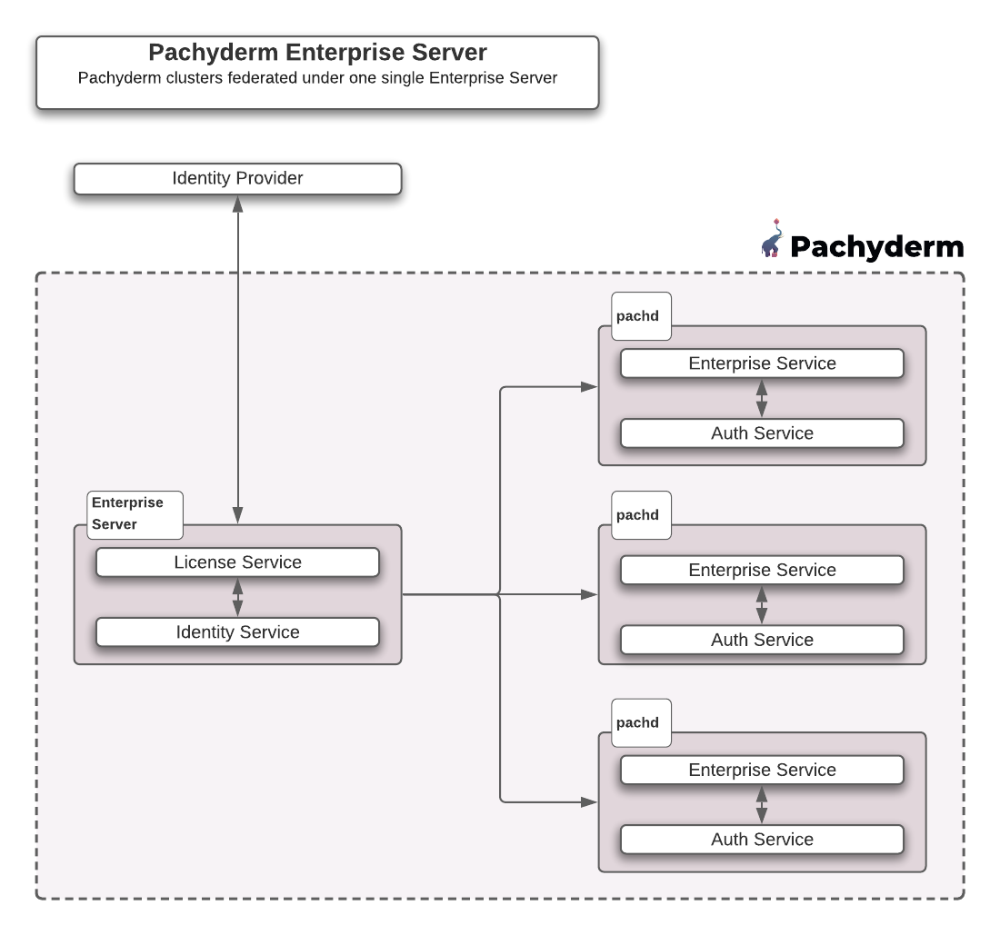

# Enterprise Server Setup
The **Enterprise Server** is a component in Pachyderm which manages Enterprise Licensing
and the integration with a company's Identity Providers (IDPs).

At a high level, an organization can have **many Pachyderm clusters registered with one single Enterprise Server**. Administrators activate the Enterprise Server with an **Enterprise License Key** from Pachyderm sales, and optionally configure authentication with their IDP via SAML, OIDC, LDAP, etc...

The following diagram gives you a quick overview of an organization with multiple Pachyderm clusters behind a single Enterprise Server.


!!! Note
	For POCs and smaller organizations with one single Pachyderm cluster, the **Enterprise Server services can be run embedded in pachd**. A separate deployment is not necessary. An organization with a single Pachyderm cluster can run the Enterprise Server services embedded within pachd.

The setup of an Enterprise Server requires to:

1. Deploy it.
1. Activate your Enterprise Key and enable Auth.
1. Register your newly created or existing Pachyderm clusters with your enterprise server.
1. Optional: Enable Auth on each cluster.

## 1 - Deploy An Enterprise Server

### Single-cluster deployment
Deploying a Pachyderm cluster with the embedded enterprise server does not require any specific action.
Proceed as usual:

1. [Install your favorite version of `pachctl`](../../../../getting_started/local_installation/#install-pachctl).
1. [Deploy Pachyderm](../../../getting_started/local_installation/#deploy-pachyderm): `pachctl deploy <local, google.....>`.
1. [Activate your enterprise Key](../deployment/#activate-pachyderm-enterprise-edition): `pachctl license activate`
1. [Enable authentication](../index.md/#activate-user-access-management): `pachctl auth activate` 


This results in a single pachd pod, with authentication enabled. Proceed to [configuring IDP integrations](../../authentication/idp-dex).

### Multi-cluster deployment

Deploying a stand-alone enterprise server requires using the `--enterprise-server` flag for `pachctl deploy`. 

- If a pachyderm cluster will also be installed in the same kubernetes cluster, they should be installed in **different namespaces**:

	```shell
	$ kubectl create namespace enterprise
	$ pachctl deploy <local, google, microsoft...> --enterprise-server --namespace enterprise <disk-size> --dynamic-etcd-nodes=1 <bucket-name> 
	```

	This command deploys postgres, etcd and a deployment and service called `pach-enterprise`. 
	`pach-enterprise` uses the same docker image and pachd binary, but it **listens on a different set of ports (31650, 31657, 31658)** to avoid conflicts with pachd.

- Check the state of your deployment by running:
	```shell
	$ kubectl get all --namespace enterprise
	```
	**System Response**
	```
	NAME                                   READY   STATUS    RESTARTS   AGE
	pod/etcd-5fd7c675b6-46kz7              1/1     Running   0          113m
	pod/pach-enterprise-6dc9cb8f66-rs44t   1/1     Running   0          105m
	pod/postgres-6bfd7bfc47-9mz28          1/1     Running   0          113m

	```

## 2- Activate enterprise licensing and enable auth

- Use your enterprise key to activate your enterprise server: 
	```shell
	$ pachctl license activate
	```
- Then enable Authentication at the Enterprise Server level:
	```shell
	$ pachctl auth activate --enterprise
	```

	!!! Warning
		Enabling Auth will return a `root token` for the enterprise server. 
		**This is separate from the root tokens for each pachd (cluster)**. 
		They should all be stored securely.

Once the enterprise server is deployed, 
deploy your cluster(s) (`pachctl deploy <local, google...>`) and register it/them with the enterprise server.
You migh want to [expose your cluster(s) to the internet](#3-register-your-clusters).
## 3-  Register your clusters
- Run this command for each of the clusters you wish to register:

	```shell
	$ pachctl enterprise register --id <my-pachd-config-name> --enterprise-server-address <pach-enterprise-IP>:650 --pachd-address <pachd-IP>:650
	```

	* `--id` is the name of the context pointing to your cluster in `~/.pachyderm/config.json`.

	* `--enterprise-server-address` is the host and port where pachd can reach the enterprise server. 
	In production, the enterprise server may be exposed on the internet.

	* `--pachd-address` is the host and port where the enterprise server can reach pachd. 
	This may be internal to the kubernetes cluster, or over the internet.

- Display the list of all registered clusters with your enterprise server: 
	```shell
	$ pachctl license list-clusters
	```

	```shell
	Using enterprise context: my-enterprise-context-name
	id: john
	address: ae1ba915f8b5b477c98cd26c67d7563b-66539067.us-west-2.elb.amazonaws.com:650
	version: 2.0.0
	auth_enabled: true
	last_heartbeat: 2021-05-21 18:37:36.072156 +0000 UTC

	---
	id: doe
	address: 34.71.247.191:650
	version: 2.0.0
	auth_enabled: true
	last_heartbeat: 2021-05-21 18:43:42.157027 +0000 UTC
	---
	```

!!! Tip "How to expose a Cluster or the Enterprise Server to the Internet?"
	1. To get an external IP address for a Cluster or the Enterprise Server, edit its k8s service (`kubectl edit service pachd` for the cluster you are pointing to or `kubectl edit service pach-enterprise -n enterprise` for the enterprise server) and change its `spec.type` value from `NodePort` to `LoadBalancer`. 
	1. Retrieve the external IP address of the edited services.
	When listing your services again (`kubectl get service` or `kubectl get service -n enterprise`), you should see an external IP address allocated to the service you just edited. 
	1. Update the context of your cluster(s) and your enterprise server with their direct url, using the external IP address above.
		- `echo '{"pachd_address": "grpc://<external-IP-address>:650"}' | pachctl config set context "your-enterprise-or-cluster-context-name" --overwrite`
		- check that your are using the right contexts: `pachctl config get active-context` / `pachctl config get active-enterprise-context`


## 4- Enable Auth on each cluster
Finally, activate auth on  each cluster. 
This is an optional step as clusters can be registered with the enterprise server without authentication being enabled.

- Before enabling authentication, set up the issuer in the idp config between the enterprise server and your cluster:
	```shell
	$ echo "issuer: http://<enterprise-server-IP>:658" | pachctl idp set-config --config -
	```
	Check that your config has been updated properly: `pachctl idp get-config`

- For each registered cluster you want to enable auth on:
	```shell
	$ pachctl auth activate --client-id <my-pachd-config-name> --redirect http://<pachd-IP>:657/authorization-code/callback 
	```
!!! Note
	- Note the **`/authorization-code/callback`** appended after `<pachd-IP>:657` in `--redirect`.
	- `--client-id` is to `pachctl auth activate` what `--id` is to `pachctl enterprise register`: In both cases, enter `<my-pachd-config-name>`. 

-	Make sure than your enterprise context is set up properly: 
	```shell
	$ pachctl config get active-enterprise-context
	```
	If not: 
	```shell
	$ pachctl config set active-enterprise-context <my-enterprise-context-name>
	```


 
To manage you server, its context, or connect your IdP, visit the [**Manage your Enterprise Server**](./manage.md) page.


